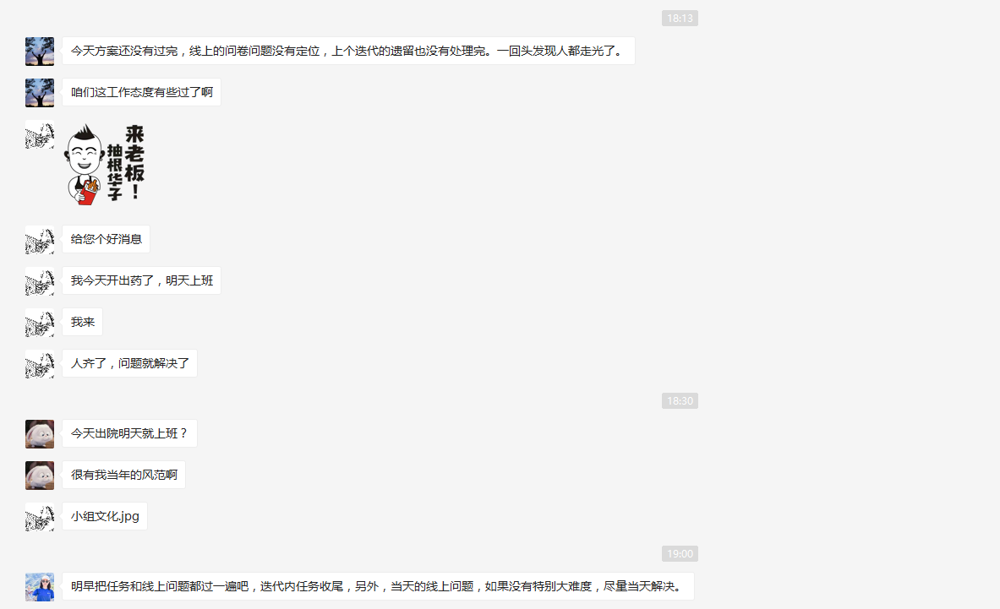

# 2020-11-10

其实今天我很不想写总结，但是贵在坚持吧。把最近的近况写一下。

最近的工作比较茫然，因为自己提升的技术没一个出结果，我总结了下，因为没有具体目标项目，只是笼统的想学一种技术，我认为目前是微前端为主，移动端网页开发为辅，vue 源码为辅，熟悉 css 动画，
以面试题为知识体系树做知识点点亮。我需要列个详细到 3 个月的时间表。

精神面貌比较重要，我最近几点睡的比较晚，没事，但是总是刷手机打法时间，以至于到公司的时间开始变晚，从上周的早上 8 点半又到了今天得早上 9 点 29，今天中午同事和我说领导说就知道我坚持不到一个星期早到，感觉很不爽。锻炼也是很久没坚持了。

今天晚上回家，看微信发现领导在工作群里说大家都走光了，但是工作都没做完，大家都没吭声，然后有同事问我情况，我安慰了下，也没多说，事实证明是对的。在隔壁群看大家聊这个事情，都在明里暗里给自己开脱，然后火烧到我身上，我也开脱了下。回忆起来，发现其实大家心里都有鬼，如果这时候大度的开玩笑的接下这个锅，不知道效果会不会好点。

工作上的事情，不多表态，能做就做，不能做就拖一段时间，在说不能做，不要傻乎乎的一开始就坦言不能做，否则还能别人以为你自己能力不行。

明天双 11，买点东西。

今天嘉敏看到我在家很安静，倒头就睡，于是在客厅呆到 9 点我醒来才进来。
