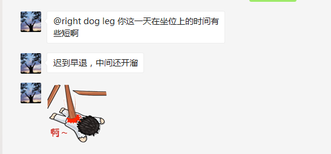

# 2020-04-08

## 故事背景

1. 算量平台埋点收尾，100 多个埋点
2. 算量平台知识问答收尾

## 复盘

1. 上午不舒服，早上 10 点半就溜回去了，但是没想到平时上午都没人找我，今天居然同事找我，瞬间全部门都知道我提前溜了，早知道我应该和部长请个假的，所以有些东西运气真的很重要。但是从另一方面说，为啥同事没找到我要让全部门都知道呢？这值得深思。
2. 下午正常工作，坚持让自己摆脱手机
3. 晚上坚持联系第二天跑了步，很有意思的是，速度慢下来之后，跑 5KM 气都没喘，突然感慨平时多运动，现在和同事一起跑的时候优势就体现出来了，意外收获吧，也算是交了更多的朋友。
4. 重点来了，下午 6 点，我按约定去跑步，结果群里同事@我工作的事情，我开玩笑的说晚了，结果直接被领导说迟到早退外加中途开溜。

   

   先不说为啥给别人这样的印象，首先，切记群里别开这样的玩笑，应该回一句出去吃个饭，马上回来解决，被别人抓住尾巴还当众说，说明这只是个导火索。

5. 晚上耗时 6 个小时，到凌晨 1 点半把工作都收尾，第一是夜深人静的时候更沉得下心，第二是憋了一股子劲。也间接发现很多工作都是琐事，完成起来要大量时间，看上去少而已。
6. 前二天每天一篇技术博客，今天又断了。
