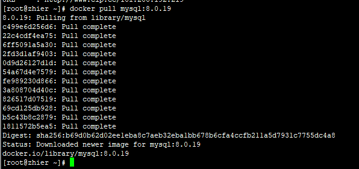
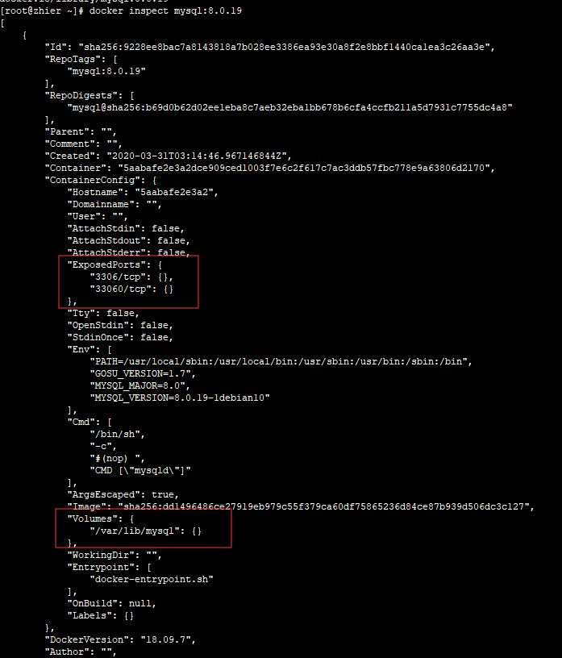
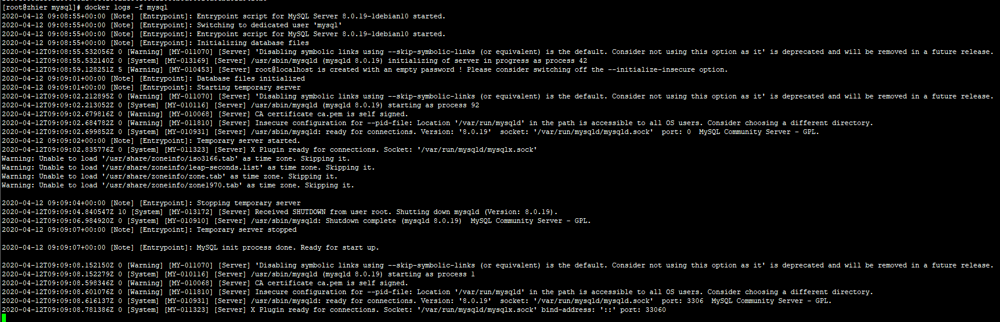
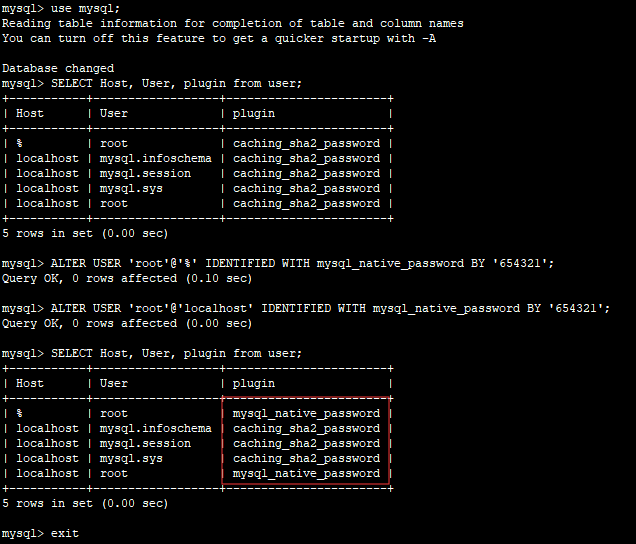
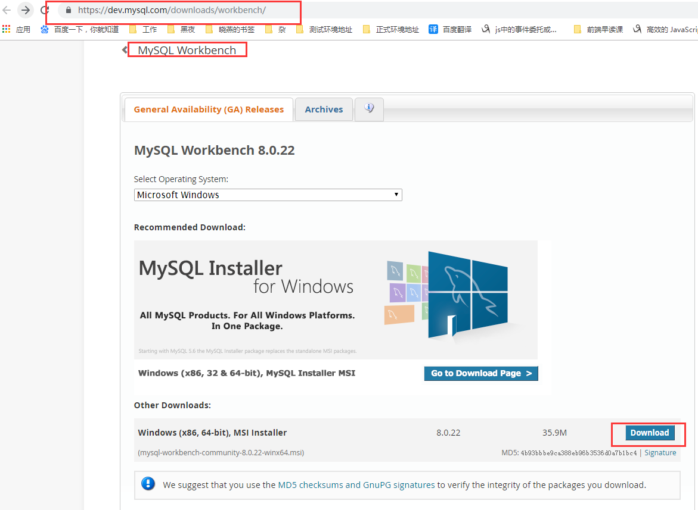
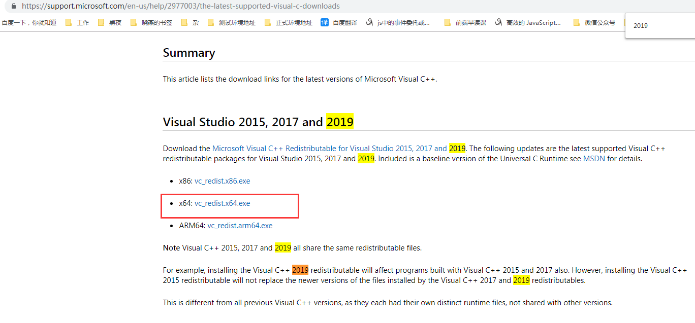

# docker_mysql 安装指南

参考资料：

1. [Docker 决战到底(九) 部署 MySQL 服务](https://www.jianshu.com/p/d8bbfd6f151b)
2. [dockerhub 官网——mysql 镜像](https://hub.docker.com/_/mysql)

## 下载 MySQL 镜像

1. 下载 mysql 镜像

   `docker pull mysql:8.0.19`
   
   ::: tip
   选择 mysql 镜像版本，在官网查找具体版本，不要用默认，否则每次安装可能版本号不同导致些许误差，在 2020-04-12，当前最新是 8.0.19
   :::

2. 查看 mysql 镜像详情

   `docker inspect mysql:8.0.19`
   
   ::: tip
   `ExposedPorts`：对外暴露的端口，在 docker 启动命令中需要用到<br>
   `Volumes`：挂载目录，需要映射到主机上，在 docker 启动命令中需要用到
   :::

## 启动 MySQL 服务实例

1.  创建主机挂载目录

    `mkdir -p /docker_volume/mysql/data`<br>

    ::: tip
    `mkdir -p` ：递归创建目录，即使上级目录不存在，会按目录层级自动创建目录<br>
    `mkdir -p /docker_volume/mysql/data`：注意路径首部是`/`，所以是从根目录开始计算
    :::

2.  启动容器

    ```bash
    docker run -d \
         --restart=unless-stopped \
         -p 2288:3306 \
         -v /docker_volume/mysql/data:/var/lib/mysql \
         -e MYSQL_ROOT_PASSWORD=654321 \
         --name mysql mysql:8.0.19 \
         --character-set-server=utf8mb4 --collation-server=utf8mb4_unicode_ci --default-authentication-plugin=mysql_native_password
    ```

::: tip 命令解析

1.  `-d`

    后台运行容器，并返回容器 ID

2.  `--restart=unless-stopped`

    在容器退出时总是重启容器，但是不考虑在 Docker 守护进程启动时就已经停止了的容器

    参考资料：[Docker run 参考(7) – Restart 策略(–restart)](https://www.centos.bz/2017/01/docker-run-restart-policy/)<br>

    ```bash
    # 获取容器“nginx”的重启次数:
    docker inspect -f "{{ .RestartCount }}" nginx
    # 查看容器“nginx”最后一次的启动时间
    docker inspect -f "{{ .State.StartedAt }}" nginx
    ```

3.  `-p 2288:3306`

    端口映射，这个就需要`docker inspect mysql:8.0.19`去查看`ExposedPorts`，mysql 查看是 3306，映射到 2288 是因为端口符合阿里云安全端口配置策略，这个可以自行配置。

4.  `-v /docker_volume/mysql/data:/var/lib/mysql`

    主机挂载目录映射，这个就需要`docker inspect mysql:8.0.19`去查看`Volumes`，mysql 的是`/var/lib/mysql`（这个是容器里面的路径）

5.  `-e MYSQL_ROOT_PASSWORD=654321`

    指定 MySQL 的初始 root 密码为 654321

6.  `name mysql mysql:8.0.19`
    启动容器的名称为`mysql`，启动的镜像是`mysql:8.0.19`

7.  `--character-set-server=utf8mb4 --collation-server=utf8mb4_unicode_ci --default-authentication-plugin=mysql_native_password`

    更改所有表的默认编码和排序规则以使用 UTF-8（utf8mb4），修改 Docker-MySQL 容器的 默认用户加密规则

    <span style="color: red;">注：这几个命令一定要写在`mysql:8.0.19`之后，更多配置查看`docker run -it --rm mysql:tag --verbose --help`</span>

:::

3.  查看 mysql 容器启动情况

`docker logs -f mysql`


## 客户端连接 mysql 服务

1.  安装 navicat premium

    参考网址：[navicat 注册安装和激活](https://blog.csdn.net/jikefzz1095377498/article/details/79578796)
    ::: tip 注意
    `Patch.exe <navicat.exe path>`：`<navicat.exe path>`一定要加双引号，否则就是个变量而不是常量了，这里我被坑了好久。
    :::

2.  修改 Docker-MySQL 容器的 默认用户加密规则

    参考网址：[修改 Docker-MySQL 容器的 默认用户加密规则](https://www.cnblogs.com/atuotuo/p/9402132.html)，[dockerhub 官网——mysql 镜像](https://hub.docker.com/_/mysql),
    [MySQL8.0 登录提示 caching_sha2_password 问题解决方法](https://blog.csdn.net/maoxinwen1/article/details/88629313)

    1. mysql 已经启动的情况下：

       ```bash
       # 先进入容器内部
       docker exec -it mysql /bin/sh
       # 进入mysql
       mysql -u root -p
       # 输入密码
       # 切换数据库
       use mysql;
       # 查询用户信息
       SELECT Host, User, plugin from user;
       # 更改用户加密规则
       ALTER USER 'root'@'%' IDENTIFIED WITH mysql_native_password BY '123456';
       ALTER USER 'root'@'localhost' IDENTIFIED WITH mysql_native_password BY '123456';
       # 查询用户信息
       SELECT Host, User, plugin from user;
       ```

       

    2. 第一次构建容器/安装

       1. 使用自定义 MySQL 配置文件

          MySQL 的默认配置可以在中找到/etc/mysql/my.cnf，其中可以包含!includedir 其他目录，例如/etc/mysql/conf.d 或/etc/mysql/mysql.conf.d。请检查 mysql 映像本身中的相关文件和目录以获取更多详细信息。<br>
          如果`/my/custom/config-file.cnf`是自定义配置文件的路径和名称，则可以 mysql 像这样启动容器（请注意，此命令仅使用自定义配置文件的目录路径）：<br>
          `docker run --name some-mysql -v /my/custom:/etc/mysql/conf.d -e MYSQL_ROOT_PASSWORD=my-secret-pw -d mysql:tag`<br>
          这将启动一个新的容器 some-mysql，其中 MySQL 实例从采用混合启动设置/etc/mysql/my.cnf 和/etc/mysql/conf.d/config-file.cnf，与后者采取优先次序设置。

       2. 没有 cnf 文件的配置

          可以将许多配置选项作为标志传递给 mysqld。这将使您可以灵活地自定义容器而无需 cnf 文件。例如，如果您想更改所有表的默认编码和排序规则以使用 UTF-8（utf8mb4），请运行以下命令：<br>
          `docker run --name some-mysql -e MYSQL_ROOT_PASSWORD=my-secret-pw -d mysql:tag --character-set-server=utf8mb4 --collation-server=utf8mb4_unicode_ci`<br>
          如果您想查看可用选项的完整列表，请运行：<br>
          `ocker run -it --rm mysql:tag --verbose --help`

    3. 完美的解决方案肯定是命令行加入`--default-authentication-plugin=mysql_native_password`，但是这里遇到几个坑，一定要注意：

       ::: tip 遇到的坑

       1. 属性拼写错误

          一开始我写成`--default_authentication_plugin=mysql_native_password`，原因是配置文件中就是这样的写法。但是后来查看`docker run -it --rm mysql:tag --verbose --help`，
          才发现应该写成`--default-authentication-plugin=mysql_native_password`。

       2. 重启无效的问题

          在正确写了命令之后，运行还是无效，后来把映射在主机的挂载目录`/docker_volume/mysql/data`清除`rm -rf data`，然后在运行这个命令，才有效，切记！

       :::

### 选择 mysql workbench 客户端

1. [mysql workbench 官网下载](https://dev.mysql.com/downloads/workbench/)



可能会弹窗提示你少了插件——`Mysql workbench requires the visual C++ 2019 redistributable package`，提前安装即可。[Visual Studio 2019](https://support.microsoft.com/en-us/help/2977003/the-latest-supported-visual-c-downloads)


