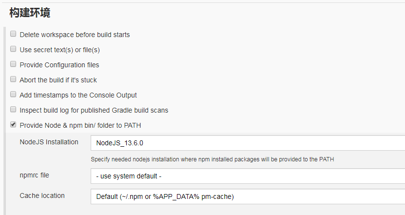

# docker 中部署 nodejs 应用

错在陈醋当成墨，写尽半生纸上酸。

## 参考资料

[Docker + jenkins 自动化部署 Node.js 应用](https://www.jianshu.com/p/47ef444c74da)
[利用 Docker 容器搭建高效的 Node.js 开发环境](https://www.imooc.com/article/19840)
[Docker 化 Node.js Web 应用](https://nodejs.org/en/docs/guides/nodejs-docker-webapp/)
http://101.200.192.219:2227/vuepress/
https://www.imooc.com/article/19840
[Docker 部署 nodejs 应用并使用 PM2 作为守护进程](https://www.cnblogs.com/caidingyu/p/11170524.html)
https://www.jianshu.com/p/bb9f88c1c032?utm_campaign
https://www.jianshu.com/p/f8740c00bbf6
https://www.jianshu.com/p/f8740c00bbf6
http://101.200.192.219:2201/job/zhierblog/
https://blog.csdn.net/chengly0129/article/details/70292953
[pm2 官网](https://pm2.keymetrics.io/docs/usage/quick-start/)
[Docker 部署 nodejs 项目 - 草稿](https://www.jianshu.com/p/5acae24b00cc)

## 遇到的问题

1. 之前有部署的经验：

   部署步骤：

   1. 需要在 linux 上安装 npm，node，pm2
   2. 上传项目到指定目录
   3. 运行 npm install
   4. 运行 pm2 命令
   5. 如果有代码更新，要手动重复执行以上步骤

   这存在的问题：

   1. node_module 很大，而且不应该每个 node server 都有一份 node_module，如果有公用就最好。
      [解决](./docker_node.md#共享模块-node-modules)
   2. 一定要有 node_module 吗，可以像 node client 一样，build 一下吗？
      不行
   3. 可以在 docker 上设置 jenkins，node，pm2 等环境吗？

   优化的方式：

   1. docker 创建一个 node_pm2 镜像，就无需在 linux 上安装 npm，node 和 pm2
   2.

## 搭建环境

复制文件夹的内容还可以用 tar 在解压的方式

## 共享模块 node_modules

用 Docker 搭建 Node.js 开发环境实例——共享模块 node_modules

### 基础设计


1. 先创建 node server 代码存放路径

   ```bash
   cd /
   mkdir /docker_volume
   mkdir /docker_volume/node_server
   mkdir /docker_volume/node_server/test
   cd /docker_volume/node_server/test
   # 存放代码，主要注意package.json
   ```

1. 在 docker 中创建一个容器用来缓存 node_modules，并暴露 /project/node_modules 作为挂载路径。
   ```bash
   # 一定要-dit，否则容器会自动停止
   docker run -dit -v /project/node_modules --name node_modules alpine
   ```
1. `docker attach node_modules`：可以进入容器内部查看情况，可以看到共享卷已经被创建。按组合键 `Ctrl+q`，然后容器会关闭并在后台保持运行，界面也可恢复。
   千万不能用`exit`命令，否则容器关闭的同时会停止运行。如果这个进入容器的命令失败，下面的步骤有新的方案。
1. `docker pull node:13.6.0-alpine`：[拉取 docker 的 node 镜像](./docker_node.md#拉取-docker-的-node-镜像)，这一步可以忽略。
1. `docker run -dit -v /docker_volume/node_server/test:/project --volumes-from node_modules --name project node:13.6.0-alpine`
   `docker run -dit -v /docker_volume/node_server/test:/project -w /project --volumes-from node_modules --name project node:13.6.0-alpine`
   这 2 条命令的区别仅仅在于`-w`，表示执行命令的初始路径，不指定默认`/`根目录。`--volumes-from node_modules`就是挂载共享卷
1. `docker exec -it project npm i lodash`：如果容器指定了`-w`，那么它会在指定路径下运行，当然也可以使用复合命令先跳转到指定目录在执行命令，这里不详细介绍了。
1. `docker exec -it project /bin/sh`：这个命令可以进入 node 容器，可以直接`exit`退出
   ```bash
   [root@zhier test]# docker exec -dit project /bin/bash
   Error response from daemon: OCI runtime exec failed: exec failed: container_linux.go:346: starting container process caused "exec: \"/bin/bash\": stat /bin/bash: no such file or directory": unknown
   ```
   这个错误说明 镜像不包含适合 bash 的风格操作，没有这样的文件或目录，可能你的镜像基于 busybox，它没有 bash shell。但他在/bin/sh 有一个 shell
1. 经过上述步骤，可以观察发现，lodash 已经在 2 个容器中共享。[docker 入门 —— docker 容器数据卷 volumes-from](https://blog.csdn.net/xiaojin21cen/article/details/84564973)，
   从文字可得出个结论：<span style="color: red;">容器之间配置信息的传递，数据卷的生命周期一直持续到没有容器使用它为止。</span>

### 优化

1. 基础中暴露的缺点：

   1. 把数据保存在容器中并不是一种值得推荐的做法，抛开 Docker 守护进程和容器本身的稳定性不说，容器也存在一定被误删的可能性。
   2. 而这种共享卷的方式有个更麻烦的问题是所有想利用这个缓存卷的容器目录结构都必须是 /project/node_modules，这样的限制就显得很不友好了。
   3. 另外用来缓存卷的容器基本上算是浪费了，起不到什么实质性的作用。

2. 创建一个 Docker volume 用来共享容器间的数据。`docker volume create node_modules13`，`docker volume ls`
   1. 首先的好处便是这个 volume 可以叫任意名字，也可以挂载到容器不同的路径下。这里之所以加上“13”是因为不同 npm 版本组织模块的方式会有些不同，这里通过对 node 版本号来进行标注，表示这些模块可用于 Node.js 13 版本。
   2. `docker run -dit -v /docker_volume/node_server/test:/project -w /project -v node_modules13:/project/node_modules --name project node:13.6.0-alpine`
   3. `docker exec -it project npm i underscore`
   4. `docker exec -it project /bin/sh`，可以确认共享模块成功。

### 自动编译/刷新

1. `docker exec -it project npm i nodemon`

### 拉取 docker 的 node 镜像

1.  常用 docker 镜像仓库地址

    - 国内仓库
      <br>[网易](https://c.163yun.com/hub#/m/home/) （需登录）
      <br>[阿里云](https://cr.console.aliyun.com/cn-beijing/instances/images) （需登录）
      <br>[DaoCloud 道客网络](https://hub.daocloud.io/)

    - 国外仓库
      <br>[Docker Hub](https://hub.docker.com/)
      <br>[Quay](https://quay.io/search)

2.  因为我的 jenkins 的 node 版本是 13.6，所以镜像也取相同版本，如图：

    
    
    

## jenkins 部署

1. `docker rm -f project`
1. `docker run -dit -p 2290:8080 -v /docker_volume/node_server/test:/project -w /project -v node_modules13:/project/node_modules --name project node:10.15-alpine`
1. `docker exec -dit project npm install pm2 -g`
1. `docker exec -dit project npm install`
1. `docker exec -dit project node server`
1. `docker exec -dit project pm2-runtime server.js`
1. `ps -ef|grep node`
1. `kill -9 id`
1. `docker exec -it zhierblogAPI pm2 list`
1. `docker exec -dit project pm2 delete server`
1. `cd /var/run`：确定`docker.sock`是否存在
1. `cd /usr/bin`：确定`docker`是否存在
1. `docker run -dit -p 2290:8080 -v /docker_volume/node_server/test:/project -w /project -v node_modules13:/project/node_modules --name project node:13.6.0-alpine`
1. `docker exec -it zhierblogAPI /bin/sh`
1. `cnpm install koa koa-static koa-router --save`，否则不会在 package.json 出现！
   部署的时候发现，jenkins 内部无宿主机的 docker 权限，所以命令执行不了，因为正常的情况是把代码上传到其他服务器，然后用权限用户做这些操作，所以这里需要给 docker 容器赋予宿主机的 docker 命令权限。
   [在 docker 容器中调用和执行宿主机的 docker](https://blog.csdn.net/catoop/article/details/91042007)，这篇文章给我帮助很大！首先这个概念叫 docker in docker
1. `Error: No valid exports main found for '/project/node_modules/koa'`
   node -v:node 版本从 13 改为 10
   [jenkins 安装 nodejs 卡死](https://blog.csdn.net/u012075238/article/details/103052201)
   这时候会出现另一个错误
   [Dockerfile 中 npm 中 Error: could not get uid/gid 问题的解决方法](https://www.cnblogs.com/liyongjian5179/p/9884944.html)
