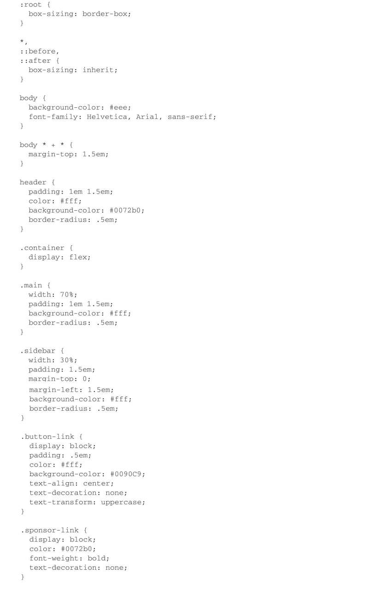
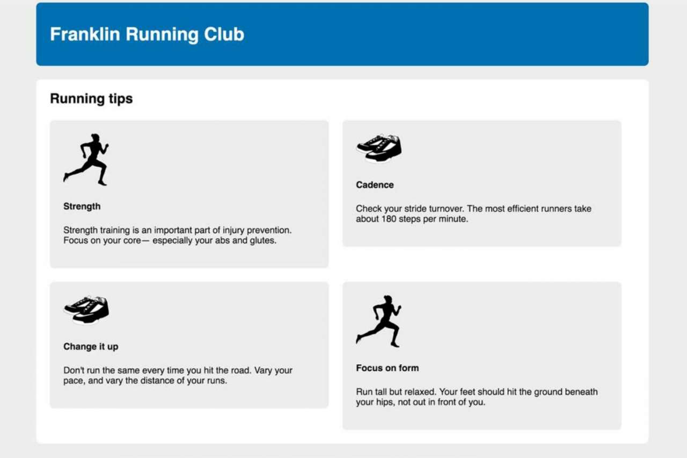
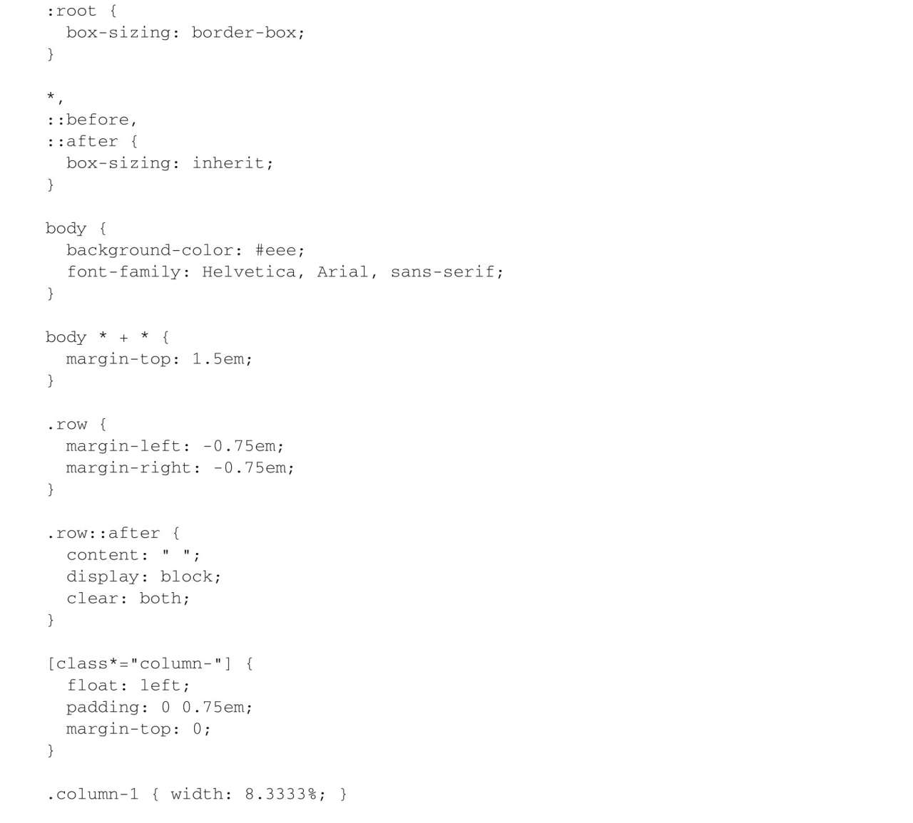
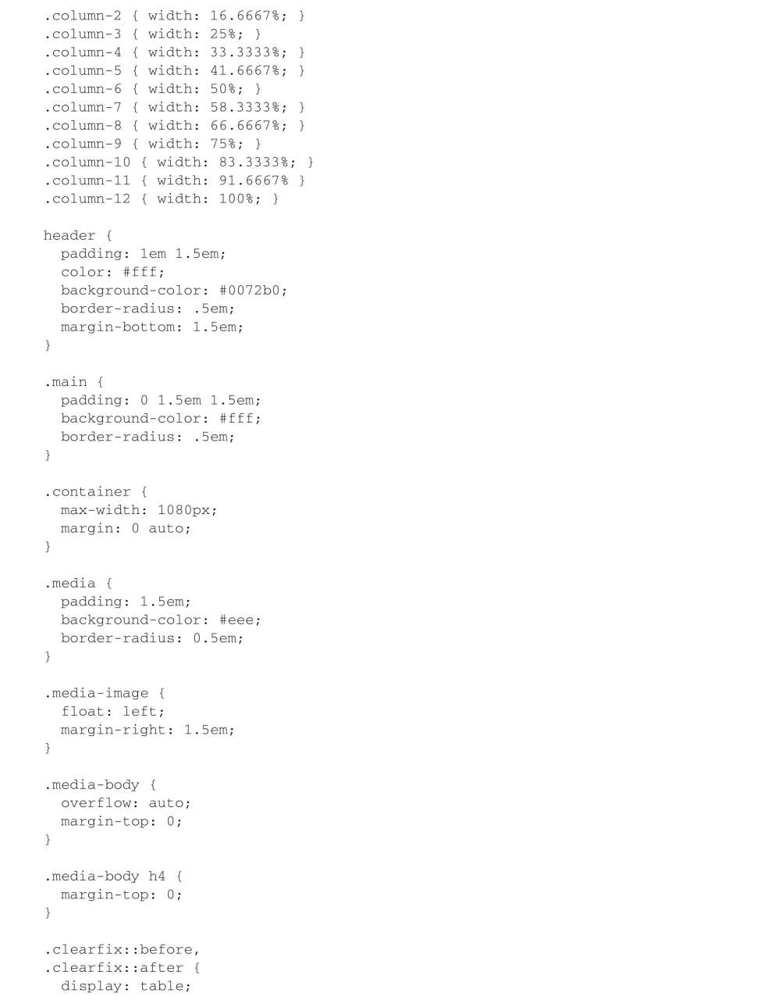
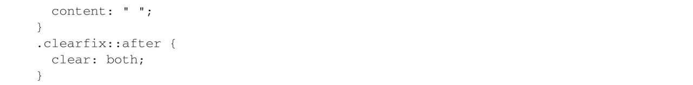
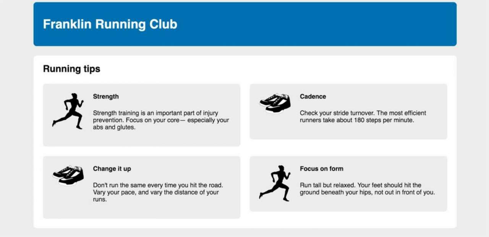

# 深入解析 css

## 层叠，继承，优先级

- css 的 c 代表 cascade，层叠
- css 开发很重要的一点是以可预测的方式书写规则
- 如果你发现有一条规则没有按预期生效，可能是因为另一条规则跟它冲突了，所以需要有层叠的概念。
- 浏览器遵循三个步骤：来源，优先级，源码顺序，来解析网页上每个元素的每个属性。

## 相对单位

不能再刚创建网页时就应用样式，而是等到将要将网页渲染到屏幕上时，才能计算样式。

em 和 rem

为什么`<span style="font-size: 1.2em, padding: 1.2em">`，padding 的实际值会大于 font-size 的实际值？
如果继承 16px，那么 font-size 就是 16 _ 1.2 = 19.2，而 padding 就是 19.2 _ 1.2 = 23.04，浏览器会先计算字号，在根据其算出其余属性值。
rem：相对根元素的字号默认值，不会出现 em 的情况，因为参考值不会变。

## 盒模型

### 给元素设置大小的使用经验

box-sizing:

1. content-box，默认值，这意味着任何指定的宽或高都只会设置内容盒子的大小
2. border-box，height 和 width 会设置内容，内边距以及边框的大小总和

全局设置 boder-box：

```css
*,
::before,
::after {
  box-sizing: border-box;
}
```

引用带样式的第三方组件，会有 css 冲突，怎么解决？

```css
:root {
  box-sizing: border-box;
}
*,
::before,
::after {
  box-sizing: inherit;
}
.third-party-component {
  box-sizing: content-box;
}
```

盒模型通常不会被继承，但是使用 inherit 关键字可以强制继承

<span style="color: red;">新的网站适合这段 css 代码，但是给已有的样式表加入这段 css，就完蛋了。</span>

### 实现垂直居中

要想让百分比高度生效，必须给父元素明确定义一个高度，为什么？
百分比参考的是元素容器块的大小，但是容器的高度通常是由子元素的高度决定的，这样会造成死循环。

如何让一个容器填满屏幕？

1. 最好的方式是使用 100vh
2. 创造等高列

如何垂直居中？

1. 可以用一个自然高度的容器吗？给容器加上相等的上下内边距让内容居中
2. 容器需要制定高度或者避免使用内边距吗？对容器使用 display:table-cell 和 vertical-align:middle
3. 可以用 flexbox 吗？如果不需要 ie9，可用 flexbox
4. 容器里面的内容只有一行文字吗？设置一个大的行高，让它等于理想的容器高度。这样会让容器高度扩展到能够容纳行高。如果内容不是行内元素，可以设置为 inline-block。
5. 容器和内容的高度都知道吗？将内容绝对定位。
6. 不知道内部元素的高度？用绝对定位结合 transform

### 实现等高列

1. css 表格

   ```css
   .wrapper {
     margin-left: -1.5em;
     margin-right: -1.5em;
   }
   .container {
     display: table;
     width: 100%;
     border-spacing: 1.5em 0;
   }
   .main {
     display: table-cell;
     width: 70%;
   }
   .sidebar {
     display: table-cell;
     width: 30%;
     padding: 1.5em;
   }
   ```

   1. `table`的元素宽度不会自动设置为`100%`，要手动书写
   2. 外边距`margin-left: 1.5em;`不会作用于`display: table-cell;`，所以使用`border-spacing: 1.5em 0;`，后遗症就是要加上`.wrapper`(一个额外的 `div`)

   3. flexbox

      不支持 ie 及其之下的浏览器

      ```css
      .container {
        display: flex;
      }
      .main {
        width: 70%;
      }
      .sidebar {
        width: 30%;
        margin-left: 1.5em;
        padding: 1.5em;
      }
      ```

### 负的外边距和外边距的折叠

当顶部或底部的外边距相邻时，就会重叠，产生单个外边距，这种现象就做折叠。

p 默认有 1em 的上下外边距，这是用户代理样式表添加的，但当前后叠加 2 个 p 时，他们的外边距不会产生 1 个 2em 的间距，而是折叠产生 1em 的间隔。

折叠外边距的大小等于相邻外边距中的最大值。

在没有其他 css 影响的情况下，所有相邻的顶部和底部外边距都会折叠，但是左右外边距不会折叠。就像公交车乘客，彼此觉得 1m 是最佳间隔，那么不必间隔 2m 才让彼此满意。

如何防止外边距折叠？

1. 对容器使用 overflow:auto
2. 在 2 个外边距之间加上边框或者内边距
3. 如果容器为浮动元素，内联块，绝对定位或固定定位
4. 当时有 flexbox 布局，弹性布局内的元素之间不会发生外边距折叠，网格布局同理
5. 当元素显示 table-cell 时不具备外边距，此外还有 table-row 和大部分其他表格显示类型，但不包括 table，table-inline，table-caption

### 网页组件之间的一致的间距

使用`* . * {}`去设置堆叠元素之间的外边距。



## 理解浮动

### 双容器模式

```css
.container {
  max-width: 1090px;
  margin: 0 auto;
}
```

### 清除浮动

```css
div {
  clear: both;
}

.clearfix::after {
  display: block;
  content: " "; /* 兼容Opera的bug，其他浏览器""即可 */
  clear: both;
}
```

浮动元素的外边距不会折叠到清除浮动的容器外部，非浮动元素可以，

```css
.clearfix::before,
.clearfix::after {
  display: table;
  content: " "; /* 兼容Opera的bug，其他浏览器""即可 */
}
.clearfix::after {
  clear: both;
}
```

在清除浮动时使用 display:table 能够包含外边距，是利用了 css 的一些特性，创建一个 display:table 元素（或者伪元素），也就在元素内隐式创建了一个表格行和一个单元格。因为外边距无法通过单元格元素折叠，所以达到效果，另外 clear 熟悉只对块级元素生效，所以 display:table-cell；无效，表格是块级元素，单元格不是。



```css
.media {
  float: left;
  width: 50%;
}
.media:nth-child(odd) {
  clear: left;
}
```

作用于 1,3,5...,如果是每行 3 个元素，则 3n+1，如果每行的数目响应式改变，则用 flexbox 或 inline-block

### BFC

1. float:left 或 right，不为 none 即可
2. overflow:hidden,auto 或 scroll，不为 visible 即可
3. display:inline-block,table-cell,table-caption,flex,inline-flex,grid 或 inline0grid
4. position:absolute 或 fixed

我一般用 1，但是案例用了 2，注意 inline-block 和 table-cell 时候元素的宽度问题。

### 网格系统

<span style="color: red;">在一个行容器放置 n 个列容器，列容器的类决定每列的宽度。</span>






### 总结

1. 了解了网格系统的原理
2. 清除浮动的多种方式，以及防止浮动时错行的方式
3. 外边距的处理
4. div 的水平居中

## flexbox

autoprefixer
