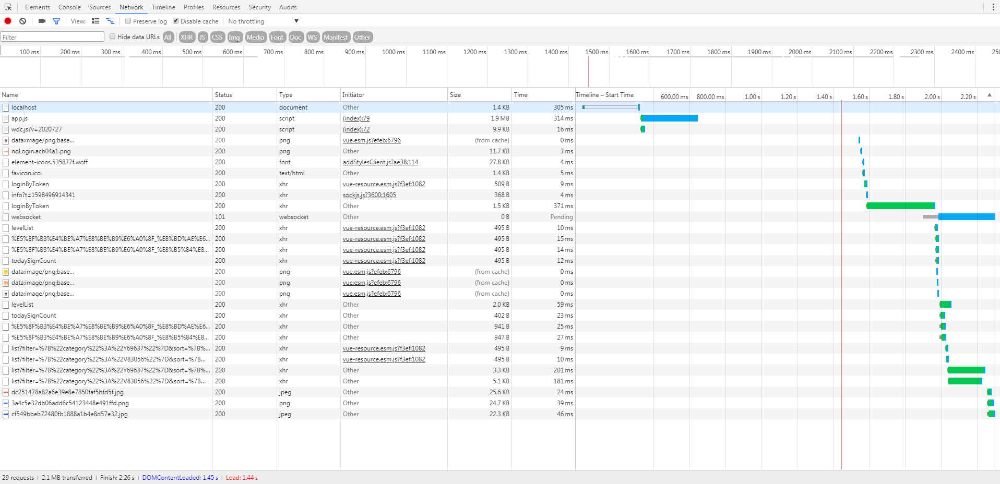

# gmp 链接数过多导致并发量太大问题调优

## 问题现场

华为云服务挂了，网页打不开，看请求数，发现并发量达到 1.5W+。可以提升配置，但是目前的更好做法是减少请求量。

## 解决思路

1. 列出前 100 的请求，逐个判断哪些是瓶颈，可以被优化。这里通过华为云自带服务 graylog。

2. 发现 favicon.ico 可以去除，PC 端网页不需要这个。

3. 文章接口优化，多个文章接口合并成一个，并且指定需要的字段，同时减少网络请求量和网络并发量

4. 栏目接口优化，合并

5. 土建资源 cdn 化，之前没做处理

6. 网页初始化获取了数据，用户异步登录之后又重新获取了数据，这个可以业务优化，根据用户登录情况只取一次数据

7. 华为云图片裁剪功能，减少图片大小

8. 考虑 pwa

   ```js
   console.log("serviceWorker" in navigator);
   ```

   验证存在

9. 统计所有涉及的项目有 gmp-side,gmp-user,gmp-course,gmp-project,gmp-shop,gtj-side,gtj-user,gtj-feedback,gccp-5-user,gccp-5-news,gccp-6-user,gccp-6-news,gmp-hot

10. loginbytoken 和 todaysignCount 和 now

    todaysignCount： false
    now： false

11. 请求获取的时机处理
    之前的设计是页面加载的时候统一处理，

12. 奖品列表
    `portal/prize/list`
    支持多类型奖品

13. 联系产品端，软件打开的时候，隐藏的容器网页初始化不进行接口请求

    这个需要软件开发人员配置提供 2 个接口，一个是网页当前所属容器是否显示，一个是切换页签的时候的广播通知

## 解决流程

### gmp-side


有 29 个请求，2.1M 的请求量，耗时 2.26s

1. 清除 favicon.ico
   ```html
   <link rel="icon" href="data:image/ico;base64,aWNv" />
   ```
2. 合并别名请求接口
