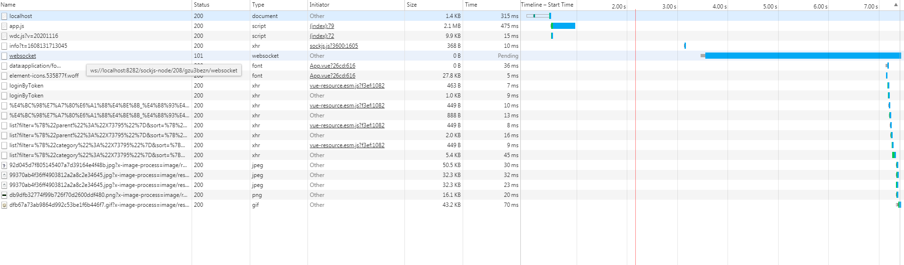

# 提升 PC 端网页的性能

## 减少链接数

### 背景

PC 端软件可以内嵌多个网页，每个网页都是独立的，所以在打开软件的时候，所有网页的请求会一并发出，这是个较大的并发量，但是经过分析，用户在使用软件的时候，很多时候并不是为了浏览内嵌的网页，而是要正常的进行工作，很多内嵌网页基本处于隐藏状态，但是它们却都加载了，但它们基本都软件被关闭都不会被切换显示和浏览使用，所以这部分网页是可以被优化处理的。

### 方法

1. 如何判断网页是否是显示状态

   一开始希望软件提供接口，但是存在 2 个问题：

   1. 软件发版是个很重的操作，而且每个软件都需要有这样的接口，就意味着需要每个软件都发新版。
   2. 即时软件都发新的版本，用户也不一定都会更新，所以还需要设计兼容以前的版本。

   但是如何在网页上就能通过 js 判断是否显示呢？[【第 2037 期】深入了解页面生命周期 API](https://mp.weixin.qq.com/s/R_qYZtK2ZZA_d5FgJXLvwA)给了我灵感，核心就在`document.visibilityState`，经过测试，内嵌网页上支持。所以思路变成刚开始网页判断是否处于隐藏状态，如果是，就不进行 api 请求！这个可以通过一个定时器去处理，
   只要记住在合适的时候注销定时器，防止内存溢出。

## 减少 js 体积

1. 缓存 js（不可行）

   想要像浏览器一样，硬盘缓存，但是因为之前的历史原因，硬盘缓存的设置被去掉了，所以软件打开必然请求 js 文件。

2. js 文件在内嵌网页上共用

   这个思路是针对软件设计的特定方案，因为软件中的内嵌网页是可以互相通信的，而且网页也只运行在软件上，所以没有太多兼容性的顾虑，直接在一个网页中下载公用 js，然后通过广播以字符串的形式发送给其他网页，那问题的核心在于：

   1. 指定的网页如何下载 js 代码，并运行和发送给其他网页，
   2. 公用 js 代码具体包含哪些？vue,vue-router,axios,vue-resource,element-ui，然后怎么把它们分离成独立的第三方 js 文件
   3. 其他网页在收到这些 js 文件的字符串之后，如何正确运行它们
   4. 是否有其他兼容性措施，在上述途径出问题的时候，网页还能正常运行

3. 组件级别的延迟加载

   这个思路取决于[【第 2147 期】交互导入模式](https://mp.weixin.qq.com/s/6O3CYnzbBCHrUWeYG-Yx4Q)

### 步骤

1. 先拆分一个 vue.js，在 gmp-side 和 gmp-project 上看下效果。

   1. 以 gmp-side 和 gmp-project 项目为例，本地正常运行的情况下，gmp 为基础网页，负责下载公共 js，gmp-project 则接收下载好的公共 js 文件，以 vue.js 为例，看效果。

      

      从上图可看出，未移植出 vue 的 npm 包前，app.js 为 2.1M。

   2. 先根据 package.json 和 node_modules 判断 vue 的版本，然后从官网下载对应的 js 文件：[vue@2.6.11.min.js](https://cdn.jsdelivr.net/npm/vue@2.6.11/dist/vue.min.js)，[vue@2.6.11.js](https://cdn.jsdelivr.net/npm/vue@2.6.11/dist/vue.js)，本地连调环境用未压缩版，方便调试。然后通过 jenkins 部署到稳定的 cdn 上。
   3. gmp-side 上通过原生 xhr 下载 vue.js，然后通过`new Function(source.vuejs)(window);`的方式将`Vue`绑定到 window，这一步非常关键。用 eval 是做不到的。另一方面，设定请求为同步请求。

      ```js
      initJS: function() {
        var source = {
        vuejs: ""
        };
        var xhr = new XMLHttpRequest();
        xhr.onreadystatechange = function() {
        if (xhr.readyState == 4) {
            if ((xhr.status >= 200 && xhr.status < 300) || xhr.status == 304) {
            window.onSendVuejs = function() {
                // console.log(source.vuejs.length);
                // console.log(source.vuejs);
                MainInteractor.broadcast("getVuejs",base64.Base64.encode(
                source.vuejs
                ));
            };
            source.vuejs = xhr.responseText;
            MainInteractor.registerCallBack("sendVuejs", "onSendVuejs");
            // eval(source.vuejs);
            new Function(source.vuejs)(window);
            // console.log(Vue);
            console.log(2222);
            } else {
            //
            }
        }
        };
        xhr.open(
        "get",
        "https://aecore-static.glodon.com/prod-ops/gmp-cdn/vue@2.6.11.js",
        // "https://cdn.jsdelivr.net/npm/vue@2.6.11/dist/vue.js",
        false
        );
        xhr.send(null);
        console.log(222222);
      },
      ```

   4. 因为 vue 库在各个地方都有用到，import 语法始终会导致 vue 在没被初始化的时候被别的地方使用，比如 vue-reosure，所以使用
      `import("@common/middleware/qwebmiddleware.js").then(async qtInteractor => {...}`语法，完美解决这个问题。
   5. 通过广播的方式，将 vue.js 文件传递给 gmp-project，但是发现传递失败，原来，vue.js 的内容虽然是字符串，但是有特殊字符，作为参数被广播的时候无法被识别，所以用 base64 加密传递。
   6. gmp-project 的接受方式如下：

      ```js
      initJS2: function() {
          var timer = null;
          var source = {
          vuejs: ""
          };
          window.onGetVuejs = function(str) {
          // console.log(base64.Base64.decode(str));
          clearInterval(timer);
          if (source.vuejs) return
          source.vuejs = base64.Base64.decode(str)
          new Function(source.vuejs)(window);
          window.onFinishVuejs()
          };
          MainInteractor.registerCallBack("getVuejs", "onGetVuejs");
          timer = setInterval(() => {
          MainInteractor.broadcast("sendVuejs", "");
          }, 250);
      }
      ```

      ```js
      // import Vue from "vue";
      import App from "./App";
      /**
       * 引入element-ui控件
       */
      import ElementUI from "element-ui";
      import "element-ui/lib/theme-chalk/index.css";
      /**
       * 引入公共样式
       */
      import "@common/css/gmp/gmp.css";
      /**
       * 引入公共方法库
       */
      import ToolManager from "@common/js/ToolManager.js";
      /**
       * 引入qt中间件
       */
      import("@common/middleware/qwebmiddleware.js").then(
        async qtInteractor => {
          window.onFinishVuejs = function(str) {
            console.log(222);
            /**
             * 引入api
             */
            import("@common/api/index").then(interceptor => {
              Vue.use(ElementUI);

              Vue.prototype.api = interceptor.default;

              Vue.prototype.ToolManager = ToolManager;
              /**
               * 另外建立一条事件线
               */
              Vue.prototype.eventHub = Vue.prototype.eventHub || new Vue();

              /**
               * 初始化
               */
              var app = new Vue({
                el: "#app",
                render: h => h(App),
                created: function() {
                  this.eventHub.$on("Authorization", function(Authorization) {
                    console.log("Authorization", Authorization);
                    Vue.http.headers.common["Authorization"] = Authorization;
                  });
                }
              });
              // 将vue实例传入interceptor中
              interceptor.default.init(app);
            });
          };
          await qtInteractor.default.init({
            // source: "gmp-side"
          });
        }
      );
      ```

   7. 现在看下 gmp-project 的最终请求流量：

      

      上图的 app.js 变成 1.8M，少了 300K，效果明显。

2. 在 vendor.js 中发现 vue-resource，vue，jquery，mock，其中 mock 在生产环境不在需要。发现技巧是搜索`/*!`，任何包开头都会有注释。
   vendor.js 是依赖的第三方库，它上面的内容都可以参照 vue.js 的处理手段。
   这里曾经遇到一个坑，我本打算直接使用这个第三方库，就是 gmp-side 下载这个 vendor.js，然后 gmp-project 接受这个文件，但是发现不行，原因有 2 个：

   - 核对 gmp-side 和 gmp-project 的 vendor.js 的内容是不是一样。这是通过对比得出的，虽然大体看就是一样，但是文件对比显示不一样。
   - 不同网页可能用到的 vendor 内容也不一样，有的用到 vue-router，有的没用到，所以这条路不灵活。

   终上所述，还是决定在 vendor.js 中一个个核对 npm 包，把它们一一下载并上传到稳定的 cdn 源上，之前想用官方 cdn，后来发现很不稳定，不能用于企业级应用，就是 demo 级别的。

3. 接下来要做的是把 eleme-ui，vue，vue-resource，jquery，mock 全部做一样的处理，关键在于怎么设计出满足生产环境和开发环境的架构。这是接下来要处理的。
