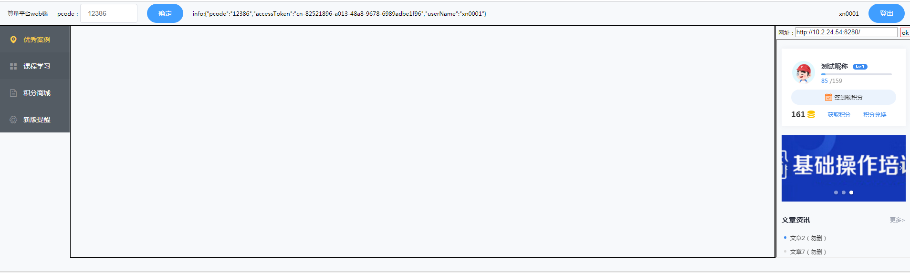

# web 端容器

在 web 端也能加载容器中的网页，核心是容器接口的 web 端实现。

## demo 页面

参照算量平台容器整体布局，如图：



### iframe 的刷新

因为是跨域，所以代码如下：

```html
<iframe
  id="iframe-gmp-side"
  name="iframe-gmp-side"
  :src="common.iframe['gmp-side']"
  style="width: calc(100% - 4px); height: calc(100% - 31px)"
></iframe>
```

```js
// 刷新iframe-gmp-side
// 注意：第二个参数是iframe的name属性值
window.open(src, "iframe-gmp-side", "");
```

### iframe 的刷新机制

必须点确定的按钮的时候，在统一更新 info 的数据，然后在所有 iframe 中进行数据更新，如果使用 v-model 去绑定类似 pcode 这样的数据，那么更新频率就太频繁了。

## 容器接口

### iframe 之间的通信机制

web 容器，自然 demo 页面相当于软件本身，每个 iframe 都相当于一个容器，所以容器之间的通信是通过 iframe 进行中转分发的，因为跨域的问题，通信要如下：

```js
// 父页面
// 父页面向id为iframesId的iframe发送通信
document.getElementById(iframesId).contentWindow.postMessage(obj, "*");
// 父页面接受iframe的通信信息
window.addEventListener("message", e => {
  if (e.origin === "http://example.org") {
    // 仅在数据发送来源自受信任的地址才执行对应操作
  }
  // e.data对应上面的obj
  console.log(e.data);
});
```

:::tip 注意
<span style="color: red;">postMessage 的第一个参数 obj，一定要是可以被 clone 的数据，不一定要是 string，但是如下代码是错误的：</span>

```js
document.getElementById(iframesId).contentWindow.postMessage(
  {
    obj: () => {
      return 123;
    }
  },
  "*"
);
```

:::

### broadcast
