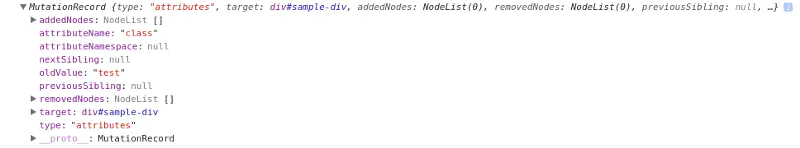

# MutationObserver

## 简介

Mutation Observer API 用来监视 DOM 变动。DOM 的任何变动，比如节点的增减、属性的变动、文本内容的变动，这个 API 都可以得到通知。

概念上，它很接近事件，可以理解为 DOM 发生变动就会触发 Mutation Observer 事件。但是，它与事件有一个本质不同：事件是同步触发，也就是说，DOM 的变动立刻会触发相应的事件；Mutation Observer 则是异步触发，DOM 的变动并不会马上触发，而是要等到当前所有 DOM 操作都结束才触发。

这样设计是为了应付 DOM 变动频繁的特点。举例来说，如果文档中连续插入 1000 个 `li`元素，就会连续触发 1000 个插入事件，执行每个事件的回调函数，这很可能造成浏览器的卡顿；而 Mutation Observer 完全不同，只在 1000 个段落都插入结束后才会触发，而且只触发一次。

Mutation Observer 有以下特点：

1. 它等待所有脚本任务完成后，才会运行，即采用异步方式
2. 它把 DOM 变动记录封装成一个数组进行处理，而不是一条条地个别处理 DOM 变动
3. 它即可以观察发生在 DOM 节点的所有变动，也可以观察某一类变动

## 参考资料

1. [JavaScript 是如何工作的：使用 MutationObserver 跟踪 DOM 的变化](https://www.jianshu.com/p/54d2b5c6b263)

## 代码分析

<<< @/docs/demo/MutationObserver/index.html

## 备选方案

### 轮询（Polling）

最简单和最简单的方法是轮询。使用浏览器 setInterval 方法，可以设置一个任务，定期检查是否发生了任何更改。当然，这种方法会显著降低 web 应用程序/网站的性能。

### MutationEvents

在 2000 年，MutationEvents API 被引入。虽然很有用，但在 DOM 中 的每一次更改都会触发改变事件，这同样会导致性能问题。现在 MutationEvents API 已经被弃用，很快现代浏览器将完全停止支持它。

### CSS animations（重要）

创建一个动画，一旦元素被添加到 DOM 中，动画就会被触发。动画开始的那一刻，animationstart 事件将被触发:如果已经将事件处理程序附加到该事件，那么你将确切地知道元素何时被添加到 DOM 中。动画的执行时间周期应该很小，用户几乎看不到它。
但是只有元素的添加才会触发它，很鸡肋

<<< @/docs/demo/MutationObserver/index2.html

## 总结（个人手写）

Mutation Observer 监听 dom 的一切变化，比如节点的增减、属性的变动、文本内容的变动。它和事件很相近，在 dom 变化的时候就会触发它，但是，事件触发是同步的，它是异步的，它会等到当前所有的 dom 都结束操作之后在统一触发，这样做可以应对 dom 频繁变化引起的性能消耗，比如一次性插入 1000 条 li，则只触发一次。它基本覆盖主流浏览器，也可对不兼容的浏览器采用 polyfill。

和它类似的方案是有 3 个：1.轮询，但耗性能。2.MutationEvents，这个和 Mutation Observer 类似，而且 2000 年开始 api 就被引入，但是没一次 dom 变动都会触发，性能消耗大，很快现代浏览器就会停止支持它。3.CSS animations，这个很特别，它只监听元素增加，它在指定元素内部的所有元素上都添加一个观察不到的动画效果，如果新增元素，它就会自带这个动画，然后通过监听`animationstart`这个动画事件，就能知道哪个元素被新增了。

现在都是 mvvm 框架，这个 api 基本没应用途径了。
