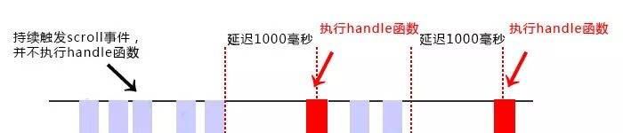
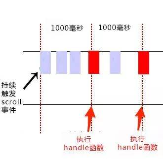

# js 防抖和节流

在进行窗口的 resize、scroll，输入框内容校验等操作时，如果事件处理函数调用的频率无限制，会加重浏览器的负担，导致用户体验非常糟糕。此时我们可以采用 debounce（防抖）和 throttle（节流）的方式来减少调用频率，同时又不影响实际效果。

参考资料：[js 防抖和节流](https://www.cnblogs.com/momo798/p/9177767.html)

## 应用场景

1. 上拉刷新，你想请求几次，你距离底部假如有 100px 的时候，开始请求数据，那你在这 100px 内，你只要上拉了，都会再次请求，可怕，一个 100px 距离，不用节流的话，估计请求 10 多 20 次。
2. 响应式页面，做过商城项目，在 resize 的情况下，不同的屏幕尺寸对应的商品项尺寸不同，间距也不同，之前是实时做修正，会导致页面卡顿。这时候就用防抖。

## 函数防抖

函数防抖（debounce）：当持续触发事件时，一定时间段内没有再触发事件，事件处理函数才会执行一次，如果设定的时间到来之前，又一次触发了事件，就重新开始延时。如下图，持续触发 scroll 事件时，并不执行 handle 函数，当 1000 毫秒内没有触发 scroll 事件时，才会延时触发 scroll 事件。



防抖 debounce 代码：

<<< @/docs/demo/debounce_and_throttle/debounce.js

代码效果：当持续触发 scroll 事件时，事件处理函数 handle 只在停止滚动 1000 毫秒之后才会调用一次，也就是说在持续触发 scroll 事件的过程中，事件处理函数 handle 一直没有执行。

::: tip 使用定时器注意的点

1. timeout 可以同时赋值多个 settimeout 定时器，但是定时器不会因此被清除，只是定时器引用被覆盖，所以一定要清除原有的，再赋值最新的，才能达到清除指定旧的定时器的效果

   ```js
   var timeout = setTimeout(() => {
     console.log(11111);
   }, 1000);
   timeout = setTimeout(() => {
     console.log(222);
   }, 2000);
   // 结果：
   // 11111
   // 222
   ```

2. clearTimeout(timeout)只是清除 timeout 定时器，但是 timeout 还是有定时器的引用值的，不再是 null

   ```js
   var timeout = setTimeout(() => {
     console.log(11111);
   }, 1000);
   clearTimeout(timeout);
   console.log(timeout);
   ```

3. timeout = null 并不会清除定时器，只是修正了 timeout 的定时器引用而已，定时器还是存在的
   ```js
   var timeout = setTimeout(() => {
     console.log(11111);
   }, 1000);
   timeout = null;
   console.log(timeout);
   // 结果
   // 11111
   ```
4. 一个小问题

   `timeout = setTimeout(()=>{console.log(1)}, 1000)`

   `timeout = null` 和`clearTimeout(timeout)`的区别

:::

## 函数节流

函数节流（throttle）：当持续触发事件时，保证一定时间段内只调用一次事件处理函数。如下图，持续触发 scroll 事件时，并不立即执行 handle 函数，每隔 1000 毫秒才会执行一次 handle 函数。
但是要注意，实现方法的不同，会有截然不同的实现效果。具体看之后的代码分析。



函数节流主要有两种实现方法：时间戳和定时器。接下来分别用两种方法实现 throttle~

节流 throttle 代码（时间戳）：

<<< @/docs/demo/debounce_and_throttle/throttle_1.js

代码效果：当高频事件触发时，第一次会立即执行（给 scroll 事件绑定函数与真正触发事件的间隔一般大于 delay，如果你非要在网页加载 1000 毫秒以内就去滚动网页的话，我也没办法 o(╥﹏╥)o），而后再怎么频繁地触发事件，也都是每 delay 时间才执行一次。而当最后一次事件触发完毕后，事件也不会再被执行了 （最后一次触发事件与倒数第二次触发事件的间隔小于 delay，为什么小于呢？因为大于就不叫高频了呀(_╹▽╹_)）。这里有个细节，是最大限度是每 1000ms 时间执行一次，也就是说，如果 1000ms 内 scroll100 次，也只执行一次，如果停止 2000ms，那么这 2000ms 内并不会执行，接着再次 scroll，因为已经没到 1000ms 一次的限制，所以立马又执行一次，并达到 1000ms 一次执行的限制，除非过了这次的 1000ms，否则不会在被触发执行了。可以这么理解，初始化的时候设置了一个时间节点，当触发 scroll 的时候，判断距离这个时间节点的时间是否大于 1000ms，小于就忽略，大于就立即执行函数，然后重置时间节点，所以重置的时间节点不一定是下一个 1000ms，而是满足执行条件的触发 scroll 的时间节点。

节流 throttle 代码（定时器）：

<<< @/docs/demo/debounce_and_throttle/throttle_2.js

代码效果：当触发事件的时候，我们设置一个定时器，再次触发事件的时候，如果定时器存在，就不执行，直到 delay 时间后，定时器执行执行函数，并且清空定时器，这样就可以设置下个定时器。当第一次触发事件时，不会立即执行函数，而是在 delay 秒后才执行。而后再怎么频繁触发事件，也都是最快每 delay 时间才执行一次。当最后一次停止触发后，由于定时器的 delay 延迟，可能还会执行一次函数。可以看出，
时间戳方法和定时器方法的区别就是首次和最后一次执行的触发时机。

节流 throttle 代码（时间戳+定时器）：

<<< @/docs/demo/debounce_and_throttle/throttle_3.js

参考资料中的实现有缺陷，我自己实现了一份。

## 总结

函数防抖：将几次操作合并为一此操作进行。原理是维护一个计时器，规定在 delay 时间后触发函数，但是在 delay 时间内再次触发的话，就会取消之前的计时器而重新设置。这样一来，只有最后一次操作能被触发。

函数节流：使得一定时间内只触发一次函数。原理是通过判断是否到达一定时间来触发函数。

区别： 函数节流不管事件触发有多频繁，都会保证在规定时间内一定会执行一次真正的事件处理函数，而函数防抖只是在最后一次事件后才触发一次函数。 比如在页面的无限加载场景下，我们需要用户在滚动页面时，每隔一段时间发一次 Ajax 请求，而不是在用户停下滚动页面操作时才去请求数据。这样的场景，就适合用节流技术来实现。

## 扩展

lodash debounce
