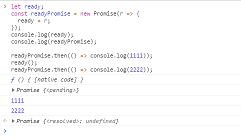

# promise

参考资料：[手写 Promise，手把手过程](https://mp.weixin.qq.com/s/q8JFWNaOZvzeLnsol7wdXw)

## 目标

1. promise 的基本功能
2. promise 的使用场景
3. promise 的实现原理
4. promise 的常见问题
5. promise 的扩展

## promise 的实现原理

### promise 是一个容器

模拟 promise 首先需要实现它的最基本的功能

1. promise 这个容器，用来存储异步或同步执行的结果。
2. 需要状态，来反映同步或者异步处理的阶段，有三种状态
   1. pending：异步或同步的执行阶段，这个时候结果值为 undefined
   2. fulfilled：异步或者同步成功返回了结果的状态，这个时候结果值记录返回的正确结果
   3. rejected：异步或者同步出现错误时的状态，这个时候结果值记录错误的原因
3. 在 promise 对象外部不鞥直接访问到 promise 的状态和结果值
4. 以参数的形式，向 promise 传递执行函数（执行同步或者异步的函数），它会在 promise 的构造函数中执行，也就是初始化 promise 对象的时候就会立即执行的函数。
   这就是为什么我们使用 promise 的时候会有一个工厂函数，专门用于初始化 promise 对象。

代码：

<<< @/docs/demo/promise/promise_v1.js{2}

### promise 内部操作状态和结果值

当执行函数有了结果之后，如何改变容器的状态和结果值？这需要定义操作状态和结果值的方法

1. 值和状态只能改变一次
2. 操作状态和值的方法不向外暴露，内部通过 resolve 方法把状态改为 fulfilled，通过 reject 方法把状态改为 rejected，同时改变状态对应的值。
   这 2 个方法作为参数传给执行函数 executor，由用户决定什么时候通过这两个方法改变状态和值。即在执行函数方法体内按场景使用对应方法。

代码：

<<< @/docs/demo/promise/promise_v2.js{2}

### promise 内部注册回调函数

能存储状态和结果值，也能改变状态和结果值了，但是还需要在相应状态下处理值的方法，即回调函数。

`Promise`有 2 个方法`then`和`catch`注册回调函数：

1. then 有两个参数，第一个参数用来注册状态变为 fulfilled 时候处理结果值的回调，第二个参数用来注册状态变为 rejected 时候处理错误原因的回调，
2. catch 方法注册的回调等同于 then 的第二个函数的作用，其实 catch 就是 then 的语法糖，相当于`then(undefined, function)`
3. `then`和`catch`都返回一个新的 promise 对象
4. 一个 promise 对象可以注册多个回调，这里指的不是链式调用。如：

   ```js
   let p = new Promise((resolve, reject) => {});
   // 各个回调是独立的，返回的新Promise也不是同一个，这相当于Promise状态传递出现了分支
   // 他们处理的状态和结果值必定是一样的，因为promise的状态和结果值处理只会有一次。
   p.then(value => {});
   p.then(value => {});
   p.catch(value => {});

   // 链式调用
   p.then(value => {})
     .then(value => {})
     .then(value => {})
     .then(value => {});
   ```

代码：

<<< @/docs/demo/promise/promise_v3.js{2}

### 需要一个机制，来处理注册的回调

既然注册了回调函数，就需要在特定的时机触发。即需要一个处理回调的机制，这里实现一个 run 方法去处理这个功能。

::: tip 注意
首先需要说明一下：这里说的处理注册的回调函数，并不是说直接执行，要遵循 js 的 event loop 事件循环机制。原生的 Promise 是把回调放入微任务等待，等此次宏任务执行完毕，再执行当前微任务
:::

处理回调的时机有 2 个：

1. 当状态从 pending 变为 fulfilled 或 rejected 的时候，需要处理注册的回调
2. 当状态不是 pending 的时候，注册回调之后立即处理

为了理解链式调用都发生了什么，上例子：

<<< @/docs/demo/promise/demo.js

整了一个好长的链，简单说明一下情况，为了说的清楚，用一个图来解释一下：


示例结论：

1. `then`方法返回的 Promise 对象的状态和结果值和它注册的回调函数返回值有关。
   1. 当回调函数返回值为非 Promise 对象的时候，`then`返回的 Promise 对象的状态是 fulfilled，值为回调函数的返回值。
   2. 当回调函数返回值为 Promise 对象 B 的时候，`then`返回这个 Promise 对象 B 的状态和结果值，继承回调函数返回的 Promise 对象的状态和结果值。
2. 当前环节（当前的`then`和`catch`），没有相应状态的回调函数的时候，状态和结果值会向下传递。

代码：

<<< @/docs/demo/promise/promise_v4.js{2}

::: tip 注意
这里用 setTimeout 来模拟微任务，会和原生的 Promise 在程序中执行顺序有所不同。更合适的应该用 observe 但是麻烦，setTimeout 代码更简洁，大家知道应该放在微任务中就好。自己写的时候尽量用 observe 吧
[简述 JavaScript 事件循环 EventLoop](https://mp.weixin.qq.com/s/egRVR0kwnSchZTks1RD-og)
:::

### 报错处理

先上示例观察下原生 Promise 的错误处理特点：

<<< @/docs/demo/promise/demo_2.js

结论如下：

1. Promise 对象执行函数出错的时候，会把状态改为 rejected，调用自身注册的 onrejected 函数。
2. 如果在 Promise 对象状态改变之后报错，Promise 对象本身不会再处理，更不会抛到对象外。但是会在 nextPromise 对象 中的 onrejected 中得到处理。
3. 如果自身没有注册 onrejected 函数，错误逐级向下传递，直到最后。即，错误会在离它最近的 onrejected 函数中得到处理，这与 rejected 状态和结果值传递方式一致。

代码：

<<< @/docs/demo/promise/promise_v5.js

可以看出，主要通过 try...catch...方式去捕获异常。
还有个小彩蛋：报错和 rejected 状态没有被处理，虽然不会抛出，也不会影响程序。但是会在控制台有红字提示。所以最后把这个提示功能加上,下面的代码调整了一下顺秩序，看着更顺眼点，再添加提示的功能。

## promise 的使用场景

参考资料：[Promise.resolve()与 new Promise(r => r(v))](https://www.cnblogs.com/wjlbk/p/12633337.html)

直接上代码：

<<< @/docs/demo/promise/demo_3.js



<span style="color: red;">这个意义是非常重大的，它表示任何地方，不同文件下，都能按顺序执行代码！异步问题得到解决。</span>

在上一段经典代码，只用于了解执行时机

<<< @/docs/demo/promise/promise_v6.js
