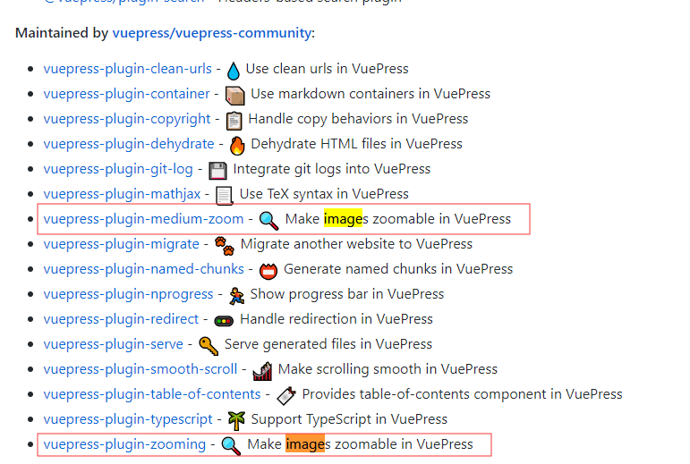
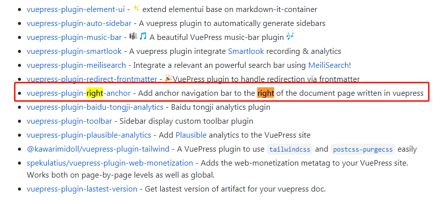
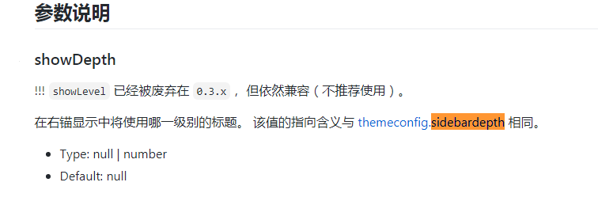

# 进阶技巧

一些优化 vuepress 配置的技巧

## sidebar 的动态配置

`.vuepress/config.js`中`themeConfig.sidebar`配置的是右侧边栏，是数组形式，如下：

```js
sidebar: {
    "/api/": getApiSidebar(),
    "/plugin/": getPluginSidebar(
    "Plugin",
    "Introduction",
    "Official Plugins"
    )
}

function getGuideSidebar(groupA, groupB) {
  return [
    {
      title: groupA,
      collapsable: false,
      children: [
        "",
        "getting-started",
        "directory-structure"
      ]
    },
    {
      title: groupB,
      collapsable: false,
      children: [
        "frontmatter",
        "permalinks"
      ]
    }
  ];
}

```

如果每添加一篇文章就必须手动更改一下配置，这是非常繁琐的，所以加入动态配置的功能，如下：

```js
function getSideBar(obj) {
  return fs
    .readdirSync(obj.path)
    .map(filename => {
      if (filename === "README.md") {
        return ["", "介绍"];
      }
      return filename.slice(0, -3);
    })
    .sort();
}

"/interview/css/": [
    {
      title: "interview——CSS篇",
      collapsable: false,
      children: getSideBar({
        path: path.resolve(__dirname, "../../interview/css")
      })
    }
  ],

```

## sidebar 的冲突问题

如果你希望自动生成一个仅仅包含了当前页面标题（headers）链接的侧边栏，你可以通过 YAML front matter 来实现：

```
---
sidebar: auto
---
```

`.vuepress/config.js`中`themeConfig.sidebar`的全局配置就会因覆盖而失效。

## vuepress 中图片的放大缩小

我在[Awesome VuePress](https://github.com/vuepressjs/awesome-vuepress)中搜索关键字`image`



```js
// config.js
plugins: [
  [
    "vuepress-plugin-zooming",
    {
      // selector: ".my-wrapper .my-img",
      delay: 1000,
      options: {
        bgColor: "black",
        zIndex: 10000
      }
    }
  ]
];
```

## 编译指定目录

jenkins 自动化部署中，灵活指定编译文档以及生成网站的相关配置非常重要，还要注意网站体积和编译速度等性能点。

1. 安装`cross-env`

   `cnpm install cross-env`

2. `package.json`加入对应命令

```js
"scripts": {
  "serve": "vue-cli-service serve",
  "build": "vue-cli-service build",
  "lint": "vue-cli-service lint",
  "docs:dev": "vuepress dev docs",
  "docs:build": "vuepress build docs",
  "build-account": "cross-env folder_name=account npm run docs:build",
  "build-Apollo": "cross-env folder_name=Apollo npm run docs:build",
  "build-B-trsut": "cross-env folder_name=B-trsut npm run docs:build"
},
```

3. `.vuepress/config.js`中做相应处理，具体看`base`,`dest`,`patterns`

```js
var obj = {
  base: folderName ? `/${folderName}/` : "/",
  dest: folderName
    ? `docs/.vuepress/dist/${folderName}`
    : "docs/.vuepress/dist",
  title: folderName ? nameMap[folderName].text : "文档",
  // 处理指定文档，提升处理速度，减小网站体积
  patterns: folderName
    ? [`${folderName}/*.md`, "README.md"]
    : ["**/*.md", "**/*.vue"],

  ...
};
```

## 生成自定义的主题

### 在自定义主题中加入搜索插件

1. 在整体项目下运行`yarn add -D @vuepress/plugin-search`进行插件安装

   ::: tip 提示

   此插件已包含在默认主题中，所以无须再次安装

   - 在`node_modules/vuepress`的`package.json`中可以看到引用了`@vuepress/theme-default`
   - 在`node_modules/@vuepress/theme-default`的`package.json`中可以看到引用了`@vuepress/plugin-search`

   :::

2. 启用插件

   ```js
   // .vuepress/config.js or themePath/index.js
   module.exports = {
     plugins: [
       [
         "@vuepress/search",
         {
           searchMaxSuggestions: 10 // 最多搜索10条，看源码会有更多配置
         }
       ]
     ]
   };
   ```

   ::: tip 提示

   如果使用自定义主题，在`themePath/package.json`

   ```json
   {
     // 只有这样写才能启动themePath/index.js的配置
     "main": "index.js",
     // 这样写只是单纯确认默认布局，不会经过themePath/index.js的处理
     // 所以刚开始一直系统提示：Cannot find module '@SearchBox'
     // "main": "layouts/Layout.vue"
     "dependencies": {
       // 如果不继承默认主题，所有的插件都要自己手动配置，
       // 可以通过在themePath下运行`yarn add -D @vuepress/plugin-search`进行配置
       "@vuepress/plugin-search": "^1.4.0"
     }
   }
   ```

   :::

   ## 支持 webp

   ```js
   // /.vuepress/config.js
   chainWebpack: config => {
     // console.log(config.module);
     // webp Loader
     // 支持webp
     config.module
       .rule("webp")
       .test(/\.webp$/)
       .use("file-loader")
       .loader("file-loader")
       .end();
   },
   ```

   ## 如何覆写主题的插件

   ### banner 上的返回首页的链接改为其他地址

   1. 设置继承默认主题
      ```js
      // `.vuepress/theme/index.js`
      module.exports = {
        // extend: "@vuepress/theme-default"
        // theme: "@vuepress/theme-vue",
        extend: "@vuepress/theme-default",
        globalLayout: "./layouts/GlobalLayout"
        // theme: "@vuepress/theme-vue"
      };
      ```
   2. 查看`theme-defalut`源码，可以发现 banner 插件就是`Navbar.vue`,于是将它 copy 到`.vuepress/theme/components`下，然后就着修改即可，这就实现了组件覆写。
      参考资料：[主题的继承](https://www.vuepress.cn/theme/inheritance.html#%E7%BB%84%E4%BB%B6%E7%9A%84%E8%A6%86%E7%9B%96)

## vuepress 文章右侧出现导航栏

我在[Awesome VuePress](https://github.com/vuepressjs/awesome-vuepress)中搜索关键字`right`



`npm i vuepress-plugin-right-anchor -D`

```js
// .vuepress/config.js
module.exports = {
  // ["vuepress-plugin-right-anchor"],
    [
      "vuepress-plugin-right-anchor",
      {
        showLevel: 2,
        // showDepth: 2, // 显示h2,h3，但是这个参数没用，看源码发现的
        ignore: [
          "/"
          // "/api/"
        ],
        expand: {
          default: true,
          trigger: "hover"
        },
        customClass: "your-customClass",
        disableGlobalUI: false
      }
    ]
};
```

这里遇到几个坑：

# 左侧边栏配置菜单层级失效

默认情况下，侧边栏会自动地显示由当前页面的标题（headers）组成的链接，并按照页面本身的结构进行嵌套，你可以通过 `themeConfig.sidebarDepth` 来修改它的行为。默认的深度是 1，它将提取到 h2 的标题，设置成 0 将会禁用标题（headers）链接，同时，最大的深度为 2，它将同时提取 h2 和 h3 标题。

但是一个侧边栏的子组配置同时支持 sidebarDepth 字段用于重写默认显示的侧边栏深度(1)。

而我在`nav: require("./nav/zh"),`中配置了 `sidebarDepth`导致的。

# 右侧边栏配置菜单层级失效

我按官网配置，但是层级总是跟`markdown.extractHeaders`相关，和我配置的`showDepth`无关。

官网的原话是：



首先看`vuepress-plugin-right-anchor`版本，发现是 0.4.5，所以应该用`showDepth`。

接着看源码，如下：

```js
const { path } = require("@vuepress/shared-utils");

module.exports = (options = {}, ctx) => {
  return {
    enhanceAppFiles: [path.resolve(__dirname, "enhanceAppFile.js")],
    extendPageData($page) {
      const { rightAnchor: frontmatterOptions = {} } = $page.frontmatter;

      $page.rightAnchor = {
        ...options,
        ...frontmatterOptions,
        isIgnore:
          Array.isArray(options.ignore) &&
          options.ignore.includes($page.regularPath),
        expand: {
          default: true,
          trigger: "hover",
          ...options.expand,
          ...frontmatterOptions.expand
        }
      };

      // TODO: Delete below when no longer support `showLevel`
      $page.rightAnchor.showDepth = $page.rightAnchor.showLevel;
    },
    globalUIComponents: options.disableGlobalUI ? [] : ["GlobalRightAnchor"]
  };
};
```

原来是代码问题，`$page.rightAnchor.showDepth = $page.rightAnchor.showLevel`，导致 `showLevel` 才有效。
