# vuepress 引入 calendar 官方 demo

目的是把如下图：

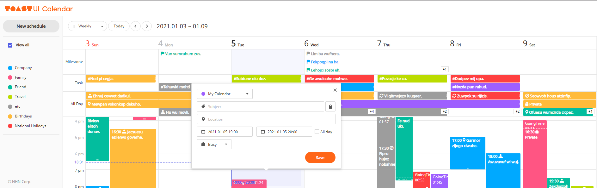

放到我的博客中，方便记录日常，以及之后更重要的东西

## 步骤

1.  经过 vuepress-theme-reco 的主题调研，已经成功配置了 Calendar.vue 用于展示布局。

2.  尝试将 Calendar 第三方插件的基础版放入其中，已经成功。

3.  尝试将 calendar 官方 demo 放入其中

    1.  首先将其拆分成三部分，分别是右侧边栏，上方工具栏和日历，然后在`layout`中统一调用，然后 css 样式在`layout`中统一引用，如图：

        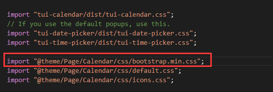

        但是因为红框的`bootstrap.min.css`是个框架级别的 css，会造成全局 css 污染，导致整个博客样式变形，所以修正为下图:

        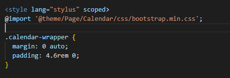

        但是`bootstrap.min.css`还是全局污染了，看了一遍`@import` 的规则后, 进行初步猜测，难道是`@import` 引入外部样式表错过了`scoped style`?又回想到此前看过的前端性能优化文章里面都有提到，在生产环境中不要使用`@import` 引入 css，因为在请求到的 css 中含有`@import`引入 css 的话，会发起请求把`@import`的 css 引进来，多次请求浪费不必要的资源。`@import`并不是引入代码到`<style scoped></style>`里面，而是发起新的请求获得样式资源，并且没有加`scoped`。于是修正为下图：

        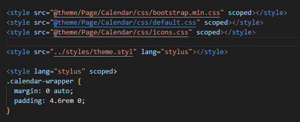

        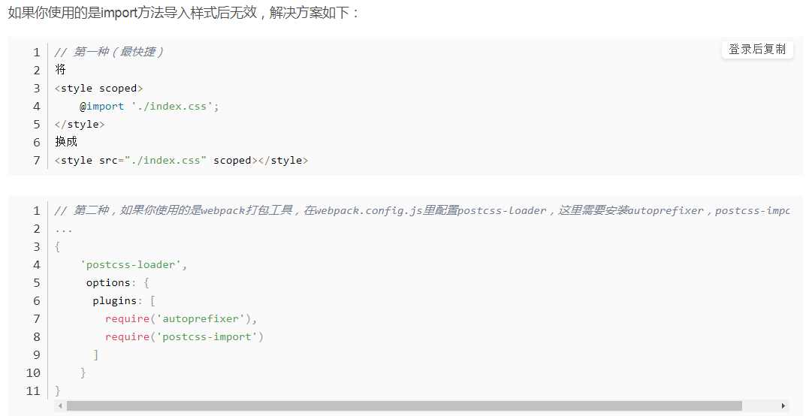

        这时候全局污染问题解决了，但是样式还是有问题，在控制台查看元素的 style，发现导入的样式没生效，以`icons.css`为例，对应的小图标都没有，在尝试放入子组件中，结果发现这个问题修复了，所以这个原因是<span style="color: red;">父组件的 scoped 无法作用到子组件中。</span>但是不可能在所有子组件都通过 scoped 引入 css 样式，这样 css 样式就会有重复的 N 份，很占体积。于是被迫将三个子组件又合并回`layout`中，这样就避免了父组件 css 的 scoped 特性在处理子组件 css 时候的麻烦问题。当然如果这里只是定制化的第三方插件的样式修正，也有父组件 css 穿透子组件 css 的方法，，可以[这样](https://vue-loader-v14.vuejs.org/zh-cn/features/scoped-css.html)，如图：

        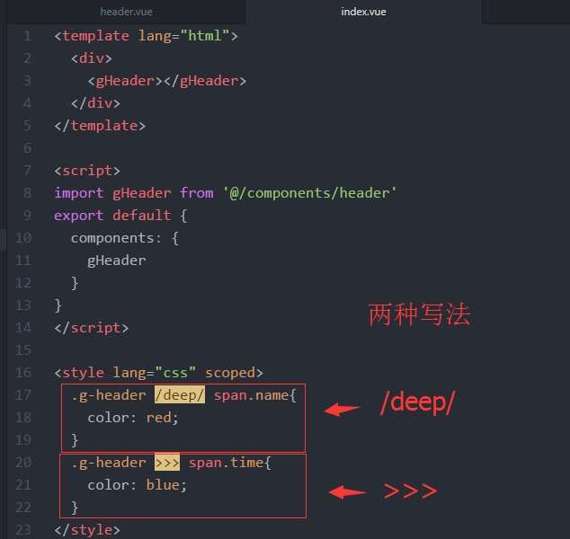

        但是可以看出它有 3 个局限性：1.必须写在 vue 文件的 style 样式中，这样才能被解析。2.只能简单定制化操作，如果是大规模引入第三方插件以及 demo，就想本例一样，工作量太大，不可行。3.它有 vue 的版本要求，旧一点的版本不支持。

        现在 demo 示例的代码都写在`layout`中，但是样式问题还是存在，首先是动态生成的 dom 元素上的 css 样式无法被 scoped！理由如下图：

        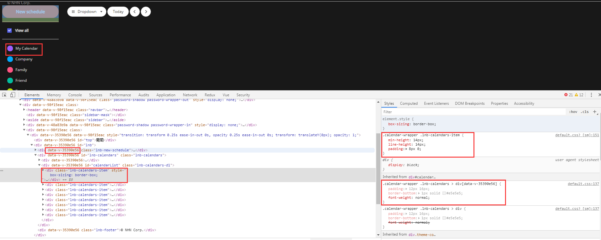

        scoped 会在代码编译的时候给元素打上私有化标记，然后 css 选择器会准确定位到作用的元素，但是动态生成的 dom 上的元素则会跳过打上私有化标记的时机！

        解决思路如下：

        首先观察 calendars 组件需要引入的 css 样式有`tui-date-picker.css`,`tui-time-picker.css`, `tui-calendar.css`, `bootstrap.min.css`, `default.css`, `icons.css`,

        1.  `tui-date-picker.css`,`tui-time-picker.css`, `tui-calendar.css`, `icons.css`4 个有命名空间，所以不会污染全局 css，
        2.  `bootstrap.min.css`会污染全局 css，必须使用`<style src="" scoped></style>`
        3.  `default.css`没有命名空间，而且会污染全局 css，而且其中的`classname`有大量动态生成的代码引用，<span style="color: red;">所以将它加入命名空间</span>。如图：

            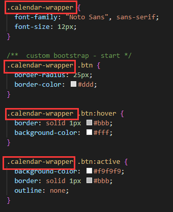

        接着修正为如图：

        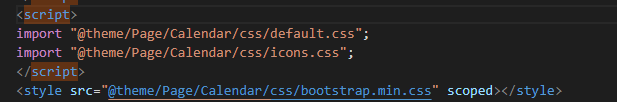

        结果发现还是有 css 冲突，就是`bootstrap.min.css`的优先级有高于`default.css`的样式，但是我希望反过来！首先造成的原因有 2 个：

        1. scoped 的 css 带有选择器的特性，本来优先级就高于普通 css
        2. scoped 的 css 比`import`的 css 更靠后，按顺序看，优先级也更高。

        这里陷入了僵局，难道对`default.css`的内容进行拆分，一部分以 scoped 的方式加载，一部分以 import 的方式？但是这样动态生成的 dom 元素上的 css 样式无法被 scoped 问题和 scoped 的 css 优先级高于 import 的 css 问题会冲突。这时候灵光一闪，终极方案出现，修正如下图：

        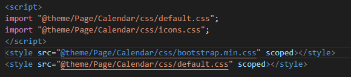

        相信不用解释，也能明白成功的原因了。

        <span style="color: red;">总结起来，引入第三方插件的 demo 示例的 css 样式成功的关键是：1.注意动态生成元素的 css 样式的全局设置，以命名空间做约束。2.注意样式优先级问题，尤其是 scoped 和 import2 种方式的优先级。3.注意父组件和子组件 css 穿透问题。</span>

        现在又遇到个新的 css 问题：在元素的 css 不存在问题的情况下，展示的元素大小有偏差，如图：

        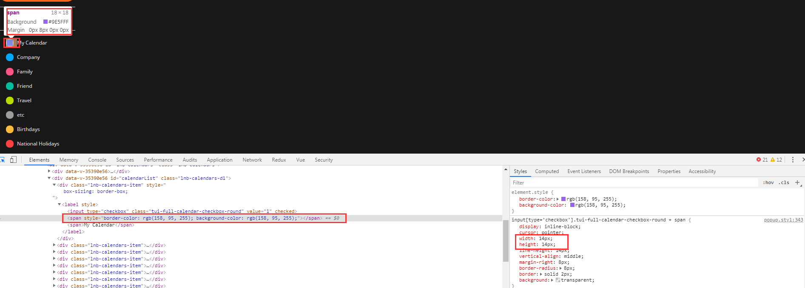

        后来定位原因如下图：

        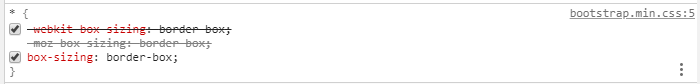

        可以分析出`bootstrap.min.css`是 scoped 的，所以这个样式不会被用到，当然，类似于这样的情况需要经验积累，见到一个修复一个。没别的系统的解决方案。在`default.css`中如下图：

        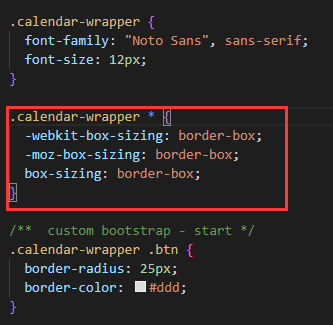

    2.  css 问题处理完成，接下来就是 js 处理，因为要 vue 化，所以 import 和 require 的区别要了解

        `import Calendar from "tui-calendar";`的结果可以在 vue 的生命周期，比如 mounted 中使用，而

        ```js
        var tui = require("tui-calendar");
        window.tui = tui;
        console.log(tui);
        ```

        在 vue 的生命周期无法使用，它的使用场景是在其他 js 文件中引用 tui 的时候。

        引入 npm 包[chance](https://chancejs.com/usage/node.html)的时候，遇到问题的解决方案：[看这里](./calendar.md#js-篇-引入第三方库-chance)

        至此：vuepress 引入 calendar 官方 demo 基本完成！

    3.  开始处理 calendar 插件的基本使用方式，[calendar 官网](https://nhn.github.io/tui.calendar/latest/tutorial-example00-basic)，尝试将数据改为真实数据。

        1. 熟悉 API
           太难了，直接从需求出发，遇到问题在找 API
        2. 想直接使用 calendar 自带的弹窗，但发现不满足要求，使用 element-ui
        3. `index.d.ts的openCreationPopup`——>`index.js`——>`calendar.js的openCreationPopup到created.openCreationPopup到_createWeekView`——>`weekView.js中scheduleCreationPopup`——>`scheduleCreationPopup.hbs`从这里看出弹窗是写死的，所以要想自定义，只能自己实现弹窗控件
        4. 使用 bootstrap 的弹框，正好熟悉 bootstrap，在设定了 alias 之后，发现 popver.js 必须是引用`bootstrap.bundle.min.js`，否则要同时引用`jquery.min.js`,`popper.min.js`,
           `bootstrap.min.js`,<span style="color: red;">popper.min.js 用于设置弹窗、提示、下拉菜单。</span>
        5. 开始选型 UI 框架，elementui 和 bootstrapvue，因为现在主要是功能上线，所以选择 elementui，其实我非常喜欢 bootstrapvue，因为界面更优美，不过这个可以后期加。
        6. elemnt-ui 无法在 vuepress 中使用，报错：`Uncaught Error: Cannot find module 'core-js/library/fn/object/assign'`如图：

           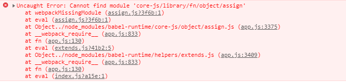

           查找资料：[vuepress 加载 element-ui 时报错 Cannot find module ‘core-js/library/fn/object/assign](https://blog.csdn.net/qq_32855007/article/details/108726430)，
           最后在[Cannot find module 'core-js/library/xxx' when import element-ui #2275](https://github.com/vuejs/vuepress/issues/2275)中发现，原来是 element ui 依赖 core-js 的 2.x 版本，而 web 项目依赖 core-js 的 3.x 版本导致的（错误信息中没有关于 element-ui 的，真坑爹）,改 core-js 的版本是不可能的，安装依赖 yarn add async-validator@1.11.5 / npm install async-validator@1.11.5 就可以解决问题了！

        7. popover 指定地点弹窗问题解决，这个问题耽误我 2 天，算的上极其困难了。

    4.  数据存储到 mysql

        1. 使用 mysql workbench 客户端
        2. 创建了 schedule 表
        3. nodejs 接口服务提供增删查改

    5.  主题处理，和 zhierblog 的主题兼容

        1. demo 中的`src/js/theme/themeConfig.js`就是主题，可以参考其中的属性，也可以在`dist/tui-calendar.js`中搜索`timegridLeft`，这里是更加详细的，也能发现有部分 style 配置在 themeconfig.js 中没写全，可在这里找到最全的。然后在初始化中加入 theme 属性即可。

           ```js
           this.cal = new Calendar("#calendar", {
                theme: {
                    "common.backgroundColor": "black",
                    'week.timegridLeftAdditionalTimezone.backgroundColor': 'black',
                    'week.timegridLeft.backgroundColor': 'black',
                    'month.moreView.backgroundColor': 'black',
                }
           }
           ```

        2. `cal.setTheme`可以实时修正主题样式

    6.  优化程序，减少 cdn 的链接，尽量本地化，然后减少文件体积，现在 3M+，太大了，然后优化代码结构，现在逻辑代码全放在一个 vue 文件里面，太臃肿了。
    7.  竞品分析：[fullcalendar.io DEMO](https://fullcalendar.io/#demos),[fullcalendar.io GITHUB](https://github.com/fullcalendar/fullcalendar)

## 遇到的问题

### css 篇

### vuepress 配置篇

### js 篇——引入第三方库 chance

这本来是个非常简单的事情，看官网以及任何 demo 示例都是如下：

```js
// yarn add chance
var chance = require("chance")();
console.log(chance.string());
```

结果居然不成功，遇到如下问题：

#### chance 引用的是全局模块，而非本地模块

当在 vscode 中，鼠标点击代码中的`var chance = require("chance")();`的`chance`时候，发现它引用的是`C:\Users\用户\AppData\Local\Microsoft\TypeScript\3.5\node_modules\@types\chance`中的`index.d.ts`，只有在把这个文件夹改名`chance2`的时候，才会引用本地模块`node_modules/chance/chance.js`,然后我发现一个是 ts 文件，一个是 js 文件，为了保持一致性，我发现在`index.d.ts`文件的同级目录下的`README.md`文件中记录了`npm install --save @types/chance`,于是运行，发现接下来就正常使用本地模块了。这个其实跟 webpack 的 npm 包查找机制有关，这里不深究。

#### `Uncaught (in promise) ReferenceError: global is not defined`

使用`var chance = require("chance")`后有错误提示`Uncaught (in promise) ReferenceError: global is not defined`，如图：

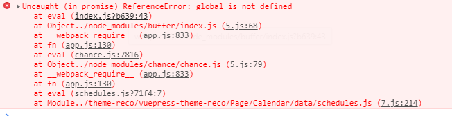

这里耽误 4 个多小时，在 nodejs 中测试没什么问题，但是在 web 上会有，最后在[stackoverflow——Uncaught (in promise): ReferenceError: global is not defined](https://stackoverflow.com/questions/58693720/uncaught-in-promise-referenceerror-global-is-not-defined)中找到灵感，代码如下：

```js
window.global = window;
var chance = require("chance")();
```

:::tip 注意
global 到底是什么，在 nodejs 环境和 web 环境下，它有什么不同？
:::

#### 全局引用 chance 模块

不想在每个文件都加入以下代码：

```js
window.global = window;
var chance = require("chance")();
```

于是使用了`webpack.ProvidePlugin`插件

```js
// config.js
chainWebpack: config => {
  config.plugin("provide").use(webpack.ProvidePlugin, [
    {
      $: "jquery",
      jquery: "jquery",
      jQuery: "jquery",
      "window.jQuery": "jquery",
      moment: "moment",
      Chance: "chance",
      global: [
        path.resolve(
          __dirname,
          "../../",
          "theme-reco/vuepress-theme-reco/helpers/global_basic.js"
        ),
        "global"
      ]
    }
  ]);
};
```

```js
// global_basic.js
export var global = typeof window !== "undefined" ? window : this;
```

```js
var chance = new Chance();
```

:::tip 知识点

1. 一开始我使用`export var global = window`，结果编辑都失败，原因是无法识别 window，如图：

   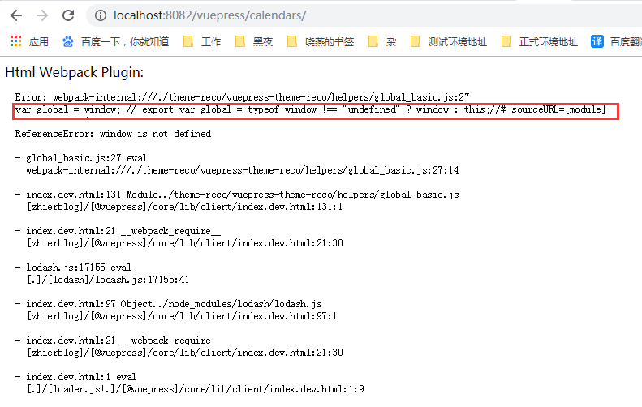

   之后参考`jquery`的写法，如图：

   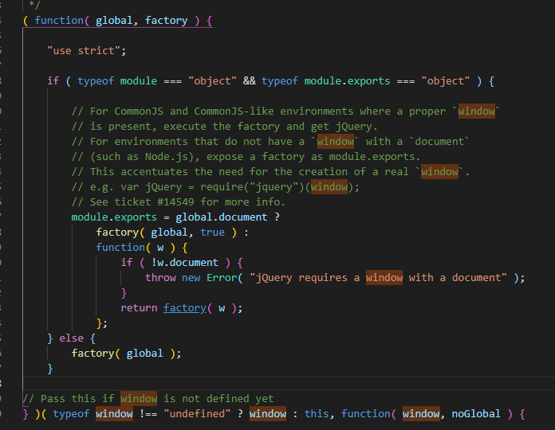

   改成`export var global = typeof window !== "undefined" ? window : this;`才终于编译通过。这里可以得出一个结论：<span style="color: red;">在`webpack.ProvidePlugin`中处理的代码，至少要保证编译不出错，哪怕`export var global = 123`都成！这样运行时出错，至少网页也能加载出来！</span>

2. 看前面的代码能知道，因为按顺序先定义`global`，在引用`chance`库，但是现在同时在`webpack.ProvidePlugin`中设置，webpack 能处理好顺序问题吗？答案是可以，但是原理这里不深究。
3. <span style="color: red;">`webpack.ProvidePlugin`设置`global`的方式值得学习！</span>

:::

#### 全局引用 chance 模块的实例化对象

连代码`var chance = new Chance();`都不想写，想直接在需要的地方`schedule.id = chance.guid();`，这样在控制台直接打印 chance 都是可以的！如图：

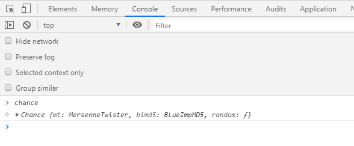

```js
// config.js
config.plugin("provide").use(webpack.ProvidePlugin, [
  {
    $: "jquery",
    jquery: "jquery",
    jQuery: "jquery",
    "window.jQuery": "jquery",
    moment: "moment",
    Chance: "chance",
    global: [
      path.resolve(
        __dirname,
        "../../",
        "theme-reco/vuepress-theme-reco/helpers/global_basic.js"
      ),
      "global"
    ],
    chance: [
      path.resolve(
        __dirname,
        "../../",
        "theme-reco/vuepress-theme-reco/helpers/global.js"
      ),
      "chance"
    ]
  }
]);
```

```js
// global_basic.js
export var global = typeof window !== "undefined" ? window : this;
```

```js
// global.js
export var chance = new Chance();
```

```js
// 业务代码直接使用
schedule.id = chance.guid();
```

:::tip 知识点

1. 之前以为写法会很简单，如下：

```js
// global.js
export var global = typeof window !== "undefined" ? window : this;
export var chance = new Chance();
```

结果出错，如图：

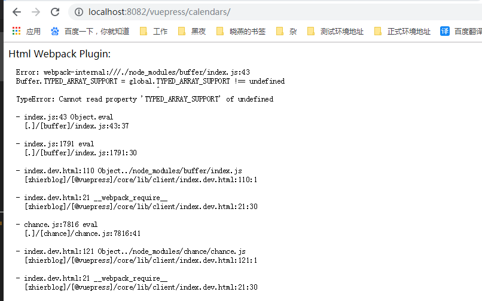

这个错误非常熟悉，就是 global 的问题嘛，但是 global 不是已经被全局化了吗？所以可以确认，在此时，global 并没有被全局化！

那如下代码呢：

```js
var global = null;
if (typeof window !== "undefined") {
  window.global = global;
} else {
  this.global = this;
}
var Chance = require("chance");
export var chance = new Chance();
```

显然想法很天真，不可以，这里似乎陷入了僵局！突然来了一个灵感，就是上述代码设计！测试成功！这里可以得出一个结论：<span style="color: red;">在`webpack.ProvidePlugin`中处理代码，只要保证单个独立文件内容编译不出错，在处理其他文件的时候，就能使用这个编译通过的文件的内容了！</span>
:::

至此，`chance`库的实例化对象全局引用成功！
