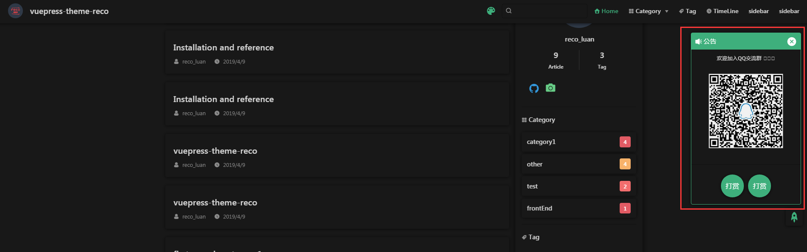
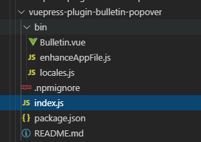

# vuepress-theme-reco 调研

## 目标

优化自己的博客主题，实现 calendar，能会后端交互，数据取自 mysql

## 源码分析

### index.js

1. thmem/index.js：主题文件的入口文件
   ```js
   module.exports = (options, ctx) => ({
     alias() {
       // themeConfig：config.js的themeConfig
       // siteConfig：config.js的整个对象，内含themeConfig
       const { themeConfig, siteConfig } = ctx;
       // resolve algolia
       // console.log(themeConfig);
       // console.log(siteConfig);
       const isAlgoliaSearch =
         themeConfig.algolia ||
         // var a = {a:1}; var b= {b:1}; console.log(a && b); console.log(a || b);
         // {b:1}
         // {a:1}
         // some: 有一个元素满足条件就返回true
         Object.keys((siteConfig.locales && themeConfig.locales) || {}).some(
           base => themeConfig.locales[base].algolia
         );
       return {
         "@AlgoliaSearchBox": isAlgoliaSearch
           ? path.resolve(__dirname, "components/AlgoliaSearchBox.vue")
           : path.resolve(__dirname, "noopModule.js"),
         "@SearchBox": path.resolve(__dirname, "components/SearchBox.vue")
       };
     }
   });
   ```

### enhanceApp.js

1. enhanceApp.js

   ```js
   export default ({ Vue, siteData, isServer, router }) => {
     Vue.use(VueCompositionAPI);
     Vue.mixin(postMixin);
     Vue.mixin(localMixin);
     if (!isServer) {
       addLinkToHead("//at.alicdn.com/t/font_1030519_2ciwdtb4x65.css");
       addScriptToHead("//kit.fontawesome.com/51b01de608.js");
       // 选定代码显示风格，在config.js的codeTheme配置.
       // 但是现在这个方法已经失效，因为它是从cdn去拉取固定主题，但是cdn失效了。
       // 其实可以本地npm包处理主题，但是这会加大包体积。
       // 这里引发一个课题：如果cdn加载不出具体的包，在从自己的服务器加载这个包，要如何处理？
       registerCodeThemeCss(siteData.themeConfig.codeTheme);
     }
     interceptRouterError(router);
   };

   // 支持的prism.js代码风格如下，但是现在有更多风格，具体看官网或者node_modules的prism包内容
   export function registerCodeThemeCss(theme = "tomorrow") {
     const themeArr = [
       "tomorrow",
       "funky",
       "okaidia",
       "solarizedlight",
       "default"
     ];
     const href = `//prismjs.com/themes/prism${
       themeArr.indexOf(theme) > -1 ? `-${theme}` : ""
     }.css`;

     addLinkToHead(href);
   }
   ```

### layouts/Layout.vue

1. 在确认了`index.js`和`enhanceApp.js`之后，切入点就是这个文件了，官网有说明，这是布局组件，必需的。根据这个组件，终于可以深入 vue 组件这条线了。

2. 支持 home 和 homeblog2 个基础布局组件，`<component v-if="$frontmatter.home" :is="homeCom"/>`

### layouts/HomeBlog.vue

1. pagation 组件

```html
<pagation
  class="pagation"
  :total="$recoPosts.length"
  :currentPage="currentPage"
  @getCurrentPage="getCurrentPage"
/>
```

找遍代码也没看到这个组件，估计是全局注入的，果然发现

```js
plugins: ["@vuepress-reco/pagation"];
```

然后在这个插件中发现

```js
const { path } = require("@vuepress/shared-utils");

module.exports = (options, context) => {
  const { perPage = 10 } = options || {};
  return {
    define() {
      return {
        PERPAGE: perPage
      };
    },
    name: "@vuepress-reco/vuepress-plugin-pagation",
    enhanceAppFiles: [
      path.resolve(__dirname, "./bin/enhanceAppFile.js"),
      () => ({
        name: "dynamic-pagation",
        content: `export default ({ Vue }) => {
          Vue.mixin({
            computed: {
              $perPage () { return ${perPage} }
            }
          })
        }`
      })
    ]
  };
};
```

```js
import Pagation from "./Pagation.vue";

export default ({ Vue }) => {
  Vue.component("Pagation", Pagation);
};
```

这里的动态引入全局变量`$perPage`值得学习。

2. `$recoPosts`

这个全局变量来自`posts.js`，它在 enhanceApp.js 中以 vue.mixin 的方式引入。

3. `filterPosts`，过滤博客数据

```js
// 过滤博客数据
export function filterPosts(posts, isTimeline) {
  posts = posts.filter((item, index) => {
    const {
      title,
      frontmatter: { home, date, publish }
    } = item;
    // 过滤多个分类时产生的重复数据
    if (posts.indexOf(item) !== index) {
      return false;
    } else {
      const someConditions =
        home == true || title == undefined || publish === false;
      const boo =
        isTimeline === true
          ? !(someConditions || date === undefined)
          : !someConditions;
      return boo;
    }
  });
  return posts;
}
```

这段代码有 2 点注意：

- 变量的命名：`const { title, frontmatter: { home, date, publish } } = item;`
- 过滤多个分类时产生的重复数据，filter 和 indexOf 的完美运用

3. `sticky`，文章排序，之前只根据文章的 frontmatter.date，现在可以动态指定排序了。

```js
// 排序博客数据
export function sortPostsByStickyAndDate(posts) {
  debugger;
  posts.sort((prev, next) => {
    const prevSticky = prev.frontmatter.sticky;
    const nextSticky = next.frontmatter.sticky;
    if (prevSticky && nextSticky) {
      return prevSticky == nextSticky
        ? compareDate(prev, next)
        : prevSticky - nextSticky;
    } else if (prevSticky && !nextSticky) {
      return -1;
    } else if (!prevSticky && nextSticky) {
      return 1;
    }
    return compareDate(prev, next);
  });
}
```

vue3.0 的知识，目前看是 setup 我还深入了解

1. `setup`返回一个对象，这个对象的属性可以被 vue 组件使用

   1. 在 Vue 3.0 中，我们可以使用新 ref 函数使任何变量在任何地方具有反应性,ref 接受参数并将其包装在具有 value 属性的对象中，然后将其用于访问或更改反应变量的值：
      在对象内部包装值似乎是不必要的，但是需要使行为在 JavaScript 中的不同数据类型之间保持统一。那是因为在 JavaScript 中，原始类型（例如 Number 或）String 是通过值而不是通过引用传递的：

2. `ctx.root`

   1. `ctx.root.$frontmatter`：获取 md 文件中`frontmatter`的设置

   ```md
   ---
   home: true
   # heroImage: /hero.png
   # heroImageStyle: {
   #   maxWidth: '600px',
   #   width: '100%',
   #   display: block,
   #   margin: '9rem auto 2rem',
   #   background: '#fff',
   #   borderRadius: '1rem',
   # }
   # isShowTitleInHome: false
   pageClass: { a: true, b: true }
   actionText: Guide
   actionLink: /views/other/guide
   features:
   - title: Yesterday
       details: 开发一款看着开心、写着顺手的 vuepress 博客主题
   - title: Today
       details: 希望帮助更多的人花更多的时间在内容创作上，而不是博客搭建上
   - title: Tomorrow
       details: 希望更多的爱好者能够参与进来，帮助这个主题更好的成长
   ---
   ```

   ::: tip 注意

   - <span style="color: red;">frontmatter 的修改必须重启服务才能生效！</span>
   - key 可以自定义

   :::

   2. `ctx.root.$site`：

      1. base：来自`.vuepress/config.js`的`base`
      2. description：来自`.vuepress/config.js`的`description`
      3. title：来自`.vuepress/config.js`的`title`
      4. themeConfig：来自`.vuepress/config.js`的`themeConfig`
         1. nav: 除了来自`.vuepress/config.js`，还有 Catefgory 和 Tag 是后期赋值进去的。
      5. <span style="color: red;">`headTags`：来自`.vuepress/config.js`的`head`</span>

   3. `ctx.root.$page`：
      1. frontmatter：和`ctx.root.$frontmatter`目前看一致

3. `isHasKey`：是否网站加密的设计在这里体现，可以从 config.js
4. `isHasPageKey`：是否文章加密的设计在这里体现，可以从 md 文件的`$frontmatter` 确认
5. `LoadingPage`：过渡页面

### comoonents/Common.vue

全局性的，所有的内容都必须经过它，包括身份认证（密码过滤），页面切换的过渡动画，右侧边栏，导航栏等等。真正的内容由`slot`形式嵌套。

### comoonents/Password.vue

1. 动画效果

```css
.inputBox{
    position absolute
    top 40%
    left 0
    right 0
    margin auto
    display block
    max-width:700px;
    height: 100px;
    background: $accentColor;
    border-radius: $borderRadius
    padding-left 20px
    box-sizing border-box
    opacity 0.9
    input{
      width:600px;
      height:100%;
      border:none;
      padding:0;
      padding-left:5px;
      color: #fff;
      background: none;
      outline: none;
      position: absolute;
      bottom:0;
      left 20px
      opacity 0
      font-size 50px
      &:focus {
        opacity 1
      }
      &:focus~span{
        transform: translateY(-80px);
        color $accentColor
        font-size 30px
        opacity:0.8;
      }
      &:focus~button{
        opacity:1;
        width:100px;
      }
    }
    span{
      width:200px;
      height: 100%;
      display: block;
      position: absolute;
      line-height:100px;
      top:0;
      left:20px;
      color: #fff;
      cursor: text;
      transition: 0.5s;
      transform-origin: left top;
      font-size 30px
    }
    button{
      overflow hidden
      width:0px;
      height:98px;
      border-radius: $borderRadius
      position: absolute;
      border 1px solid $accentColor
      background var(--background-color)
      right:1px;
      top 1px
      border:0;
      padding:0;
      color: $accentColor;
      font-size:18px;
      outline:none;
      cursor: pointer;
      opacity:0;
      transition: 0.5s;
      z-index: 1;
    }
  }
```

2. 输入密码页分从上到下分 4 个部分，逐一呈现。

### comoonents/LoadingPage.vue

1. 过渡动画

### comoonents/SidebarButton.vue

1. 使用 css 样式就能控制是移动端还是 PC 端，从而确认是否显示移动端才出现的侧边栏按钮

```css
.sidebar-button
  cursor pointer
  display none
  width 1.25rem
  height 1.25rem
  position absolute
  padding 0.6rem
  top 0.6rem
  left 1rem
  .icon
    display block
    width 1.25rem
    height 1.25rem

@media (max-width: $MQMobile)
  .sidebar-button
    display block
```

### comoonents/Navbar.vue

1. `:src="$withBase($themeConfig.logo)"`

如果你的网站会被部署到一个非根路径，你将需要在 .vuepress/config.js 中设置 base，举例来说，如果你打算将你的网站部署到 https://foo.github.io/bar/，那么 base 的值就应该被设置为 "/bar/" (应当总是以斜杠开始，并以斜杠结束)。

有了基础路径（Base URL），如果你希望引用一张放在 .vuepress/public 中的图片，你需要使用这样路径：/bar/image.png，然而，一旦某一天你决定去修改 base，这样的路径引用将会显得异常脆弱。为了解决这个问题，VuePress 提供了内置的一个 helper \$withBase（它被注入到了 Vue 的原型上），可以帮助你生成正确的路径：

```html

```

值得一提的是，你不仅可以在你的 Vue 组件中使用上述的语法，在 Markdown 文件中亦是如此。

最后补充一句，一个 base 路径一旦被设置，它将会自动地作为前缀插入到 .vuepress/config.js 中所有以 / 开始的资源路径中。

2. `$localePath`

当前页面的 locale 路径前缀，默认值为 /。

### comoonents/Mode.vue

1. `vue-click-outside`

   实现原理：

   1. 先进行 vue 的指令绑定，[自定义指令](https://cn.vuejs.org/v2/guide/custom-directive.html)
   2. 处理触发事件的兼容性问题，是使用 click 还是使用 touchstart
   3. 通过事件冒泡的方式来确定触发事件的元素（或者处于整个事件冒泡中的元素）是否和目标元素相交，来确认是否触发指令绑定的方法。
      这里使用`composedPath`去获取事件冒泡的整个路径，这里可以有兼容性写法，如下：

   ```js
   /*
    * 获取事件冒泡路径，兼容ie11,edge,chrome,firefox,safari
    * @param evt
    * @returns {*}
    */
   function eventPath(evt) {
     const path = (evt.composedPath && evt.composedPath()) || evt.path,
       target = evt.target;

     if (path != null) {
       return path.indexOf(window) < 0 ? path.concat(window) : path;
     }

     if (target === window) {
       return [window];
     }

     function getParents(node, memo) {
       memo = memo || [];
       const parentNode = node.parentNode;

       if (!parentNode) {
         return memo;
       } else {
         return getParents(parentNode, memo.concat(parentNode));
       }
     }

     return [target].concat(getParents(target), window);
   }
   ```

   4. 处理更多细节，比如 isServer，目标元素上的绑定属性等。

2. 主题的设置

   `const rootElement = document.querySelector(':root')`，在根元素上加入参数

### comoonents/AlgoliaSearchBox.vue

AlgoliaSearch 的使用

### comoonents/SearchBox.vue

搜索组件，重要

核心在`const { pages } = this.$site`，pages 中含有所有文章的标题信息。

### comoonents/NavLinks.vue

1. 站点源码外链设计，没有使用简单的 if-else 写法，而是使用正则智能匹配，更有范。

   ```js
   repoLabel () {
     if (!this.repoLink) return
     if (this.$themeConfig.repoLabel) {
       return this.$themeConfig.repoLabel
     }

     const repoHost = this.repoLink.match(/^https?:\/\/[^/]+/)[0]
     const platforms = ['GitHub', 'GitLab', 'Bitbucket']
     for (let i = 0; i < platforms.length; i++) {
       const platform = platforms[i]
       if (new RegExp(platform, 'i').test(repoHost)) {
         return platform
       }
     }

     return 'Source'
   }
   ```

2. 加入标签和分类，使用`@vuepress/plugin-blog`插件，将分类和标签的相关信息直接存在 `$categories` 和 `$tags` 这两个全局变量中。
   在具体 md 文章中，加入：

   ```md
   ---
   title: first page in category1
   date: 2018-12-15
   tags:
     - tag1
   categories:
     - category1
   ---
   ```

   所以就能从`this.$categories`和`this.$tags`取到对应文章列表，reco 专门针对这 2 个属性做了分类页和标签页。

   ```js
   // blogConfig 的处理，根绝配置自动添加分类和标签
   const blogConfig = this.$themeConfig.blogConfig || {};
   const isHasCategory = userNav.some(item => {
     if (blogConfig.category) {
       return item.text === (blogConfig.category.text || "分类");
     } else {
       return true;
     }
   });
   if (!isHasCategory && Object.hasOwnProperty.call(blogConfig, "category")) {
     const category = blogConfig.category;
     const $categories = this.$categories;
     userNav.splice(parseInt(category.location || 2) - 1, 0, {
       items: $categories.list.map(item => {
         item.link = item.path;
         item.text = item.name;
         return item;
       }),
       text: category.text || "分类",
       type: "links",
       icon: "reco-category"
     });
   }
   ```

   上述代码有点意思，可以借鉴。

   最终效果是导航栏会加入下拉选择的 category 和直接点击的 tag

3. `@vuepress/plugin-blog`插件使用 permalink 概念，可以让路由不像文档结构一样，可自定义，[永久链接](https://vuepress.vuejs.org/zh/guide/permalinks.html#%E8%83%8C%E6%99%AF),
   ```js
   [
     "@vuepress/plugin-blog",
     {
       permalink: "/:regular",
       frontmatters: [
         {
           id: "tags",
           keys: ["tags"],
           path: "/tag/",
           layout: "Tags",
           scopeLayout: "Tag"
         },
         {
           id: "categories",
           keys: ["categories"],
           path: "/categories/",
           layout: "Categories",
           scopeLayout: "Category"
         },
         {
           id: "timeline",
           keys: ["timeline"],
           path: "/timeline/",
           layout: "TimeLines",
           scopeLayout: "TimeLine"
         }
       ]
     }
   ],
   ```

### comoonents/NavLink.vue

1. exact

```vue
<router-link
  class="nav-link"
  :to="link"
  v-if="!isExternal(link)"
  :exact="exact"
>
    <reco-icon :icon="`${item.icon}`" />
    {{ item.text }}
  </router-link>
```

```js
computed: {
  link () {
    // 这个方法会一个可用的path，主要处理md/html的后缀，已经hash，还有/结尾的地址
      return ensureExt(this.item.link)
    },
    exact () {
      if (this.$site.locales) {
        return Object.keys(this.$site.locales).some(rootLink => rootLink === this.link)
      }
      return this.link === '/'
    }
  },
```

不加这个，导航栏的首页会一直处于亮显状态

### comoonents/DropdownLink.vue（没懂）

1. 下拉框 css 样式
   分 PC 端浏览器和移动端浏览器的样式区别，非常值得学习
2. 下拉框展示的动画效果

## 知识点

### prism-themes

[prism-themes](https://github.com/PrismJS/prism-themes)
reco 的主题似乎是从 cdn 去获取，这样能减少打包体积，不过 cdn 的地址在变化，而且能用的很少。

### plugin-register-components

`vuepress`是如何内置`plugin-register-components`等组件的？

1. 首先找到 node_modules 中的 vuepress 包，在`package.json`中发现`"main": "index.js",`，于是在`index.js`中发现`module.exports = require('@vuepress/core')`
2. 全局搜索`register-`，也可以发现`@vuepress/core/lib/node/App.js`中有关键代码：

   ```js
   this.pluginAPI
     // internl core plugins
     .use(require("./internal-plugins/siteData"))
     .use(require("./internal-plugins/routes"))
     .use(require("./internal-plugins/rootMixins"))
     .use(require("./internal-plugins/enhanceApp"))
     .use(require("./internal-plugins/palette"))
     .use(require("./internal-plugins/style"))
     .use(require("./internal-plugins/layoutComponents"))
     .use(require("./internal-plugins/pageComponents"))
     .use(require("./internal-plugins/transformModule"))
     .use(require("./internal-plugins/dataBlock"))
     .use(require("./internal-plugins/frontmatterBlock"))
     .use("container", {
       type: "slot",
       before: info => `<template #${info}>`,
       after: "</template>"
     })
     .use("container", {
       type: "v-pre",
       before: "<div v-pre>",
       after: "</div>"
     })
     .use("@vuepress/last-updated", !!shouldUseLastUpdated)
     // 这就是global-components该目录下的组件都会被自动注册为全局组件的原因
     .use("@vuepress/register-components", {
       componentsDir: [
         path.resolve(this.sourceDir, ".vuepress/components"),
         path.resolve(this.themeAPI.theme.path, "global-components"),
         this.themeAPI.existsParentTheme &&
           path.resolve(this.themeAPI.parentTheme.path, "global-components")
       ]
     });
   ```

   解析`plugin-register-components`源码，核心是`enhanceAppFiles`，这是 vuepress 的 OPTION API。

   1. 此选项接受指向增强文件的绝对文件路径或返回该路径的函数，你可以通过此选项做一些应用级别的配置:
   2. 此选项还支持动态代码，允许你使用贴近编译上下文的能力来做更多的事：（插件使用了这个特性）

   ```js
   module.exports = (options, context) => ({
     multiple: true,

     async enhanceAppFiles() {
       const {
         componentsDir = [],
         components = [],
         getComponentName = fileToComponentName
       } = options;
       const baseDirs = Array.isArray(componentsDir)
         ? componentsDir
         : [componentsDir];

       function importCode(name, absolutePath) {
         return `Vue.component(${JSON.stringify(
           name
         )}, () => import(${JSON.stringify(absolutePath)}))`;
       }

       function genImport(baseDir, file) {
         const name = getComponentName(file);
         const absolutePath = path.resolve(baseDir, file);
         const code = importCode(name, absolutePath);
         return code;
       }

       let code = "";

       // 1. Register components in specified directories
       for (const baseDir of baseDirs) {
         if (!isString(baseDir)) {
           continue;
         }
         const files = (await resolveComponents(baseDir)) || [];
         code += files.map(file => genImport(baseDir, file)).join("\n") + "\n";
       }

       // 2. Register named components.
       code += components.map(({ name, path: absolutePath }) =>
         importCode(name, absolutePath)
       );

       code = `import Vue from 'vue'\n` + code + "\n";

       return [
         {
           name: `global-components-${++moduleId}.js`,
           content: code
         }
       ];
     }
   });
   ```

### vuepress-plugin-bulletin-popover

这个插件是个完美的示例！





```js
const { path } = require("@vuepress/shared-utils");

module.exports = (options, context) => ({
  // 这些属性值能在vue中被直接引用
  define() {
    // 来自插件配置的传参
    const { title, width, body, footer } = options || {};
    return {
      WIDTH: width || "260px",
      TITLE: title || "公告",
      BODY: body || [],
      FOOTER: footer || []
    };
  },
  name: "@vuepress-reco/vuepress-plugin-bulletin-popover",
  enhanceAppFiles: [path.resolve(__dirname, "./bin/enhanceAppFile.js")],
  globalUIComponents: "Bulletin"
});
```

`define`：让 vue 组件直接使用一些变量数据。非常有用。
`globalUIComponents`：注入全局 UI
`enhanceAppFiles`：vue 组件全局注入，代码如下：

```js
import Bulletin from "./Bulletin.vue";

export default ({ Vue }) => {
  Vue.component("Bulletin", Bulletin);
};
```

然后就能在`Bulletin`组件完成图中的公告弹窗了，至于`const { title, width, body, footer } = options || {};`就能得到来自插件配置的传参，如下：

```js
plugins: [
    [
      "@vuepress-reco/vuepress-plugin-bulletin-popover",
      {
        body: [
          {
            type: "title",
            content: "欢迎加入QQ交流群 🎉🎉🎉",
            style: "text-aligin: center;"
          },
          {
            type: "image",
            src: "/rvcode_qq.png"
          }
        ],
        footer: [
          {
            type: "button",
            text: "打赏",
            link: "/donate"
          },
          {
            type: "button",
            text: "打赏",
            link: "/donate"
          }
        ]
      }
    ]
  ]
};
```
