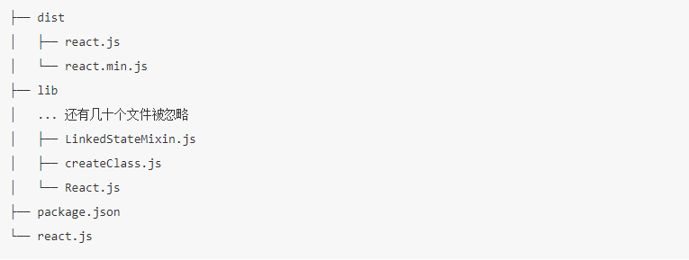

# 深入浅出 webpack

## 入门

## 配置

## 实战

### 3-1 使用 es6

### 3-2 使用 typescript 语音

### 3-3 使用 flow 检测器

### 3-4 使用 SCSS 语音

### 3-5 使用 PostCSS

### 3-6 使用 React 框架

### 3-7 使用 Vue 框架

### 3-8 使用 Angular2 框架

### 3-9 为单页应用生成 HTML

1. 分离 css 样式为单独 css 文件，并且压缩

   1. 安装 extract-text-webpack-plugin

      `npm install -D extract-text-webpack-plugin optimize-css-assets-webpack-plugin cssnano`

   2. webpack.config.json 的相关配置

      ```js
      // webpack.config.json
      const extractCSS = new ExtractTextPlugin({
        // 因为webpack4.x包含了contentash这个关键字段，所以在ExtractPlugin中不能使用contenthash
        // 使用md5:contenthash:hex:8替代
        // 官网：https://www.webpackjs.com/plugins/extract-text-webpack-plugin/ 有描述，但是不详细，要仔细分析
        // https://blog.csdn.net/shenzhen_zsw/article/details/97943217
        // 给输出的 CSS 文件名称加上 hash 值
        // filename: `[name]_[contenthash].css`,
        filename: `[name]_[md5:contenthash:hex:8].css`,
      });
      const OptimizeCssAssetsPlugin = require("optimize-css-assets-webpack-plugin");

      module.exports = {
        module: {
            rules: [
            {
                test: /\.css/, // 增加对 CSS 文件的支持
                // 提取出 Chunk 中的 CSS 代码到单独的文件中
                use: extractCSS.extract({
                //   fallback: "style-loader",
                use: [
                    {
                    loader: "css-loader",
                    options: {
                        // If you are having trouble with urls not resolving add this setting.
                        // See https://github.com/webpack-contrib/css-loader#url
                        url: false,
                        // minimize: true,
                        sourceMap: true,
                    },
                    },
                ], // 压缩 CSS 代码
                }),
            },
            ],
        },
        plugins: [
            extractCSS,
            new OptimizeCssAssetsPlugin({
            cssProcessor: require("cssnano"), //引入cssnano配置压缩选项
            cssProcessorOptions: {
                discardComments: { removeAll: true },
            },
            canPrint: true, //是否将插件信息打印到控制台
            })
        };
      ```

      看如上代码，注意二点：

      1. webpack4.x 与 ExtractTextPlugin 兼容性问题，在 ExtractPlugin 中不能使用 contenthash，使用 md5:contenthash:hex:8 替代。
      2. css-loader 高版本中不在支持 minimize，改为使用`optimize-css-assets-webpack-plugin`和`cssnano`

         

         

2. 自动生成 html 页面，并且指定嵌套在里面的 js 和 css（这里的嵌套是指外链方式），即按需加载

   1. `polyfills.js`文件只应用于兼容老版本浏览器，所以在新版本浏览器上的网页应该不去加载

      1. `polyfills.js`源码
         ```js
         import "babel-polyfill";
         import "whatwg-fetch";
         ```
      2. `webpack.config.js`中单独输出`polyfills.js`的压缩文件，并且文件命名是固定的，区别于其他文件带有`hash`值

         ```js
         // webpack.config.json
         const path = require("path");
         const prefix = "3-9/";
         module.exports = {
           entry: {
             app: `./${prefix}main.js`, // Chunk app 的 JS 执行入口文件
             polyfills: `./${prefix}polyfills.js`,
             google_analytics: `./${prefix}google_analytics.js`
           },
           output: {
             // filename: "[name]*[chunkhash:8].js", // 给输出的文件名称加上 hash 值
             filename: obj => {
               // console.log(obj.chunk.name);
               if (obj.chunk.name === "polyfills") {
                 return `polyfills.bundle.js`;
               } else {
                 return `[name]_[chunkhash:8].js`;
               }
             },
             path: path.resolve(__dirname, `./dist`)
           },
           optimization: {
             splitChunks: {
               cacheGroups: {
                 commons: {
                   // test: /[\\/]node_modules[\\/][^(?=(babel-polyfill|whatwg-fetch))][\\/]/,
                   // test: /[\\/]node_modules[\\/](?!(lodash))/,
                   test: /[\\/]node_modules[\\/]/,
                   name: "vendors",
                   // chunks: "all"
                   chunks(chunk) {
                     // 排除名字为`polyfills`的模块。
                     return chunk.name !== "polyfills";
                   }
                 }
               }
             }
           }
         };
         ```

         如上代码：核心是：

         1. 利用了 output.filename 的 function 形式，和它自带的`[name]`,`[chunkhash]`等特有的值处理
         2. 利用了 optimization 的压缩方式，这个在生产环境下，会自动执行。
         3. entry 中指定了`polyfills`
         4. `polyfills`文件本来会打包到 common.js 中，但是`optimization`压缩的时候指明了不打包`polyfills`chunk。

      3. 使用 html 模板，在里面设置按需加载`polyfills.js`

         ```js
         // webpack.config.js
         const HTMLWebpackPlugin = require("html-webpack-plugin");
         module.exports = {
           plugins: [
             // 使用本文的主角 HTMLWebpackPlugin，一个 HTMLWebpackPlugin 对应一个 HTML 文件
             new HTMLWebpackPlugin({
               title: "hzy",
               template: `./${prefix}template.html`, // HTML 模版文件所在的文件路径
               filename: "index.html", // 输出的 HTML 的文件名称
               excludeChunks: ["polyfills"]
             })
           ]
         };
         ```

         ```html
         <html>
           <head>
             <meta charset="UTF-8" />
             <!--异步加载 Disqus 评论-->
             <!-- <script src="https://dive-into-webpack.disqus.com/embed.js" async></script> -->
             <title><%= htmlWebpackPlugin.options.title %></title>
             <script>
               var modernBrowser = "fetch" in window && "assign" in Object;

               if (!modernBrowser) {
                 var scriptElement = document.createElement("script");

                 scriptElement.async = false;
                 scriptElement.src = "./polyfills.bundle.js";
                 document.head.appendChild(scriptElement);
               }
             </script>
           </head>
           <body>
             <div id="app"></div>
             <!--Disqus 评论容器-->
             <!-- <div id="disqus_thread"></div> -->
           </body>
         </html>
         ```

         如上代码：

         1. 浏览器上先根据兼容性判断是否加载`polyfills.bundle.js`
         2. `HTMLWebpackPlugin`插件的`excludeChunks`是核心设定，定义`polyfills.bundle.js`这个 chunk 不会自动加载到模板 html 中。
         3. `HTMLWebpackPlugin`插件可以为模板传入参数
         4. 参考资料: [HTMLWebpackPlugin](https://github.com/jantimon/html-webpack-plugin#third-party-addons)
         5. 本来使用`html-webpack-inline-source-plugin`可以让模板内联 js 和 css 文件，减少网络请求，但是因为版本兼容性的问题，这个没有成功，也没有深入下去，参考资料：[html-webpack-inline-source-plugin](https://github.com/DustinJackson/html-webpack-inline-source-plugin)

3. 源码
   其实核心代码已经贴出，源码在 faster/test/opensdk/webpack/3-9
4. 坑
   1. 写了 2 个 module 键值对，导致第一个 module 设定的 loader 总是无效
5. 没有设置 babel-loader

### 3-10 管理多个单页应用

    实例化多个`html-webpack-plugin`对象，核心在`chunk`参数，指定引入的chunk

### 3-11 构建同构应用

### 3-12 构建 Electron 应用

### 3-13 构建 Npm 模块

### 3-14 构建离线应用

### 3-15 搭配 NpmScript

### 3-16 检查代码

### 3-17 通过 Node.js API 启动 Webpack

### 3-18 使用 Webpack Dev Middleware

### 3-19 加载图片

```js
module.exports = {
  module: {
    rules: [
      {
        test: /\.png$/,
        use: [
          {
            loader: "url-loader",
            options: {
              // 30KB 以下的文件采用 url-loader
              limit: 1024 * 30,
              // 否则采用 file-loader，默认值就是 file-loader
              fallback: "file-loader"
            }
          }
        ]
      }
    ]
  }
};
```

通过 imagemin-webpack-plugin 压缩图片；
通过 webpack-spritesmith 插件制作雪碧图。

### 3-20 加载 SVG

### 3-21 加载 Source Map

有些从 Npm 安装的第三方模块是采用 ES6 或者 TypeScript 编写的，它们在发布时会同时带上编译出来的 JavaScript 文件和对应的 Source Map 文件，以方便你在使用它们出问题的时候调试它们；

默认情况下 Webpack 是不会去加载这些附加的 Source Map 文件的，Webpack 只会在转换过程中生成 Source Map。 为了让 Webpack 加载这些附加的 Source Map 文件，需要安装 source-map-loader 。 使用方法如下：

```js
module.exports = {
  module: {
    rules: [
      {
        test: /\.js$/,
        // 只加载你关心的目录下的 Source Map，以提升构建速度
        include: [path.resolve(root, "node_modules/some-components/")],
        use: ["source-map-loader"],
        // 要把 source-map-loader 的执行顺序放到最前面，如果在 source-map-loader 之前有 Loader 转换了该 JavaScript 文件，会导致 Source Map 映射错误
        enforce: "pre"
      }
    ]
  }
};
```

::: tip
由于 source-map-loader 在加载 Source Map 时计算量很大，因此要避免让该 Loader 处理过多的文件，不然会导致构建速度缓慢。 通常会采用 include 去命中只关心的文件。
:::

`npm i -D source-map-loader`

## 优化

### 4-1 缩小文件搜索范围

#### 优化 resolve.alias 配置

resolve.alias 配置项通过别名来把原导入路径映射成一个新的导入路径。

在实战项目中经常会依赖一些庞大的第三方模块，以 React 库为例，安装到 node_modules 目录下的 React 库的目录结构如下：



可以看到发布出去的 React 库中包含两套代码：

- 一套是采用 CommonJS 规范的模块化代码，这些文件都放在 lib 目录下，以 package.json 中指定的入口文件 react.js 为模块的入口。
- 一套是把 React 所有相关的代码打包好的完整代码放到一个单独的文件中，这些代码没有采用模块化可以直接执行。其中 dist/react.js 是用于开发环境，里面包含检查和警告的代码。dist/react.min.js 是用于线上环境，被最小化了。

默认情况下 Webpack 会从入口文件 ./node_modules/react/react.js 开始递归的解析和处理依赖的几十个文件，这会时一个耗时的操作。 通过配置 resolve.alias 可以让 Webpack 在处理 React 库时，直接使用单独完整的 react.min.js 文件，从而跳过耗时的递归解析操作。

相关 Webpack 配置如下：

```js
module.exports = {
  resolve: {
    // 使用 alias 把导入 react 的语句换成直接使用单独完整的 react.min.js 文件，
    // 减少耗时的递归解析操作
    alias: {
      react: path.resolve(__dirname, "./node_modules/react/dist/react.min.js") // react15
      // 'react': path.resolve(__dirname, './node_modules/react/umd/react.production.min.js'), // react16
    }
  }
};
```

::: tip
除了 React 库外，大多数库发布到 Npm 仓库中时都会包含打包好的完整文件，对于这些库你也可以对它们配置 alias。

但是对于有些库使用本优化方法后会影响到后面要讲的使用 Tree-Shaking 去除无效代码的优化，因为打包好的完整文件中有部分代码你的项目可能永远用不上。 一般对整体性比较强的库采用本方法优化，因为完整文件中的代码是一个整体，每一行都是不可或缺的。 但是对于一些工具类的库，例如 lodash，你的项目可能只用到了其中几个工具函数，你就不能使用本方法去优化，因为这会导致你的输出代码中包含很多永远不会执行的代码。
:::

#### 优化 module.noParse 配置

`module.noParse` 配置项可以让 Webpack 忽略对部分没采用模块化的文件的递归解析处理，这样做的好处是能提高构建性能。 原因是一些库，例如 jQuery 、ChartJS， 它们庞大又没有采用模块化标准，让 Webpack 去解析这些文件耗时又没有意义。

noParse 是可选配置项，类型需要是 RegExp、[RegExp]、function 其中一个。

例如想要忽略掉 jQuery 、ChartJS，可以使用如下代码：

```js
// 使用正则表达式
noParse: /jquery|chartjs/;

// 使用函数，从 Webpack 3.0.0 开始支持
noParse: content => {
  // content 代表一个模块的文件路径
  // 返回 true or false
  return /jquery|chartjs/.test(content);
};
```

在上面的 优化 resolve.alias 配置 中讲到单独完整的 react.min.js 文件就没有采用模块化，让我们来通过配置 module.noParse 忽略对 react.min.js 文件的递归解析处理， 相关 Webpack 配置如下：

```js
const path = require("path");

module.exports = {
  module: {
    // 独完整的 `react.min.js` 文件就没有采用模块化，忽略对 `react.min.js` 文件的递归解析处理
    noParse: [/react\.min\.js$/]
  }
};
```

::: tip
注意被忽略掉的文件里不应该包含 import 、 require 、 define 等模块化语句，不然会导致构建出的代码中包含无法在浏览器环境下执行的模块化语句。
:::

### 4-2 使用 DllPlugin

#### Dllplugin 和 CommonsChunkPlugin 的区别

参考资料：[webpack 使用 DllPlugin 和 DllReferencePlugin 提取公共插件提升打包效率](https://www.jianshu.com/p/deedd775eec3),[webpack 分离第三方库(CommonsChunkPlugin 并不是分离第三方库的好办法 DllPlugin 科学利用浏览器缓存）](https://www.cnblogs.com/lihuanqing/p/6979518.html)

源码在 faster/test/opensdk/webpack/4-2

项目在发布测试和生产环境前需要打包，而 webpack 默认使用 commonChunkPlugin，该插件虽然可以将第三方库提取到 vendor 中，但每次打包时都会重新被打包一次，而这些第三方库一般是不会产生变化的，这也就意味着每次打包时都会花费一部分时间来生成相同的 vendor.js 文件，这无异于是一种资源浪费。
好在 webpack 中提供了 DllPlugin 和 DllReferencePlugin 来提升打包效率。参考源码 4-2 会发现打包速度从 8S 提升到 2S。

相同点：第三方库是比较稳定的，不会轻易改变，利用浏览器缓存后，用户再次加载页面会减少服务器请求，提高速度优化体验。提取多个应用（入口）公共模块的作用和他类似，公共部分会被缓存，所有应用都可以利用缓存内容从而提高性能。

不同点：
分离第三方库就能利用浏览器换缓存了么？

同样显而易见是否定的，导致无法利用缓存的因素有很多，比如最明显的有可能你每次分离的库文件重新打包都会得到不同的名称，这个比较容易发现，再比如说后台的同事给 js 文件设置的缓存过期时间为 0，这就尴尬了，但 0 就不能利用缓存了么？并不是，只要文件是完全不变的，注意是完全不变，包括修改时间，依然会利用缓存，性能飞起。想利用缓存必须先了解缓存，这里简单提一下：

浏览器缓存机制是什么样的？

HTTP1.1 给的策略是使用 Cache-control 配合 Etag，
Cache-control 设置举例：
'Cache-Control': 'public, max-age=600'，
max-age 即过期时间，如果已过期的话，还会查看 Etag，
ETag 的值：
Apache 中，ETag 的值默认是对文件的索引节（INode），大小（Size）和最后修改时间（MTime）进行 Hash 后得到的。
如果 Etag 相同，依然不会请求新资源，而会使用以前的文件。

CommonsChunkPlugin 到底是用来干什么的？

字面理解，提取公共包，公共包那就是不只一个地方使用喽，单页应用（单入口）的库只有他自己使用，不能算公共包吧？这个插件提取的公共包，每次是会重新打包的（Etag 会不同），无论是节约打包时间，（虽然微不足道的时间但毕竟是无用功：库根本没变么），还是对浏览器缓存的利用（万一 max-age 过期了你就放弃缓存了么？）都不是好的方案。最佳方案浮出水面：DllPlugin

DllPlugin 有什么优势？

只对库文件打包一次。也就是说，只要库文件不变，只需要打包一次，以后再打包业务代码和库文件没关系啦，这样一来真正做到了库文件永远是那个库文件，只要库文件不变，缓存永远有效（Etag 不变），打起包来把库丢到脑后，神清气爽。

注意：

1. <span style="color: red;">在生产环境一定要压缩代码</span>
2. 存在一个小问题，那就是开发环境访问项目的话也会存在一个引用 vendor.dll.js 的 script 标签，我们应该只在构建生产环境的 HTML 时才需要引入此资源。

#### Babel 之 babel-polyfill、babel-runtime、transform-runtime 详解

参考资料：[Babel 之 babel-polyfill、babel-runtime、transform-runtime 详解](https://www.cnblogs.com/L-xmin/p/12493824.html),[babel 里 transform-runtime 插件的作用](https://segmentfault.com/a/1190000020335546?utm_source=tag-newest)

babel 默认只转换新的 JavaScript 语法，比如箭头函数、扩展运算（spread）。

不转换新的 API，例如 Iterator、Generator、Set、Maps、Proxy、Reflect、Symbol、Promise 等全局对象，以及一些定义在全局对象上的方法（比如 Object.assign）都不会转译。如果想使用这些新的对象和方法，则需要为当前环境提供一个垫片（polyfill）。

1. babel-polyfill

目前最常用的配合 Babel 一起使用的 polyfill 是 babel-polyfill，通过改写全局 prototype 的方式实现，它会加载整个 polyfill，针对编译的代码中新的 API 进行处理，并且在代码中插入一些帮助函数，比较适合单独运行的项目。

babel-polyfill 解决了 Babel 不转换新 API 的问题，但是直接在代码中插入帮助函数，会导致污染了全局环境，并且不同的代码文件中包含重复的代码，导致编译后的代码体积变大。虽然这对于应用程序或命令行工具来说可能是好事，但如果你的代码打算发布为供其他人使用的库，或你无法完全控制代码运行的环境，则会成为问题。

一般浏览器不支持一个新的 API，那它可能就是全部新 API 都不支持，所以，可以在 index.html 页面进行简单的判断去确定是否要加载 polyfill.js，然后将 polyfill.js 文件单独打包出来，这个方案的局限性是污染了全局代码，而且做不到按需加载，即无法 tree shaking，但是对于一般浏览器，它更友好，代码量更少，只是对于老版本浏览器，会稍微不友好点而已。
参考源码在 faster/test/opensdk/webpack/3-9

<span style="color: red;">因为这是一个 polyfill （它需要在你的源代码之前运行），我们需要让它成为一个 dependency，而不是一个 devDependency 。</span>
`npm install --save babel-polyfill`

直接在代码中 require，或者在 webpack 的 entry 中添加，也可以在 babel 的 env 中设置 useBuildins 为 true 来开启。

参考资料：[webpack 之 polyfill 踩坑之路](https://www.cnblogs.com/lovecode3000/p/12499148.html)

2. babel-runtime

babel-runtime 插件能够将这些工具函数的代码转换成 require 语句，指向为对 babel-runtime 的引用。每当要转译一个 api 时都要手动加上 require('babel-runtime')。简单说 babel-runtime 更像是一种按需加载的实现，比如你哪里需要使用 Promise，只要在这个文件头部 require Promise from 'babel-runtime/core-js/promise' 就行了

不过如果你许多文件都要使用 Promise，难道每个文件都要 import 一遍不成？

3. babel-plugin-transform-runtime

为了方便使用 babel-runtime，解决手动 require 的苦恼。它会分析我们的 ast 中，是否有引用 babel-rumtime 中的垫片（通过映射关系），如果有，就会在当前模块顶部插入我们需要的垫片。

transform-runtime 是利用 plugin 自动识别并替换代码中的新特性，你不需要再引入，只需要装好 babel-runtime 和 配好 plugin 就可以了。

好处是按需替换，检测到你需要哪个，就引入哪个 polyfill，如果只用了一部分，打包完的文件体积对比 babel-polyfill 会小很多。而且 transform-runtime 不会污染原生的对象，方法，也不会对其他 polyfill 产生影响。

所以 transform-runtime 的方式更适合开发工具包，库，一方面是体积够小，另一方面是用户（开发者）不会因为引用了我们的工具，包而污染了全局的原生方法，产生副作用，还是应该留给用户自己去选择。

有些第三方库可能也会依赖 Promise，他们却不会被 babel 处理，这时就需要从 window 上获取，所以还是需要挂载到 window 上，而且这样也是符合 ES6 标准的。
一个简短的写法如下：

```js
// 如果开启了babel-plugin-transform-runtime，则
window.Promise = window.Promise || Promise;
```

`npm install --save-dev babel-plugin-transform-runtime`
`npm install --save babel-runtime`

```js
// .babelrc
{
  "plugins": [
    ["transform-runtime", {
      "helpers": false,
      "polyfill": false,
      "regenerator": true,
      "moduleName": "babel-runtime"
    }]
  ]
}
```

优点

- 不会污染全局变量

- 多次使用只会打包一次

- 依赖统一按需引入,无重复引入,无多余引入

缺点

- <span style="color: red;">不支持实例化的方法，例 Array.includes(x) 就不能转化</span>

- 如果使用的 API 用的次数不是很多，那么 transform-runtime 引入 polyfill 的包会比不是 transform-runtime 时大

- 随着应用的增大，相同的 polyfill 每个模块都要做重复的工作（检测，替换），虽然 polyfill 只是引用，编译效率不够高效。

4. 比较

babel-polyfill 与 babel-runtime 相比虽然有各种缺点，但在某些情况下仍然不能被 babel-runtime 替代， 例如，

[1, 2, 3].includes(3)，Object.assign({}, {key: 'value'})，Array，Object 以及其他”实例”下 es6 的方法，babel-runtime 是无法支持的， 因为 babel-runtime 只支持到 static 的方法。

#### 用了 Dllplugin，是否还需要 Babel 之 babel-polyfill、babel-runtime、transform-runtime

Dllplugin 是处理第三方库的，polyfill 只是其中的一部分而已，另外用它能更好处理新旧浏览器按需加载 polyfill 的问题，而且更能利用浏览器缓存优势。

Babel 之 babel-polyfill、babel-runtime、transform-runtime 仍然有用到的地方，不过看自己的代码习惯了。

### 4-3 使用 HappyPack

参考资料：[happy pack 原理解析](https://segmentfault.com/a/1190000021037299?utm_source=tag-newest)(源码太深了，看不懂)，[点满 webpack 技能点，让你的打包速度提效 90%](https://www.cnblogs.com/duanlibo/p/12532569.html)

参考源码在 faster/test/opensdk/webpack/4-3

由于有大量文件需要解析和处理，构建是文件读写和计算密集型的操作，特别是当文件数量变多后，Webpack 构建慢的问题会显得严重。 运行在 Node.js 之上的 Webpack 是单线程模型的，也就是说 Webpack 需要处理的任务需要一件件挨着做，不能多个事情一起做。

文件读写和计算操作是无法避免的，那能不能让 Webpack 同一时刻处理多个任务，发挥多核 CPU 电脑的威力，以提升构建速度呢？

HappyPack 就能让 Webpack 做到这点，它把任务分解给多个子进程去并发的执行，子进程处理完后再把结果发送给主进程。

由于 JavaScript 是单线程模型，要想发挥多核 CPU 的能力，只能通过多进程去实现，而无法通过多线程实现。

::: tip

1. 本质上， happypack 是用通过 js 的多进程来实现打包加速，需要注意的是，创建子进程和子进程和主进程之间通信也是有开销的，当你的 loader 很慢的时候，可以加上 happypack，否则，可能会编译的更慢！
2. 在源码中，设置进程池为 3，打包速度从 7s 降到 5s，但是改为 5 的时候，变成 7s。所以一定要掌握度。
3. webpack4 已经加入 thread-loader，作用类似 happypack，但是配置更简单。如果你使用的版本是<4，那么还是可以继续使用 HappyPack。
4. 一定要配置 thread-loader,HappyPack,和裸奔的三套配置，然后对比选出对项目最优的打包配置，因为根据项目的复杂程度，每个都有对应的优势，要多比对。

:::

`npm install -D happypack`

```js
const path = require("path");
const ExtractTextPlugin = require("extract-text-webpack-plugin");
const HappyPack = require("happypack");
const { CleanWebpackPlugin } = require("clean-webpack-plugin");
const happyThreadPool = HappyPack.ThreadPool({ size: 3 });
const prefix = "4-2/";

module.exports = {
  // JS 执行入口文件
  entry: {
    main: `./${prefix}main.js`
  },
  output: {
    // 把所有依赖的模块合并输出到一个 bundle.js 文件
    filename: "[name].js",
    // 输出文件都放到 dist 目录下
    path: path.resolve(__dirname, "./dist")
  },
  module: {
    rules: [
      {
        test: /\.js$/,
        // 把对 .js 文件的处理转交给 id 为 babel 的 HappyPack 实例
        use: ["happypack/loader?id=babel"],
        // 排除 node_modules 目录下的文件，node_modules 目录下的文件都是采用的 ES5 语法，没必要再通过 Babel 去转换
        exclude: path.resolve(__dirname, "node_modules")
      },
      {
        // 把对 .css 文件的处理转交给 id 为 css 的 HappyPack 实例
        test: /\.css$/,
        use: ExtractTextPlugin.extract({
          use: ["happypack/loader?id=css"]
        })
      }
    ]
  },
  plugins: [
    new CleanWebpackPlugin(),
    new HappyPack({
      // 用唯一的标识符 id 来代表当前的 HappyPack 是用来处理一类特定的文件
      id: "babel",
      // 如何处理 .js 文件，用法和 Loader 配置中一样
      loaders: ["babel-loader?cacheDirectory"],
      // 使用共享进程池中的子进程去处理任务
      threadPool: happyThreadPool
    }),
    new HappyPack({
      id: "css",
      // 如何处理 .css 文件，用法和 Loader 配置中一样
      loaders: ["css-loader"],
      // 使用共享进程池中的子进程去处理任务
      threadPool: happyThreadPool
    }),
    new ExtractTextPlugin({
      filename: `[name].css`
    })
  ],
  devtool: "source-map" // 输出 source-map 方便直接调试 ES6 源码
};
```

`npm install --save-dev thread-loader`

### 4-4 使用 ParallelUglifyPlugin

在使用 Webpack 构建出用于发布到线上的代码时，都会有压缩代码这一流程。 最常见的 JavaScript 代码压缩工具是 UglifyJS，并且 Webpack 也内置了它。

用过 UglifyJS 的你一定会发现在构建用于开发环境的代码时很快就能完成，但在构建用于线上的代码时构建一直卡在一个时间点迟迟没有反应，其实卡住的这个时候就是在进行代码压缩。

由于压缩 JavaScript 代码需要先把代码解析成用 Object 抽象表示的 AST 语法树，再去应用各种规则分析和处理 AST，导致这个过程计算量巨大，耗时非常多。

ParallelUglifyPlugin 就做了这个事情。 当 Webpack 有多个 JavaScript 文件需要输出和压缩时，原本会使用 UglifyJS 去一个个挨着压缩再输出， 但是 ParallelUglifyPlugin 则会开启多个子进程，把对多个文件的压缩工作分配给多个子进程去完成，每个子进程其实还是通过 UglifyJS 去压缩代码，但是变成了并行执行。 所以 ParallelUglifyPlugin 能更快的完成对多个文件的压缩工作。

`npm i -D webpack-parallel-uglify-plugin`

```js
const path = require("path");
const DefinePlugin = require("webpack/lib/DefinePlugin");
const ParallelUglifyPlugin = require("webpack-parallel-uglify-plugin");

module.exports = {
  plugins: [
    // 使用 ParallelUglifyPlugin 并行压缩输出的 JS 代码
    new ParallelUglifyPlugin({
      // 传递给 UglifyJS 的参数
      uglifyJS: {
        output: {
          // 最紧凑的输出
          beautify: false,
          // 删除所有的注释
          comments: false
        },
        // 在UglifyJs删除没有用到的代码时不输出警告，官方代码中这里有问题，根据报错信息得出结论放到这个位置
        warnings: false,
        compress: {
          // warnings: false,
          // 删除所有的 `console` 语句，可以兼容ie浏览器
          drop_console: true,
          // 内嵌定义了但是只用到一次的变量
          collapse_vars: true,
          // 提取出出现多次但是没有定义成变量去引用的静态值
          reduce_vars: true
        }
      }
    })
  ]
};
```

::: tip
UglifyES 是 UglifyJS 的变种，专门用于压缩 ES6 代码，它们两都出自于同一个项目，并且它们两不能同时使用。

UglifyES 一般用于给比较新的 JavaScript 运行环境压缩代码，例如用于 ReactNative 的代码运行在兼容性较好的 JavaScriptCore 引擎中，为了得到更好的性能和尺寸，采用 UglifyES 压缩效果会更好。

ParallelUglifyPlugin 同时内置了 UglifyJS 和 UglifyES，也就是说 ParallelUglifyPlugin 支持并行压缩 ES6 代码。
:::

::: tip

1. 我之前把 UglifyJS 的配置和 splitChunks 弄混了，一个是压缩，一个是抽出公共模块，webpack4 在 production 模式下会自动进行压缩 UglifyJS，所以一般不配置，但是既然要使用`ParallelUglifyPlugin`，还是可以尝试配置一下的

2. 一定要注意，开启多进程是消耗资源的，所以使用之后效果不一定好，还是要具体场景具体实践。

3. webpack 是在 v4.26.0 将默认的压缩插件从 uglifyjs-webpack-plugin 改成 teaser-webpack-plugin 的。原因是：uglifyjs-webpack-plugin 使用的 uglify-es 已经不再被维护，取而代之的是一个名为 terser 的分支。所以 webpack 官方放弃了使用 uglifyjs-webpack-plugin，建议使用 terser-webpack-plugin。<span style="color: red;">但是如果使用 ParallelUglifyPlugin，还是可以把压缩插件指定为 UglifyJS。</span>

4. 代码里面包含了 ES6 的语法，你的 uglifyjs 不支持的呀，用 UglifyES，但是它现在不维护了，不过对于一般的项目无视不影响，如果打包慢可以考虑用它试试。 terser-webpack-plugin 支持。具体配置如下：

   参考资料:[terser-webpack-plugin](https://www.npmjs.com/package/terser-webpack-plugin)

   ```js
   optimization: {
    minimize: true,
    minimizer: [
      new TerserPlugin({
        cache: 'path/to/cache',
      }),
    ],
   },
   ```

   和`splitChunks`的配置方式类似

:::

### 4-5 使用自动刷新

#### 优化文件监听性能

开启监听模式时，默认情况下会监听配置的 Entry 文件和所有其递归依赖的文件。 在这些文件中会有很多存在于 node_modules 下，因为如今的 Web 项目会依赖大量的第三方模块。 在大多数情况下我们都不可能去编辑 node_modules 下的文件，而是编辑自己建立的源码文件。 所以一个很大的优化点就是忽略掉 node_modules 下的文件，不监听它们。

```js
module.export = {
  // 只有在开启监听模式时，watchOptions 才有意义
  // 默认为 false，也就是不开启
  watch: true,
  // 监听模式运行时的参数
  // 在开启监听模式时，才有意义
  watchOptions: {
    // 不监听的文件或文件夹，支持正则匹配
    // 默认为空
    ignored: /node_modules/,
    // 监听到变化发生后会等300ms再去执行动作，防止文件更新太快导致重新编译频率太高
    // 默认为 300ms
    aggregateTimeout: 300,
    // 判断文件是否发生变化是通过不停的去询问系统指定文件有没有变化实现的
    // 默认每隔1000毫秒询问一次
    poll: 1000
  }
};
```

#### 优化自动刷新的性能

devServer.inline 配置项，它就是用来控制是否往 Chunk 中注入代理客户端的，默认会注入。 事实上，在开启 inline 时，DevServer 会为每个输出的 Chunk 中注入代理客户端的代码，当你的项目需要输出的 Chunk 有很多个时，这会导致你的构建缓慢。 其实要完成自动刷新，一个页面只需要一个代理客户端就行了，DevServer 之所以粗暴的为每个 Chunk 都注入，是因为它不知道某个网页依赖哪几个 Chunk，索性就全部都注入一个代理客户端。 网页只要依赖了其中任何一个 Chunk，代理客户端就被注入到网页中去。

这里优化的思路是关闭还不够优雅的 inline 模式，只注入一个代理客户端。 为了关闭 inline 模式，在启动 DevServer 时，可通过执行命令 webpack-dev-server --inline false（也可以在配置文件中设置），

- 入口网址变成了 http://localhost:8080/webpack-dev-server/
- bundle.js 中不再包含代理客户端的代码了

要开发的网页被放进了一个 iframe 中，编辑源码后，iframe 会被自动刷新。 同时你会发现构建时间从 1566ms 减少到了 1130ms，说明优化生效了。构建性能提升的效果在要输出的 Chunk 数量越多时会显得越突出。

如果你不想通过 iframe 的方式去访问，但同时又想让网页保持自动刷新功能，你需要手动往网页中注入代理客户端脚本，往 index.html 中插入以下标签：

```html
<!--注入 DevServer 提供的代理客户端脚本，这个服务是 DevServer 内置的-->
<script src="http://localhost:8080/webpack-dev-server.js"></script>
```

给网页注入以上脚本后，独立打开的网页就能自动刷新了。但是要注意在发布到线上时记得删除掉这段用于开发环境的代码。

控制浏览器刷新有三种方法：

- 借助浏览器扩展去通过浏览器提供的接口刷新，WebStorm IDE 的 LiveEdit 功能就是这样实现的。
- 往要开发的网页中注入代理客户端代码，通过代理客户端去刷新整个页面。
- 把要开发的网页装进一个 iframe 中，通过刷新 iframe 去看到最新效果。

### 4-6 开启模块热替换

原理是当一个源码发生变化时，只重新编译发生变化的模块，再用新输出的模块替换掉浏览器中对应的老模块。

模块热替换技术的优势有：

- 实时预览反应更快，等待时间更短。
- 不刷新浏览器能保留当前网页的运行状态，例如在使用 Redux 来管理数据的应用中搭配模块热替换能做到代码更新时 Redux 中的数据还保持不变。

劣势：

- 模块热替换还面临着和自动刷新一样的性能问题，因为它们都需要监听文件变化和注入客户端。
- 写多余 js 代码

鸡肋设置，还要写 js 代码，脚手架做了这一切是最好的。

```js
import React from "react";
import { render } from "react-dom";
import { AppComponent } from "./AppComponent";
import "./main.css";

render(<AppComponent />, window.document.getElementById("app"));

// 只有当开启了模块热替换时 module.hot 才存在
if (module.hot) {
  // accept 函数的第一个参数指出当前文件接受哪些子模块的替换，这里表示只接受 ./AppComponent 这个子模块
  // 第2个参数用于在新的子模块加载完毕后需要执行的逻辑
  module.hot.accept(["./AppComponent"], () => {
    // 新的 AppComponent 加载成功后重新执行下组建渲染逻辑
    render(<AppComponent />, window.document.getElementById("app"));
  });
}
```

其中的 module.hot 是当开启模块热替换后注入到全局的 API，用于控制模块热替换的逻辑。

现在修改 AppComponent.js 文件，把 Hello,Webpack 改成 Hello,World，你会发现模块热替换生效了。 但是当你编辑 main.js 时，你会发现整个网页被刷新了。为什么修改这两个文件会有不一样的表现呢？

当子模块发生更新时，更新事件会一层层往上传递，也就是从 AppComponent.js 文件传递到 main.js 文件， 直到有某层的文件接受了当前变化的模块，也就是 main.js 文件中定义的 module.hot.accept(['./AppComponent'], callback)， 这时就会调用 callback 函数去执行自定义逻辑。如果事件一直往上抛到最外层都没有文件接受它，就会直接刷新网页。

那为什么没有地方接受过 .css 文件，但是修改所有的 .css 文件都会触发模块热替换呢？ 原因在于 style-loader 会注入用于接受 CSS 的代码。

### 4-7 区分环境

```
if (process.env.NODE_ENV === 'production') {
  console.log('你正在线上环境');
} else {
  console.log('你正在使用开发环境');
}
```

```js
const DefinePlugin = require("webpack/lib/DefinePlugin");

module.exports = {
  plugins: [
    new DefinePlugin({
      // 定义 NODE_ENV 环境变量为 production
      "process.env": {
        NODE_ENV: JSON.stringify("production")
      }
    })
  ]
};
```

::: tip
注意在定义环境变量的值时用 JSON.stringify 包裹字符串的原因是环境变量的值需要是一个由双引号包裹的字符串，而 JSON.stringify('production')的值正好等于'"production"'。
:::

`cross-env`的作用是通过命令行 shell 命令去传递参数，让 webpck.config.js 能接收到，或者说 webpack 打包的时候能使用的参数，但是`process.env.NODE_ENV === 'production'`是使用在源码上的，比如是否输出 log 等，有一定的区别。但是删除 log 日志可以在压缩插件去处理，所以暂时不清楚`process.env.NODE_ENV === 'production'`的使用场景，但是的确是让源码更灵活了。

### 4-8 压缩代码

### 4-9 CDN 加速

参考资料：[webpack 使用 HtmlWebpackPlugin 进行 cdn 配置](https://www.jianshu.com/p/9248db0349fb)

构建需要实现以下几点：

静态资源的导入 URL 需要变成指向 CDN 服务的绝对路径的 URL 而不是相对于 HTML 文件的 URL。
静态资源的文件名称需要带上有文件内容算出来的 Hash 值，以防止被缓存。
不同类型的资源放到不同域名的 CDN 服务上去，以防止资源的并行加载被阻塞。

::: tip
使用了多个域名后又会带来一个新问题：增加域名解析时间。是否采用多域名分散资源需要根据自己的需求去衡量得失。 当然你可以通过在 HTML HEAD 标签中 加入 <link rel="dns-prefetch" href="//js.cdn.com"> 去预解析域名，以降低域名解析带来的延迟。
:::

### 4-10 使用 Tree Shaking

当你的项目使用了大量第三方库时，你会发现 Tree Shaking 似乎不生效了，原因是大部分 Npm 中的代码都是采用的 CommonJS 语法， 这导致 Tree Shaking 无法正常工作而降级处理。 但幸运的时有些库考虑到了这点，这些库在发布到 Npm 上时会同时提供两份代码，一份采用 CommonJS 模块化语法，一份采用 ES6 模块化语法。 并且在 package.json 文件中分别指出这两份代码的入口。

以 redux 库为例，其发布到 Npm 上的目录结构为：
