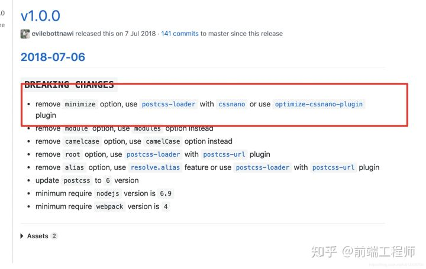
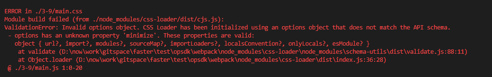

# 深入浅出 webpack

## 入门

## 配置

## 实战

### 3-1 使用 es6

### 3-2 使用 typescript 语音

### 3-3 使用 flow 检测器

### 3-4 使用 SCSS 语音

### 3-5 使用 PostCSS

### 3-6 使用 React 框架

### 3-7 使用 Vue 框架

### 3-8 使用 Angular2 框架

### 3-9 为单页应用生成 HTML

1. 分离 css 样式为单独 css 文件，并且压缩

   1. 安装 extract-text-webpack-plugin

      `npm install -D extract-text-webpack-plugin optimize-css-assets-webpack-plugin cssnano`

   2. webpack.config.json 的相关配置

      ```js
      // webpack.config.json
      const extractCSS = new ExtractTextPlugin({
        // 因为webpack4.x包含了contentash这个关键字段，所以在ExtractPlugin中不能使用contenthash
        // 使用md5:contenthash:hex:8替代
        // 官网：https://www.webpackjs.com/plugins/extract-text-webpack-plugin/ 有描述，但是不详细，要仔细分析
        // https://blog.csdn.net/shenzhen_zsw/article/details/97943217
        // 给输出的 CSS 文件名称加上 hash 值
        // filename: `[name]_[contenthash].css`,
        filename: `[name]_[md5:contenthash:hex:8].css`,
      });
      const OptimizeCssAssetsPlugin = require("optimize-css-assets-webpack-plugin");

      module.exports = {
        module: {
            rules: [
            {
                test: /\.css/, // 增加对 CSS 文件的支持
                // 提取出 Chunk 中的 CSS 代码到单独的文件中
                use: extractCSS.extract({
                //   fallback: "style-loader",
                use: [
                    {
                    loader: "css-loader",
                    options: {
                        // If you are having trouble with urls not resolving add this setting.
                        // See https://github.com/webpack-contrib/css-loader#url
                        url: false,
                        // minimize: true,
                        sourceMap: true,
                    },
                    },
                ], // 压缩 CSS 代码
                }),
            },
            ],
        },
        plugins: [
            extractCSS,
            new OptimizeCssAssetsPlugin({
            cssProcessor: require("cssnano"), //引入cssnano配置压缩选项
            cssProcessorOptions: {
                discardComments: { removeAll: true },
            },
            canPrint: true, //是否将插件信息打印到控制台
            })
        };
      ```

      看如上代码，注意二点：

      1. webpack4.x 与 ExtractTextPlugin 兼容性问题，在 ExtractPlugin 中不能使用 contenthash，使用 md5:contenthash:hex:8 替代。
      2. css-loader 高版本中不在支持 minimize，改为使用`optimize-css-assets-webpack-plugin`和`cssnano`

         

         

2. 自动生成 html 页面，并且指定嵌套在里面的 js 和 css（这里的嵌套是指外链方式），即按需加载

   1. `polyfills.js`文件只应用于兼容老版本浏览器，所以在新版本浏览器上的网页应该不去加载

      1. `polyfills.js`源码
         ```js
         import "babel-polyfill";
         import "whatwg-fetch";
         ```
      2. `webpack.config.js`中单独输出`polyfills.js`的压缩文件，并且文件命名是固定的，区别于其他文件带有`hash`值

         ```js
         // webpack.config.json
         const path = require("path");
         const prefix = "3-9/";
         module.exports = {
           entry: {
             app: `./${prefix}main.js`, // Chunk app 的 JS 执行入口文件
             polyfills: `./${prefix}polyfills.js`,
             google_analytics: `./${prefix}google_analytics.js`
           },
           output: {
             // filename: "[name]*[chunkhash:8].js", // 给输出的文件名称加上 hash 值
             filename: obj => {
               // console.log(obj.chunk.name);
               if (obj.chunk.name === "polyfills") {
                 return `polyfills.bundle.js`;
               } else {
                 return `[name]_[chunkhash:8].js`;
               }
             },
             path: path.resolve(__dirname, `./dist`)
           },
           optimization: {
             splitChunks: {
               cacheGroups: {
                 commons: {
                   // test: /[\\/]node_modules[\\/][^(?=(babel-polyfill|whatwg-fetch))][\\/]/,
                   // test: /[\\/]node_modules[\\/](?!(lodash))/,
                   test: /[\\/]node_modules[\\/]/,
                   name: "vendors",
                   // chunks: "all"
                   chunks(chunk) {
                     // 排除名字为`polyfills`的模块。
                     return chunk.name !== "polyfills";
                   }
                 }
               }
             }
           }
         };
         ```

         如上代码：核心是：

         1. 利用了 output.filename 的 function 形式，和它自带的`[name]`,`[chunkhash]`等特有的值处理
         2. 利用了 optimization 的压缩方式，这个在生产环境下，会自动执行。
         3. entry 中指定了`polyfills`
         4. `polyfills`文件本来会打包到 common.js 中，但是`optimization`压缩的时候指明了不打包`polyfills`chunk。

      3. 使用 html 模板，在里面设置按需加载`polyfills.js`

         ```js
         // webpack.config.js
         const HTMLWebpackPlugin = require("html-webpack-plugin");
         module.exports = {
           plugins: [
             // 使用本文的主角 HTMLWebpackPlugin，一个 HTMLWebpackPlugin 对应一个 HTML 文件
             new HTMLWebpackPlugin({
               title: "hzy",
               template: `./${prefix}template.html`, // HTML 模版文件所在的文件路径
               filename: "index.html", // 输出的 HTML 的文件名称
               excludeChunks: ["polyfills"]
             })
           ]
         };
         ```

         ```html
         <html>
           <head>
             <meta charset="UTF-8" />
             <!--异步加载 Disqus 评论-->
             <!-- <script src="https://dive-into-webpack.disqus.com/embed.js" async></script> -->
             <title><%= htmlWebpackPlugin.options.title %></title>
             <script>
               var modernBrowser = "fetch" in window && "assign" in Object;

               if (!modernBrowser) {
                 var scriptElement = document.createElement("script");

                 scriptElement.async = false;
                 scriptElement.src = "./polyfills.bundle.js";
                 document.head.appendChild(scriptElement);
               }
             </script>
           </head>
           <body>
             <div id="app"></div>
             <!--Disqus 评论容器-->
             <!-- <div id="disqus_thread"></div> -->
           </body>
         </html>
         ```

         如上代码：

         1. 浏览器上先根据兼容性判断是否加载`polyfills.bundle.js`
         2. `HTMLWebpackPlugin`插件的`excludeChunks`是核心设定，定义`polyfills.bundle.js`这个 chunk 不会自动加载到模板 html 中。
         3. `HTMLWebpackPlugin`插件可以为模板传入参数
         4. 参考资料: [HTMLWebpackPlugin](https://github.com/jantimon/html-webpack-plugin#third-party-addons)
         5. 本来使用`html-webpack-inline-source-plugin`可以让模板内联 js 和 css 文件，减少网络请求，但是因为版本兼容性的问题，这个没有成功，也没有深入下去，参考资料：[html-webpack-inline-source-plugin](https://github.com/DustinJackson/html-webpack-inline-source-plugin)

3. 源码
   其实核心代码已经贴出，源码在 faster/test/opensdk/webpack/3-9
4. 坑
   1. 写了 2 个 module 键值对，导致第一个 module 设定的 loader 总是无效
5. 没有设置 babel-loader

### 3-10 管理多个单页应用

    实例化多个`html-webpack-plugin`对象，核心在`chunk`参数，指定引入的chunk

### 3-11 构建同构应用

### 3-12 构建 Electron 应用

### 3-13 构建 Npm 模块

### 3-14 构建离线应用

### 3-15 搭配 NpmScript

### 3-16 检查代码

### 3-17 通过 Node.js API 启动 Webpack

### 3-18 使用 Webpack Dev Middleware

### 3-19 加载图片

```js
module.exports = {
  module: {
    rules: [
      {
        test: /\.png$/,
        use: [
          {
            loader: "url-loader",
            options: {
              // 30KB 以下的文件采用 url-loader
              limit: 1024 * 30,
              // 否则采用 file-loader，默认值就是 file-loader
              fallback: "file-loader"
            }
          }
        ]
      }
    ]
  }
};
```

通过 imagemin-webpack-plugin 压缩图片；
通过 webpack-spritesmith 插件制作雪碧图。

### 3-20 加载 SVG

### 3-21 加载 Source Map

有些从 Npm 安装的第三方模块是采用 ES6 或者 TypeScript 编写的，它们在发布时会同时带上编译出来的 JavaScript 文件和对应的 Source Map 文件，以方便你在使用它们出问题的时候调试它们；

默认情况下 Webpack 是不会去加载这些附加的 Source Map 文件的，Webpack 只会在转换过程中生成 Source Map。 为了让 Webpack 加载这些附加的 Source Map 文件，需要安装 source-map-loader 。 使用方法如下：

```js
module.exports = {
  module: {
    rules: [
      {
        test: /\.js$/,
        // 只加载你关心的目录下的 Source Map，以提升构建速度
        include: [path.resolve(root, "node_modules/some-components/")],
        use: ["source-map-loader"],
        // 要把 source-map-loader 的执行顺序放到最前面，如果在 source-map-loader 之前有 Loader 转换了该 JavaScript 文件，会导致 Source Map 映射错误
        enforce: "pre"
      }
    ]
  }
};
```

::: tip
由于 source-map-loader 在加载 Source Map 时计算量很大，因此要避免让该 Loader 处理过多的文件，不然会导致构建速度缓慢。 通常会采用 include 去命中只关心的文件。
:::

`npm i -D source-map-loader`

## 优化
