---
tags
  - 前端早读课2147
---
# 交互导入

当用户与 UI 交互时，对非关键资源延迟加载就很有必要。

你的页面可能包含组件或资源的代码或数据，而这些代码或数据并不是立即需要的。例如，除非用户点击或滚动页面的某些部分，否则他们看不到用户界面的某些部分。这可以应用于你编写的多种第一方代码，但也适用于视频播放器或聊天小应用等第三方小组件，通常需要单击一个按钮来显示主界面。

如果这些资源开销很大，立马加载这些资源可能会阻塞主线程，从而推迟用户与页面更关键部分交互的时间。这会影响交互准备度量，如首次输入延迟、总阻塞时间和交互时间。不必立即加载这些资源，可以在更合适的时机加载它们，例如:

- 当用户第一次点击与该组件进行交互时
- 滚动组件到可视区域中
- 或将该组件推迟到浏览器空闲状态时加载（通过 requestIdleCallback）。

在高层次上，加载资源的方式是不同的：

- Eager - 立即加载资源（加载脚本的正常方式）。
- 基于路由的延迟加载 - 当用户跳转到路由或组件时加载。
- 基于交互时延迟加载 - 当用户点击用户界面时加载（如显示聊天）。
- 在可是区域内延迟加载 - 当用户向组件滚动时加载。
- 预取 - 在需要之前加载，但在关键资源加载之后加载
- 预载 - 急切地，以更大程度的紧迫感；

:::tip 注意：
只有在交互前无法预取资源才应该对第一方代码进行交互时加载。然而这种模式对于第三方代码来说是非常相似的。在这种情况下，如果是非关键性的代码，通常希望将其推迟到将来的某个时间点。这可以通过多种方式实现，比如推迟到可交互，等到浏览器处于空闲状态或使用其他方式。
:::

在许多场景下，在可交互时延迟导入功能代码是一种常用的模式。在这篇文章中将介绍你可能曾经使用过的一个场景是 Google Docs，通过延迟到用户交互时才加载共享功能脚本来节省 500KB 的加载量。


## 另一个导入式交互的场景是加载第三方小组件。

### “伪”加载带有 facade 的第三方用户界面

可能会导入一个第三方脚本，并且对它所渲染的内容或何时加载代码的控制较少。实现加载式交互的一个直接选择: 使用 facade。Facade 是一个简单的“预览”或“占位符” ，用于模拟体验成本较高的组件，比如使用图像或屏幕快照。这是我们在 Lighthouse 团队中一直使用的术语，也是我们的这个想法。

当用户单击“预览”(facade)时，将加载代码资源。这限制了如果用户不打算使用某个功能却需要为之付出体验成本。类似地，当鼠标悬停时，facade 可以预先连接到必要的资源。

:::tip 注意:
第三方资源经常被添加到页面中，而没有充分考虑它们如何适应站点的整体加载。同步加载第三方脚本阻塞了浏览器解析，可能会延迟水合。如果可能的话，第三方脚本应该使用异步/延迟(或其他方法)来加载，以确保第一方脚本不会耗尽网络带宽。除非是关键性资源，否则可以选择使用诸如 import-on-interaction 之类的模式转移到延迟加载上。
:::

### 嵌入式视频播放器

“facade”的一个很好的例子是 Paul Irish 的 YouTube Lite Embed。这提供了一个自定义元素，它接受一个 YouTube 视频 ID，并显示一个最小的缩略图和播放按钮。点击元素会动态加载完整的 YouTube 嵌入式代码，意味着从未点击播放的用户不需要支付获取和处理它的成本。

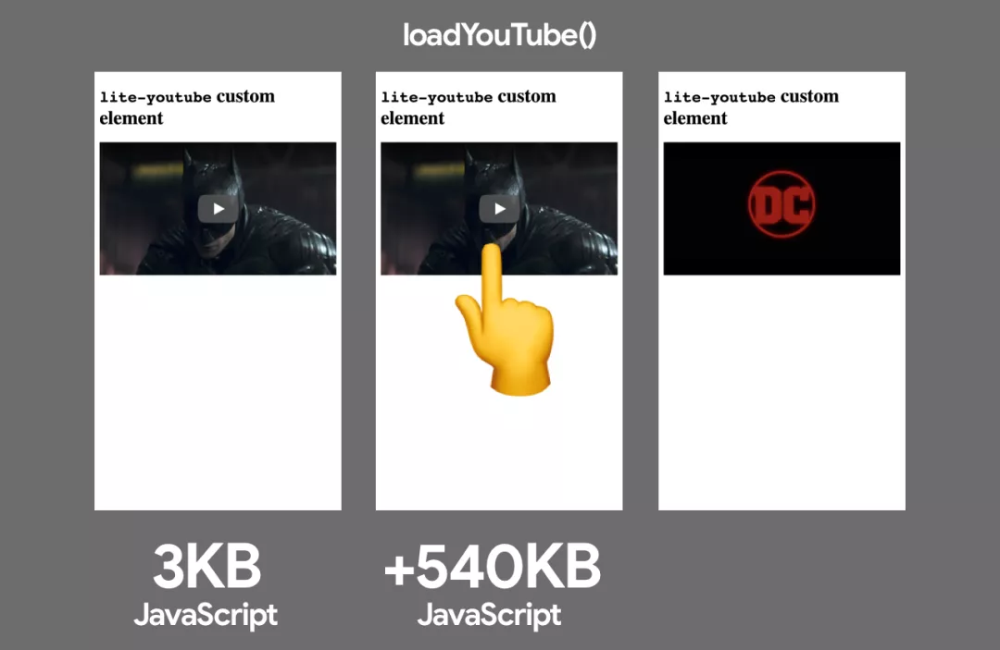

谷歌的一些网站也在开发中使用了类似的技术。在 Android.com 上，不是急于加载 YouTube 视频嵌入播放器，而是向用户展示一个带有假播放按钮的缩略图。当他们点击它时，会加载一个模态，它使用全屏的 YouTube 嵌入式播放器自动播放视频。

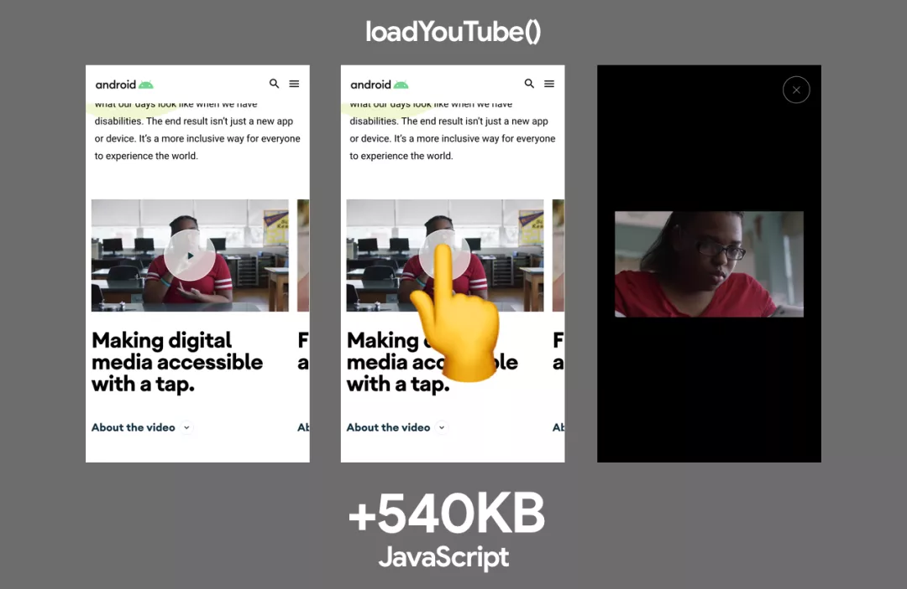

### 认证

应用程序可能需要通过客户端的 JavaScript SDK 来支持与服务的认证。这些 SDK 有时会很大，JS 执行成本很高，如果用户不打算登录，我宁可不急于在前期加载它们。相反在用户点击 "登录 "按钮时动态导入认证库，在初始加载时保持主线程更多的空闲状态。

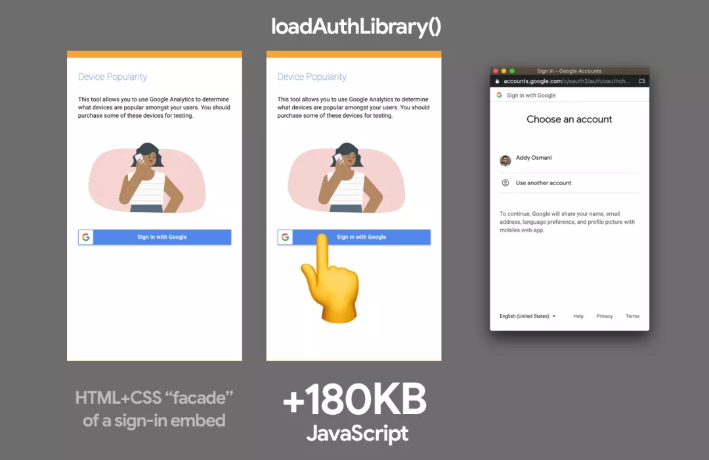

### 聊天小工具

Calibre 应用通过使用类似的 facade 方法，将基于 Intercom 的即时聊天的性能提高了 30%。他们只用 CSS 和 HTML 实现了一个 "假的 "快速加载的即时聊天按钮，点击后会加载他们的 Intercom bundles 包。

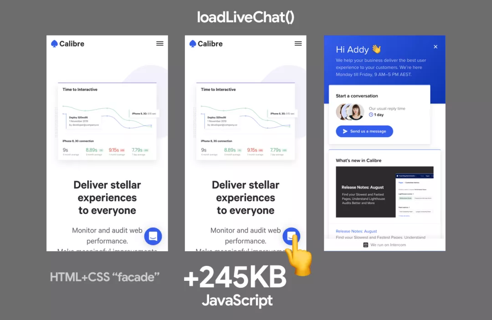

Postmark 注意到，尽管客户只是偶尔使用，但他们的帮助聊天小工具总是被提前地加载。这个小工具需要 314KB 的脚本，比他们的整个主页还要多。为了改善用户体验，他们使用 HTML 和 CSS 将小组件替换成了一个假的组件，点击后就会加载真实的代码。这一改变将互动时间从 7.7s 减少到 3.7s。

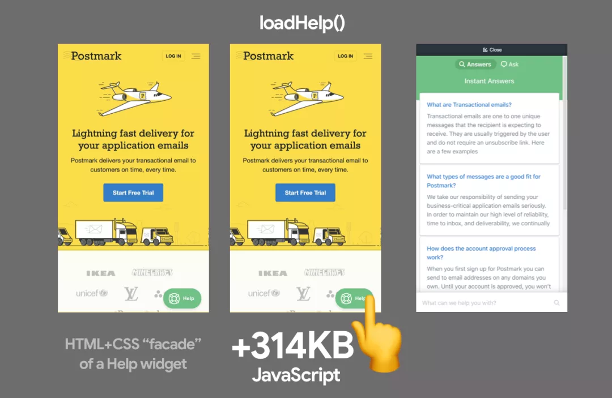

### 其他

Ne-digital 使用了一个 React 库，当用户点击 "scroll to top "按钮时，会自动滚到页面顶部。他们没有为此提前加载 react-scroll 依赖，而是在与按钮交互时加载，节省了约 7KB。

```js
handleScrollToTop() {
    import("react-scroll").then(scroll => {
        scroll.animateScroll.scrollToTop({});
    });
}
```

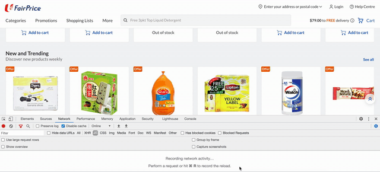

## 如何进行交互式导入？

### Vanilla JavaScript

在 JavaScript 中，动态导入可以实现模块的懒加载，并返回一个 promise，如果应用得当，功能相当强大。下面例子是一个在按钮事件监听器中使用动态导入功能，导入 lodash.sortby 模块，然后使用它。

```js
const btn = document.querySelector("button");
btn.addEventListener("click", e => {
  e.preventDefault();
  import("lodash.sortby")
    .then(module => module.default)
    .then(sortInput())
    // use the imported dependency
    .catch(err => {
      console.log(err);
    });
});
```

在动态导入之前，或者对于用例来说，显然不太适合，我会在我的页面中使用一个基于 Promise 加载器动态注入脚本（参见这里的完整实现，演示了一个签到 facade）。

```js
const loginBtn =   document.querySelector("#login");
loginBtn.addEventListener("click", () => {
  const loader = new scriptLoader();
  loader
    .load(["//apis.google.com/js/client:platform.js?onload=showLoginScreen"])
    .then(({ length }) => {
      console.log(`${length} scripts loaded!`);
    });
});
```

### React

让我们想象一下，我们有一个聊天程序，它有一个 `<MessageList>`， `<MessageInput>`和一个 `<EmojiPicker>`组件（由 emoji-mart 提供，它是 98KB minified 和 gzipped）。在初始页面加载时，提前加载所有这些组件是很常见的。

```jsx
import MessageList from "./MessageList";
import MessageInput from "./MessageInput";
import EmojiPicker from "./EmojiPicker";
const Channel = () => {
  ...
  return (
    <div>
      <MessageList />
      <MessageInput />
      {emojiPickerOpen && <EmojiPicker />}
    </div>
  );
};
```

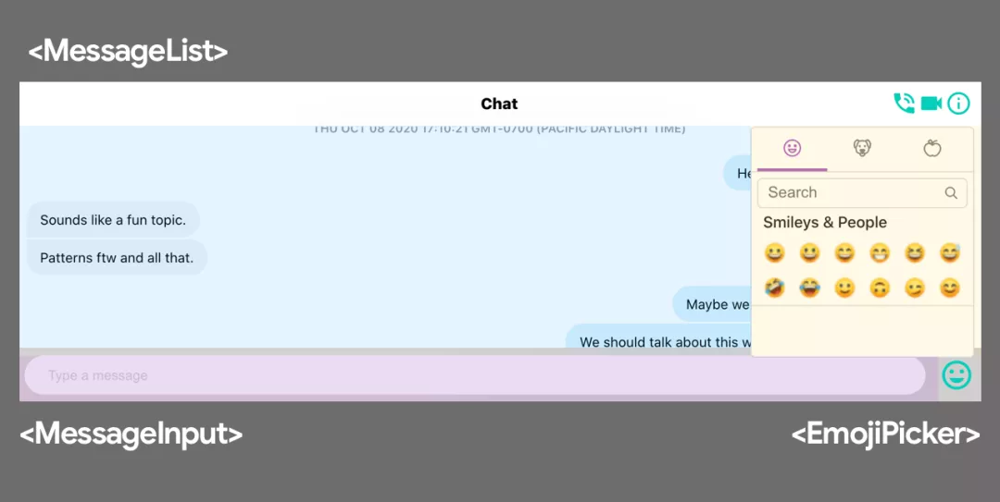

通过代码拆分，将这项工作的加载分解开来是比较直接的做法。在组件级别上 React.lazy 方法使得使用动态导入对 React 应用进行代码拆分变得非常容易。React.lazy 函数提供了一种内置的方法，可以将应用程序中的组件分离成独立的 JavaScript 块，而只需很少的腿部工作。然后，当你把它与 Suspense 组件结合起来时，你可以处理加载状态。

```jsx
import React, { lazy, Suspense } from "react";
import MessageList from "./MessageList";
import MessageInput from "./MessageInput";

const EmojiPicker = lazy(() => import("./EmojiPicker"));

const Channel = () => {
  ...
  return (
    <div>
      <MessageList />
      <MessageInput />
      {emojiPickerOpen && (
        <Suspense fallback={<div>Loading...</div>}>
          <EmojiPicker />
        </Suspense>
      )}
    </div>
  );
};
```

我们可以扩展这个想法，只在 `<MessageInput>`中的 Emoji 图标被点击时导入 Emoji Picker 组件的代码，而不是在应用程序最初加载时提前导入。

```jsx
import React, { useState, createElement } from "react";
import MessageList from "./MessageList";
import MessageInput from "./MessageInput";
import ErrorBoundary from "./ErrorBoundary";

const Channel = () => {
  const [emojiPickerEl, setEmojiPickerEl] = useState(null);
  const openEmojiPicker = () => {
    import(
      /* webpackChunkName: "emoji-picker" */
      "./EmojiPicker"
    )
      .then(module => module.default)
      .then(emojiPicker => {
        setEmojiPickerEl(createElement(emojiPicker));
      });
  };
  const closeEmojiPickerHandler = () => {
    setEmojiPickerEl(null);
  };
  return (
    <ErrorBoundary>
      <MessageList />
      <MessageInput onClick={openEmojiPicker} />
      {emojiPickerEl}
    </ErrorBoundary>
  );
};
```

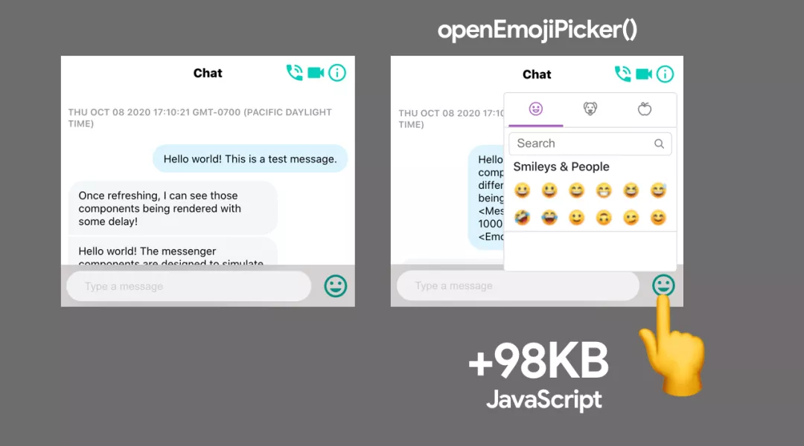

### Vue

在 Vue.js 中，可以通过几种不同的方式来实现类似的交互式导入模式。一种方法是使用动态导入包装在一个函数中，即 `()=>import("./Emojipicker")`来动态导入 Emojipicker Vue 组件。通常，这样做会让 Vue.js 在需要渲染组件时进行懒加载。

然后，我们可以在用户交互后面对懒加载进行把关。通过在 picker 的父 div 上使用条件 v-if，当用户点击按钮时，可以有条件地获取并渲染 Emojipicker 组件。

```vue
<template>
  <div>
    <button @click="show = true">Load Emoji Picker</button>
    <div v-if="show">
      <emojipicker></emojipicker>
    </div>
  </div>
</template>
<script>
export default {
  data: () => ({
    show: false
  }),
  components: {
    Emojipicker: () => import("./Emojipicker")
  }
};
</script>
```

大多数支持动态组件加载的框架和库，包括 Angular，应该都可以使用 import-on-interaction 模式。

## 作为渐进式加载的一部分，第一方代码的交互式导入

在交互时加载代码，也恰好是 Google 在 Flights 和 Photos 等大型应用中处理渐进式加载的一个关键部分。为了说明这一点，我们来看看 Shubhie Panicker 之前介绍的一个例子。

想象一下，一个用户正计划去印度孟买旅行，他们访问谷歌酒店看价格。这个交互所需的所有资源都可以在前期提前地加载，但如果用户没有选择任何目的地，地图所需的 HTML/CSS/JS 就没有必要了。

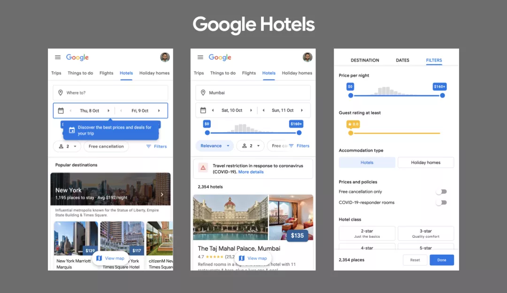

在最简单的下载场景中，想象一下谷歌酒店使用的是原生的客户端渲染（CSR）。所有的代码都会在前期被下载和处理：HTML，然后是 JS，CSS，然后获取数据，只有当我们拥有一切后才会渲染。然而，这让用户等待了很长时间，屏幕上什么都没有显示。一大块的 JavaScript 和 CSS 可能是不必要的。

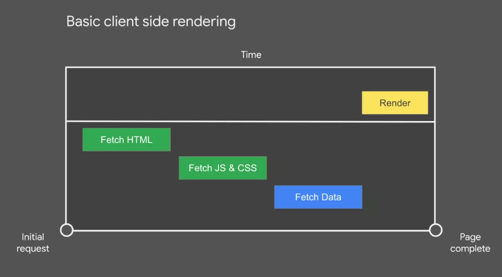

接下来，想象一下这种体验搬到服务器端渲染（SSR）上。我们会让用户更快得到一个视觉上完整的页面，这很好，然而在数据从服务器获取，客户端框架完成渲染之前，页面不会是交互式的。

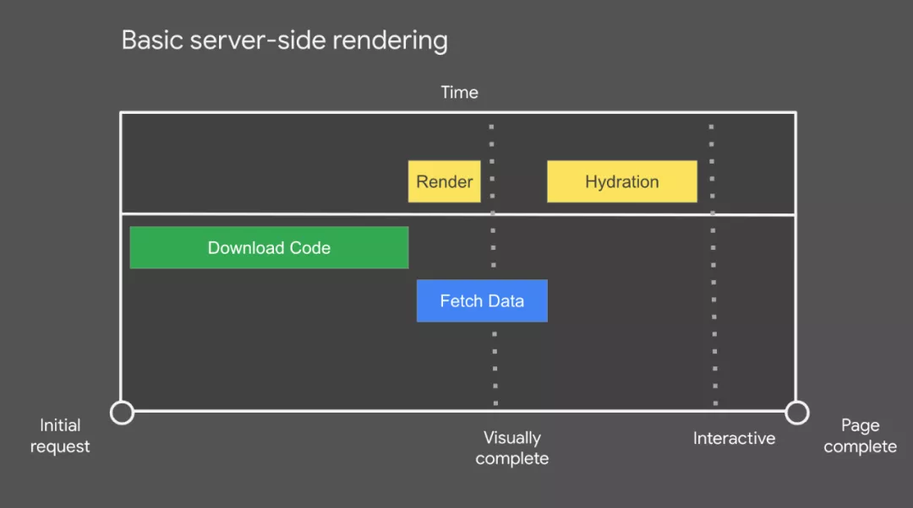

SSR 可以是一种改进，但用户可能会有一种不可思议的山谷体验，即页面看起来准备好了，但他们无法点击任何东西。有时这被称为愤怒点击，因为用户往往在沮丧中反复点击。

回到谷歌酒店搜索的例子，如果我们将 UI 稍微放大一点，我们可以看到，当用户点击 "更多过滤器 "以准确找到合适的酒店时，该组件所需的代码会被下载。

最初只下载了极少的代码，除此之外，用户的交互决定了哪些代码会在什么时候发下来。

我们来仔细看看这个加载场景。

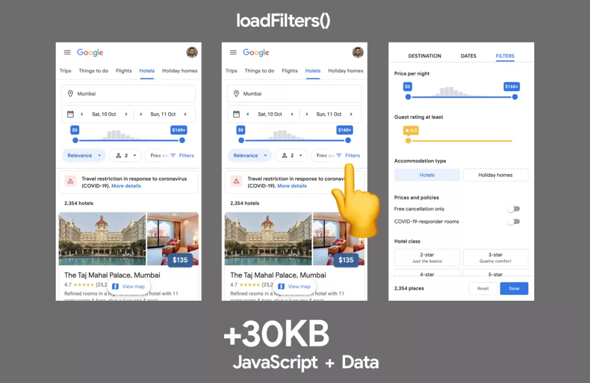

交互驱动的后期加载有很多重要的方面。

- 首先，我们最初下载的是最小的代码，这样页面在视觉上就会很快完成。
- 其次，当用户开始与页面进行交互时，我们利用这些交互来决定要加载哪些其他代码。比如加载 "更多过滤器 "组件的代码。
- 这意味着页面上很多功能的代码永远不会被下发到浏览器，因为用户不需要使用它们。

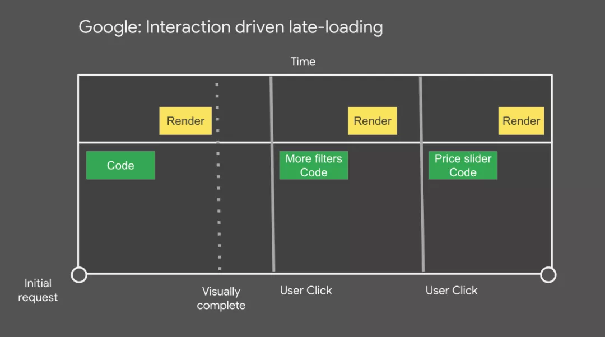

我们如何避免失去早期的点击量？

在 Google 这些团队使用的框架栈中，我们可以提前跟踪点击，因为 HTML 的第一块包括一个小的事件库（JSAction），它可以在框架被引导之前跟踪所有的点击。这些事件有两个用途。

- 根据用户交互触发组件代码的下载。
- 当框架完成引导时，重放用户交互。

其他可以使用的潜在启发式方法包括，加载组件代码。

- 闲置时间后的一段时间
- 当用户将鼠标悬停在相关的 UI/按钮/调用上时。
- 基于基于浏览器信号(如网络速度，数据节省模式等)的急切程度。

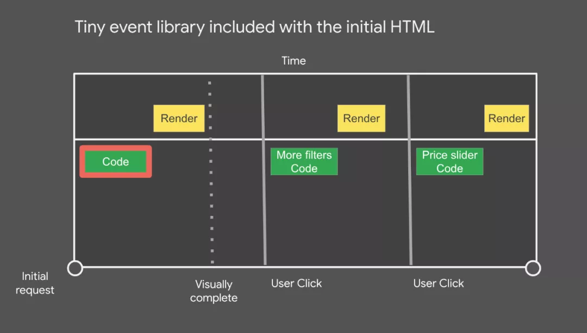

那数据呢？

用于渲染页面的初始数据包含在初始页面的 SSR HTML 中，并流中。后期加载的数据是根据用户交互下载的，因为我们知道它和什么组件在一起。

这样就完成了交互时的导入，数据获取的工作方式类似于 CSS 和 JS 的功能。由于组件知道自己需要什么代码和数据，所以它所有的资源永远不超过一个请求。

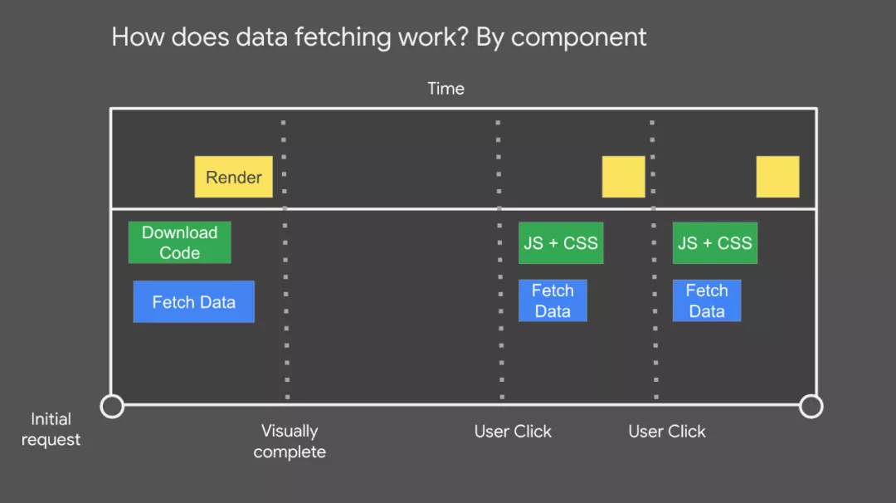

这个功能是我们在构建时创建一个组件和它们的依赖关系图。Web 应用程序能够在任何时候引用这个图，并快速获取任何组件所需的资源（代码和数据）。这也意味着我们可以根据组件而不是路由进行代码拆分。

关于上述例子的演练，请参见《用 JavaScript 社区提升 Web 平台》。

## 权衡

将昂贵的工作转移到更接近用户交互的地方，可以优化页面的初始加载速度，然而该技术并非没有权衡。

如果用户点击后需要很长时间来加载脚本会怎样？

在谷歌酒店的例子中，小颗粒的块状结构可以最大限度地减少用户长时间等待代码和数据的获取和执行的机会。在其他一些情况下，大的依赖性可能确实会在较慢的网络上引入这种担忧。

减少这种情况发生的机会的一种方法是更好地分解加载，或者在页面中的关键内容完成加载后预加载这些资源。我鼓励测试这种影响，以确定它在你的应用程序中的真实应用程度。

在用户交互之前缺乏功能怎么办？

facade 的另一个权衡是在用户交互之前缺乏功能。例如，一个嵌入式视频播放器将无法自动播放媒体。如果这样的功能是关键，你可以考虑采用其他的方法来加载资源，比如在用户滚动到视图中的时候懒加载这些第三方 iframe，而不是将加载推迟到交互之前。

##　用静态变体取代交互式嵌入体

我们已经讨论了交互式导入模式和渐进式加载，但是对于嵌入的使用情况，完全静态化呢？

在某些情况下，嵌入的最终渲染内容可能会被立即需要，例如在初始视口中可见的社交媒体帖子。当嵌入内容带来 2-3MB 的 JavaScript 时，这也会带来自己的挑战。因为嵌入的内容是马上需要的，所以懒加载和 facade 可能不太适用。

如果为了优化性能，可以完全用一个看起来类似的静态变体来替换嵌入，链接出一个更具交互性的版本（例如原始的社交媒体帖子）。在构建时，嵌入的数据可以被拉入并转化为静态 HTML 版本。

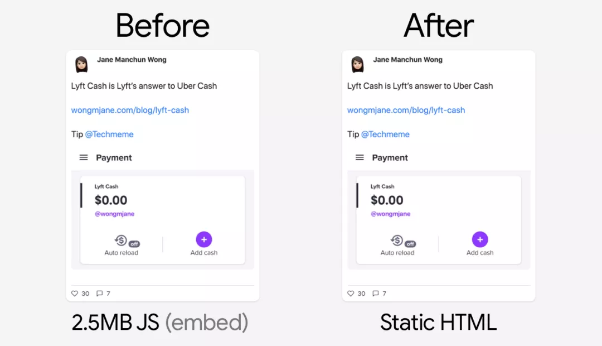

这就是@wongmjane 在[他们的博客](https://twitter.com/wongmjane)(另一个网址)[https://wongmjane.com/]上对一种社交媒体嵌入的方法，既提高了页面加载性能，又消除了由于嵌入代码增强了回退文本而导致的累积布局偏移。

虽然静态替换可以很好地提高性能，但它们通常需要做一些定制的事情，所以在评估你的选择时要记住这一点。

## 结论

第一方 JavaScript 经常会影响现代网页的交互准备，但它经常会在网络上被延迟，背后是来自第一方或第三方来源的非关键 JS，导致主线程繁忙。

一般来说，避免在文档头部同步第三方脚本，争取在第一方 JS 加载完成后再加载非阻塞的第三方脚本。像 import-on-interaction 这样的模式给我们提供了一种方法，将非关键资源的加载推迟到用户更有可能需要他们所支持的 UI 的时候。

特别感谢 Shubhie Panicker、Connor Clark、Patrick Hulce、Anton Karlovskiy 和 Adam Raine 的投入。

原文: [The Import On Interaction Pattern](https://addyosmani.com/blog/import-on-interaction/)
