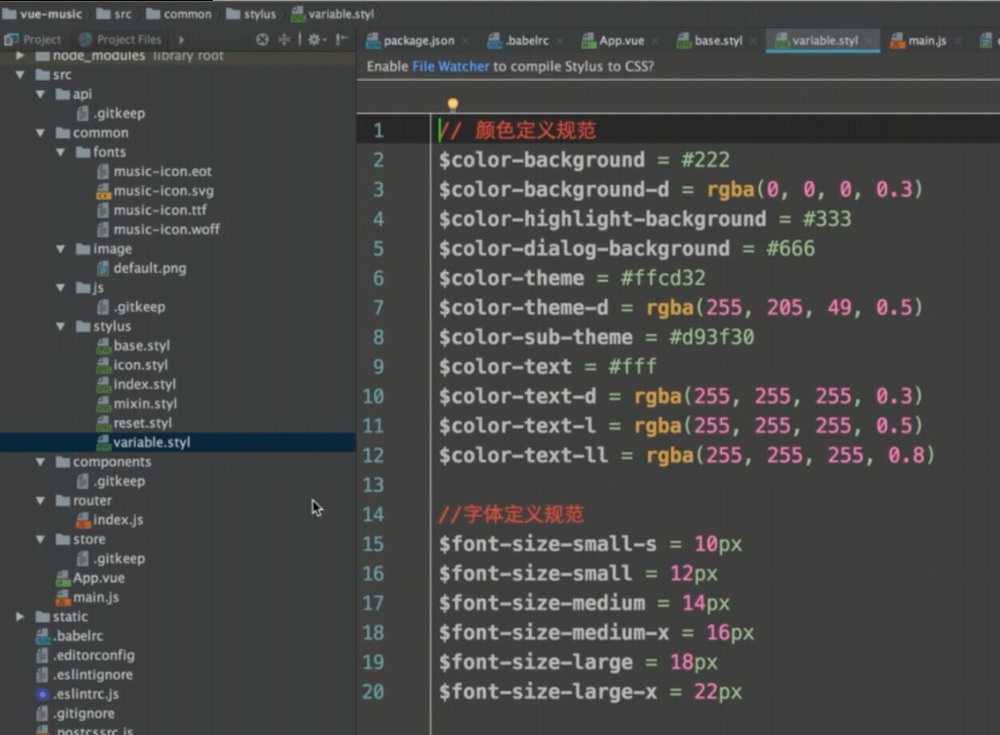
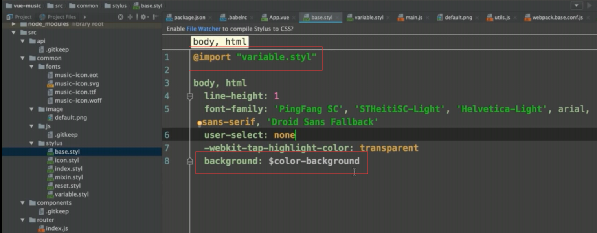

# vue-music 的学习

不过她会等，等到苍颜白发人衰镜，等到黄烟青瓦人空心，他时常看到定安和铁头，一起出现在门口，她也总是欢喜不已，可她的欢喜像在哭，悲悯像在笑，一帘袅娜中，江湖的芥子，消失在了苍莽之中，何时再见，永远不见！

任何贷款提前还都要违约金，这个可以修改，但你要发现并且提出，一般 3 年内还完要付，之后还不要。

## time

1. 2020-09-14 19:35 - 2020-09-14 20:55 - 80m - 5.歌手页面
2. 2020-09-14 21:45 - 2020-09-14 23:20 - 95m - 6.歌手详情页
3. 2020-09-20 11:30 - 2020-09-20 23:50 - 20m - 7.播放组件
4. 2020-09-20 13:15 - 2020-09-20 13:35 - 20m - 7.播放组件
5. 2020-09-20 17:50 - 2020-09-20 19:10 - 80m - 7.播放组件
6. 2020-09-23 20:55 - 2020-09-23 22:00 - 65m - 7.播放组件
7. 2020-09-24 22:00 - 2020-09-24 23:30 - 90m - 7.播放组件
8. 2020-09-25 22:30 - 2020-09-25 23:35 - 65m - 8.歌单页面，9.排行榜和详情页
9. 2020-09-27 21:45 - 2020-09-27 23:05 - 80m - 10.搜索页面开发

## 步骤

1. 初始化项目

   1. `vue create vue-music`
      这里需要注意，选择 Manually select features，选择对应的插件，其中 css pre-processors 对应的就是 less,stylus,sass。如果是移植别的项目，最好别选 linter / Formatter
   2. 因为是 vue3.0 的脚手架，所以配置下载`vue.config.js`，具体配置可以参考[vue3.0 项目构建](../interview/vue/guide)

2. 加入基础配置

   `cnpm install fastclick babel-polyfill -D`
   `cnpm install babel-runtime --save`

   ```js
   // main.js
   import "babel-polyfill";
   import fastclick from "fastclick";
   // 所有点击都不会有300ms的延迟
   fastclick.attach(document.body);
   ```

3. 路由 vue-router

   1. jsonp 获取数据

      1. 解决跨域
      2. 原理
      3. 手写
      4. [jsonp](https://github.com/webmodules/jsonp)

   2. redirect

## 知识点

1. 设置颜色字体规范和字体定义规范
   
   

2. 解决移动端点击有 300ms 延迟的特性

   `cnpm install fastclick -D`
   [FastClick 原理浅析](https://www.jianshu.com/p/05b142d84780)

3. 移动端适配

   ```html
   <!-- 移动端常见配置 -->
   <meta
     name="viewport"
     content="width=device-width, initial-scale=1.0, maximum-scale=1.0, minimum-scale=1.0, user-scalable=no"
   />
   ```

4. vue3.0 别名设置

   ```js
   // vue.config.js
   const path = require("path");
   function resolve(dir) {
     return path.join(__dirname, "./", `${dir}`);
   }

   module.exports = {
     // 和configureWebpack都能达到修改配置的效果，但是这样的修正更高级
     chainWebpack: (config) => {
       // 设置别名
       config.resolve.alias
         .set("common", resolve("src/common"))
         .set("components", resolve("src/components"))
         .set("src", resolve(`src`));
     },
   };
   ```

5. export 相关知识

   ```js
   export default function jsonp (){}

   import jsonp

   export function jsonp2() {}

   import {jsonp2}
   ```

6. better-scorll
   移动端常用组件

   浏览器刷新是 17ms 一次

   ```js
   mounted () {
      setTimeout(()=>{
         // ...
      }, 20)
   }
   // 可以用nextTick
   ```

   无缝轮播：左右 2 边各克隆一个 item
   https://github.com/ustbhuangyi/better-scroll/blob/master/README_zh-CN.md

   点击事件的监听处理：classname：needclick，这个具体看 fastclick 的支持
   better-scroll 和 fastclick 的点击事件的冲突处理

7. 接口后端代理
   设置 reffer 和 host
   如果通过后端接口去欺骗，那么可以通过封高访问 IP 或者参数签名的方式处理

8. flex
   经典布局

9. 图片懒加载
   vue-lazyload
   https://blog.csdn.net/u010014658/article/details/73477232

10. scroll 组件的设计和使用思路

11. loading

12. 数组排序

```js
// a-z升序
res.sort((a, b) => {
  return a.title.charCodeAt(0) - b.title.charCodeAt(0);
});
```

13. @click 定义方法传递参数
    可以用`:data-index = xxx`，然后 e.target 上 getAttribute 去取值

14. \$ref 可以是对象数组，写在 v-for 的 li 上，参考 base/listview.vue

15. created 中定义`this.touch = {}` 和在 data 中定义`touch: {}`区别在于后者会进行 touch 的双向绑定，但是前者不会。

16. `let delta = (this.touch.y2 - this.touch.y1) / ANCHOR_HEIGHT | 0`等价于向下取整，就是 `math.floor`

17. better-scroll 的滚动联动

18. listview 的细节调优，尤其是边界情况

19. 点击事件，冒泡概念，移动端处理

20. 路由动画

styus

```css
.slide-enter-active, .slide-leave-active transition: all 0.3s;
.slide-enter, .slide-leave-to transform: translate3d;
```

21. vuex 初始化配置
    使用场景

    1. 关联组件的数据共享
    1. 路由的数据传递

22. scroll 歌曲列表页面上拉的 UI 跟随滚动效果
    参考 6-10

23. 图片宽高比 10:7
    参考 6-11

24. js 级别的 style 兼容处理

25. vuex，action 的使用

26. p 和 div 的区别

27. create-keyframe-animation
    https://github.com/HenrikJoreteg/create-keyframe-animation

28. audio paly,error,duration

29. prevent,stop 等浏览器默认事件

30. svg, circle
    progress-circle.vue

    ```html
    <svg
      :width="radius"
      :height="radius"
      viewBox="0 0 100 100"
      version="1.1"
      xmlns="http://www.w3.org/2000/svg"
    >
      <circle
        class="progress-background"
        r="50"
        cx="50"
        cy="50"
        fill="transparent"
      />
      <circle
        class="progress-bar"
        r="50"
        cx="50"
        cy="50"
        fill="transparent"
        :stroke-dasharray="dashArray"
        :stroke-dashoffset="dashOffset"
      />
    </svg>
    ```

31. 洗牌函数
    utils

32. list.findIndex((item)=>{})

33. jsonp 返回的字符串用正则表达式取里面的内容

34. lyric-parse 歌词解析

35. mixin
    底部播放器自适应高度

36. 歌词左右滑动以及动画效果

37. promise 的高阶写法

```js
return axios
  .get(url, {
    params: data,
  })
  .then((res) => {
    return Promise.resolve(res.data);
  });
```

38. mixin.styl

```css
// 背景图片
bg-image($url)
  background-image: url($url + "@2x.png")
  @media (-webkit-min-device-pixel-ratio: 3),(min-device-pixel-ratio: 3)
    background-image: url($url + "@3x.png")

// 不换行
no-wrap()
  text-overflow: ellipsis
  overflow: hidden
  white-space: nowrap

// 扩展点击区域
extend-click()
  position: relative
  &:before
    content: ''
    position: absolute
    top: -10px
    left: -10px
    right: -10px
    bottom: -10px
```

39. 父组件给子组件传值

- props
- 子组件定义方法，父组件调用\$refs 去获取子组件，然后调用子组件方法赋值

40.

```js
r.push({ ...data.zhida, ...{ type: "singer" } });
```

41. 上拉刷新

```js
if (this.pullup) {
  this.scroll.on("scrollEnd", () => {
    if (this.scroll.y <= this.scroll.maxScrollY + 50) {
      this.$emit("scrollToEnd");
    }
  });
}
```

42. 搜索框的节流操作
    debounce

43. 手机端输入框输入文字会弹出键盘，影响滚动

input.blur()解决
